# 정렬

## 정렬 알고리즘이란?

- 목록 안에 저장된 요소들을 특정한 순서대로 재배치하는 알고리즘
- 입력데이터는 보통 배열과 같은 데이터 구조 (연결리스틑 사용하면 처음 or 끝부터 차례대로 훑어야해서 정렬 시 사용이 복잡해진다)
- 흔히 사용하는 순서 : 숫자 , 사전 순서(A~Z)
- 정렬 방향 : 오름차순, 내림차순

## 정렬이 중요한 이유

- 이진 탐색 사용 가능 → O(log n)
- 중복 제거에 편리
- 데이터 구조 최적화
- 데이터 처리 속도 향상
- 많은 문제에서 정렬 후 탐색/처리를 기반으로 함

## 정렬 알고리즘의 분류

정렬 알고리즘은 크게 두 기준으로 나눌 수 있다:

### 비교 기반 정렬(Comparison Sort)

두 값을 비교하며 순서를 정한다.

| 알고리즘  | 평균 시간복잡도   |
| ----- | ---------- |
| 버블 정렬 | O(n²)      |
| 선택 정렬 | O(n²)      |
| 삽입 정렬 | O(n²)      |
| 병합 정렬 | O(n log n) |
| 퀵 정렬  | O(n log n) |
| 힙 정렬  | O(n log n) |

### 대표 정렬 알고리즘 설명

#### 버블 정렬 (Bubble Sort)

서로 인접한 두 원소를 검사하여 정렬하는 알고리즘
인접한 2개의 레코드를 비교하여 크기가 순서대로 되어 있지 않으면 서로 교환한다.

1. 버블 정렬은 첫 번째 자료와 두 번째 자료를, 두 번째 자료와 세 번째 자료를, 세 번째와 네 번째를, … 이런 식으로 (마지막-1)번째 자료와 마지막 자료를 비교하여 교환하면서 자료를 정렬한다.
2. 1회전을 수행하고 나면 가장 큰 자료가 맨 뒤로 이동하므로 2회전에서는 맨 끝에 있는 자료는 정렬에서 제외되고, 2회전을 수행하고 나면 끝에서 두 번째 자료까지는 정렬에서 제외된다. 
3. 이렇게 정렬을 1회전 수행할 때마다 정렬에서 제외되는 데이터가 하나씩 늘어난다.

#### 선택 정렬 (Selection Sort)

제자리 정렬(in-place sorting) 알고리즘의 하나
입력 배열(정렬되지 않은 값들) 이외에 다른 추가 메모리를 요구하지 않는 정렬 방법

1. 주어진 배열 중에서 최솟값을 찾는다.
2. 그 값을 맨 앞에 위치한 값과 교체한다(패스(pass)).
3. 맨 처음 위치를 뺀 나머지 리스트를 같은 방법으로 교체한다.
4. 하나의 원소만 남을 때까지 위의 1~3 과정을 반복한다.

#### 삽입 정렬 (Insertion Sort)

손안의 카드를 정렬하는 방법과 유사하다.
새로운 카드를 기존의 정렬된 카드 사이의 올바른 자리를 찾아 삽입한다.
새로 삽입될 카드의 수만큼 반복하게 되면 전체 카드가 정렬된다.

1. 처음 Key값은 두번째 자료부터 시작한다.
2. 앞에있는 값과 비교하여 key값이 더 작으면 서로 위치를 교환한다.
3. 다음은 세번째 자료를 앞의 두 자료와 각각 비교하여 크기에 따라 위치를 바꾼다.
4. 이를 반복하면 된다.

#### 병합 정렬 (Merge Sort)

일반적인 방법으로 구현했을 때 이 정렬은 안정 정렬 에 속하며, 분할 정복 알고리즘의 하나 이다.
분할 정복(divide and conquer) 방법
문제를 작은 2개의 문제로 분리하고 각각을 해결한 다음, 결과를 모아서 원래의 문제를 해결하는 전략이다.
분할 정복 방법은 대개 순환 호출을 이용하여 구현한다.

1. 리스트의 길이가 0 또는 1이면 이미 정렬된 것으로 본다. 그렇지 않은 경우에는 정렬되지 않은 리스트를 절반으로 잘라 비슷한 크기의 두 부분 리스트로 나눈다.
2. 각 부분 리스트를 재귀적으로 합병 정렬을 이용해 정렬한다.
3. 두 부분 리스트를 다시 하나의 정렬된 리스트로 합병한다.

##### 특징

**장점**
- 안정적인 정렬 방법
- 데이터의 분포에 영향을 덜 받는다. 즉, 입력 데이터가 무엇이든 간에 정렬되는 시간은 동일하다. (O(nlog₂n)로 동일)
- 만약 레코드를 연결 리스트(Linked List)로 구성하면, 링크 인덱스만 변경되므로 데이터의 이동은 무시할 수 있을 정도로 작아진다.
- 제자리 정렬(in-place sorting)로 구현할 수 있다.
- 따라서 크기가 큰 레코드를 정렬할 경우에 연결 리스트를 사용한다면, 합병 정렬은 퀵 정렬을 포함한 다른 어떤 졍렬 방법보다 효율적이다.

**단점**
- 만약 레코드를 배열(Array)로 구성하면, 임시 배열이 필요하다.
- 제자리 정렬(in-place sorting)이 아니다.
- 레크드들의 크기가 큰 경우에는 이동 횟수가 많으므로 매우 큰 시간적 낭비를 초래한다.

##### 합병 정렬(merge sort)의 시간복잡도

시간복잡도를 계산한다면

- 분할 단계
  - 비교 연산과 이동 연산이 수행되지 않는다.
- 합병 단계
  - 비교 횟수

  - 순환 호출의 깊이 (합병 단계의 수)
    - 레코드의 개수 n이 2의 거듭제곱이라고 가정(n=2^k)했을 때, n=2^3의 경우, 2^3 -> 2^2 -> 2^1 -> 2^0 순으로 줄어들어 순환 호출의 깊이가 3임을 알 수 있다. 이것을 일반화하면 n=2^k의 경우, k(k=log₂n)임을 알 수 있다.
    - k=log₂n
  - 각 합병 단계의 비교 연산
    - 크기 1인 부분 배열 2개를 합병하는 데는 최대 2번의 비교 연산이 필요하고, 부분 배열의 쌍이 4개이므로 24=8번의 비교 연산이 필요하다. 다음 단계에서는 크기 2인 부분 배열 2개를 합병하는 데 최대 4번의 비교 연산이 필요하고, 부분 배열의 쌍이 2개이므로 42=8번의 비교 연산이 필요하다. 마지막 단계에서는 크기 4인 부분 배열 2개를 합병하는 데는 최대 8번의 비교 연산이 필요하고, 부분 배열의 쌍이 1개이므로 8*1=8번의 비교 연산이 필요하다. 이것을 일반화하면 하나의 합병 단계에서는 최대 n번의 비교 연산을 수행함을 알 수 있다.
  - 최대 n번
  - 순환 호출의 깊이 만큼의 합병 단계 * 각 합병 단계의 비교 연산 = nlog₂n
- 이동 횟수
  - 순환 호출의 깊이 (합병 단계의 수)
    - k=log₂n
  - 각 합병 단계의 이동 연산
    - 임시 배열에 복사했다가 다시 가져와야 되므로 이동 연산은 총 부분 배열에 들어 있는 요소의 개수가 n인 경우, 레코드의 이동이 2n번 발생한다.
  - 순환 호출의 깊이 만큼의 합병 단계 * 각 합병 단계의 이동 연산 = 2nlog₂n
- T(n) = nlog₂n(비교) + 2nlog₂n(이동) = 3nlog₂n = O(nlog₂n)

#### 퀵 정렬 (Quick Sort)

- 분할 정복 알고리즘의 하나로, 평균적으로 매우 빠른 수행 속도를 자랑하는 정렬 방법
  - 합병 정렬(merge sort)과 달리 퀵 정렬은 리스트를 비균등하게 분할한다.
- 과정 설명
  1. 리스트 안에 있는 한 요소를 선택한다. 이렇게 고른 원소를 피벗(pivot) 이라고 한다.
  2. 피벗을 기준으로 피벗보다 작은 요소들은 모두 피벗의 왼쪽으로 옮겨지고 피벗보다 큰 요소들은 모두 피벗의 오른쪽으로 옮겨진다. (피벗을 중심으로 왼쪽: 피벗보다 작은 요소들, 오른쪽: 피벗보다 큰 요소들)
  3. 피벗을 제외한 왼쪽 리스트와 오른쪽 리스트를 다시 정렬한다.
     - 분할된 부분 리스트에 대하여 순환 호출 을 이용하여 정렬을 반복한다.
     -  부분 리스트에서도 다시 피벗을 정하고 피벗을 기준으로 2개의 부분 리스트로 나누는 과정을 반복한다.
  4. 부분 리스트들이 더 이상 분할이 불가능할 때까지 반복한다.
     - 리스트의 크기가 0이나 1이 될 때까지 반복한다.

##### 퀵 정렬 특징

- 장점
  - 속도가 빠르다.
  - 시간 복잡도가 O(nlog₂n)를 가지는 다른 정렬 알고리즘과 비교했을 때도 가장 빠르다.
- 추가 메모리 공간을 필요로 하지 않는다.
  - 퀵 정렬은 O(log n)만큼의 메모리를 필요로 한다.
- 단점
  - 정렬된 리스트에 대해서는 퀵 정렬의 불균형 분할에 의해 오히려 수행시간이 더 많이 걸린다.

- 퀵 정렬의 불균형 분할을 방지하기 위하여 피벗을 선택할 때 더욱 리스트를 균등하게 분할할 수 있는 데이터를 선택한다.
  - EX) 리스트 내의 몇 개의 데이터 중에서 크기순으로 중간 값(medium)을 피벗으로 선택한다.

#### 힙 정렬 (Heap Sort)

힙 정렬은 내림차순을 기준으로 정렬하며, 완전 이진 트리의 일종으로 우선순위 큐를 위하여 만들어진 자료구조이다.
최댓값, 최솟값을 쉽게 추출할 수 있는 자료구조

**개념요약**
- 최대 힙 트리나 최소 힙 트리를 구성해 정렬을 하는 방법
- 내림차순 정렬을 위해서는 최대 힙을 구성하고 오름차순 정렬을 위해서는 최소 힙을 구성하면 된다.
- 과정 설명
  - 정렬해야 할 n개의 요소들로 최대 힙(완전 이진 트리 형태)을 만든다.
    - 내림차순을 기준으로 정렬(오름차순도 가능)
  - 그 다음으로 한 번에 하나씩 요소를 힙에서 꺼내서 배열의 뒤부터 저장하면 된다.
  - 삭제되는 요소들(최댓값부터 삭제)은 값이 감소되는 순서로 정렬되게 된다.

##### 내림차순 정렬을 위한 최대 힙(max heap)의 구현

- 힙(heap)은 1차원 배열로 쉽게 구현될 수 있다.
- 정렬해야 할 n개의 요소들을 1차원 배열에 기억한 후 최대 힙 삽입을 통해 차례대로 삽입한다.
- 최대 힙으로 구성된 배열에서 최댓값부터 삭제한다.

**최대 힙의 삽입**

1. 힙에 새로운 요소가 들어오면, 일단 새로운 노드를 힙의 마지막 노드에 이어서 삽입한다.
2. 새로운 노드를 부모 노드들과 교환해서 힙의 성질을 만족시킨다.

**최대 힙의 삭제**

- 최대 힙에서 최댓값은 루트 노드이므로 루트 노드가 삭제된다.
  - 최대 힙(max heap)에서 삭제 연산은 최댓값을 가진 요소를 삭제하는 것이다.
- 삭제된 루트 노드에는 힙의 마지막 노드를 가져온다.
- 힙을 재구성한다.

예를들어 오름차순으로 정렬을 한다고 하면 
1. 배열을 Max-Heap으로 만든다.
2. 루트 노드(최대값)과 마지막 원소를 교환한다.
3. 방금 교환한 마지막 원소를 제외한 나머지 노드들을 이용해서 Max-Heap으로 만들고 1부터 반복하면 된다.

##### 특징

- 장점
  - 시간 복잡도가 좋은편
  - 힙 정렬이 가장 유용한 경우는 전체 자료를 정렬하는 것이 아니라 가장 큰 값 몇개만 필요할 때 이다.

### 비교하지 않는 정렬(Non-Comparison Sort)

특정 조건에서 더 빠른 정렬 가능:
| 알고리즘                 | 시간복잡도    |
| -------------------- | -------- |
| 계수 정렬(Counting Sort) | O(n + k) |
| 기수 정렬(Radix Sort)    | O(nk)    |
| 버킷 정렬                | O(n) 평균  |

### 대표 정렬 알고리즘 설명

#### 계수 정렬 (Counting Sort)

모든 정렬 알고리즘은 기본적으로 배열의 요소들을 검사하는 과정이 포함되어 있다. 결국 배열의 데이터들을 비교하기 위해서는 decision tree 의 높이인 logn 만큼 비교연산이 일어난다는 것을 알아낼 수 있다. 

그렇다면 만약 비교연산을 사용하지 않는다면 어떨까? 비교연산을 사용하지 않는다면 Decision Tree 의 제약사항 없이 더 빠른 정렬이 가능하지 않을까?  
계수정렬 혹은 카운팅 소트는 이런 아이디어를 기반으로 해서 나온 Օ(n+데이터의 최대값 k)의 속도가 보장되는 정렬 알고리즘이다. 카운팅 소트는 이름 그대로 배열 내에 특정한 값이 몇번 등장했는지에 따라 정렬을 수행하기 때문에 비교연산이 사용되지 않는다.

카운팅 정렬은 다음과 같은 과정으로 수행된다.

1. 입력받은 배열 A의 요소값들의 등장횟수를 저장할 배열 B와 최종적으로 정렬된 값들을 담을 배열 C를 준비한다.
2. 입력밭은 배열에서 값을 하나씩 꺼내서 해당 값을 배열 B의 인덱스로 사용해 B 의 요소 값을 하나 증가시킨다. ``(B[A[i]]++)``
3. B가 완성되면 B의 각 요소들을 누적합으로 갱신한다. ``B[i] = B[i] + B[i-1]``
4. A 의 가장 뒤에서 부터 값을 하나씩 꺼내서 해당값을 B의 인덱스로 사용하고 참조된 B의 값을 배열 C의 인덱스로 사용해서 배열 C에 A에서 꺼낸 값을 넣는다. ``C[B[A[i]]] = A[i]``
5. 사용된 B의 값을 하나 감소시킨다. ``(B[A[i]]--)``
6. A의 모든 요소에 대해 4번, 5번 과정을 반복한다.

**Example**
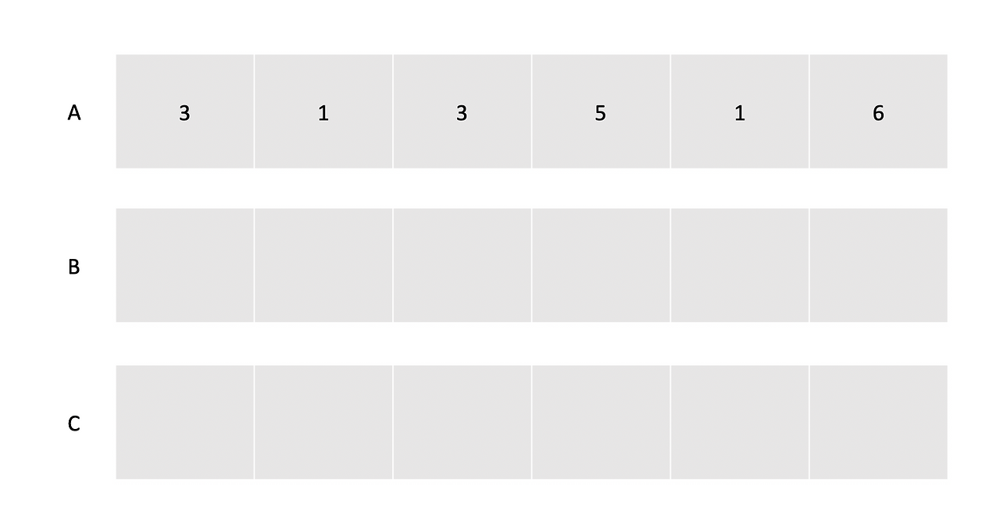

일단 배열 A를 입력받았고, 배열 B와 C를 준비했다.

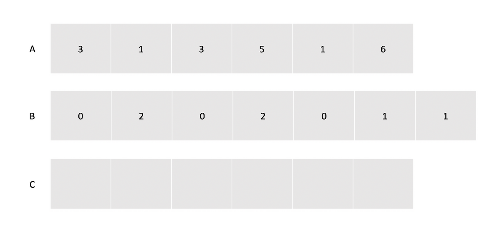

제일 먼저, A를 순회하면서 A에 들어가 있는 값들의 등장 횟수를 배열 B에 저장해주었다. 예를 들어 A에서 0이라는 값은 존재하지 않기 때문에 B의 0번 인덱스는 0이되고, 3은 총 2번 등장했기 때문에 B의 3번 인덱스는 2로 걍신되었다.

주목할 점은 B의 배열길이는 A에 있는 최댓값에 따라 결정된다는 것이다. 이후에 이것이 성능에 어떤 영향이 있을지 논의해보자.

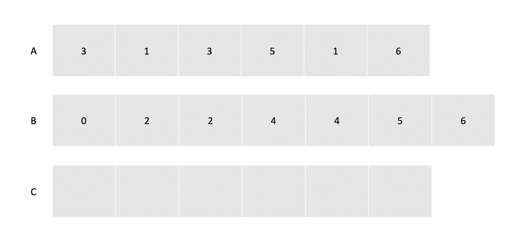

B 배열의 값들을 1부터 마지막 값까지 바로 이전 값과 계속 더해서 누적합으로 만들어준다.

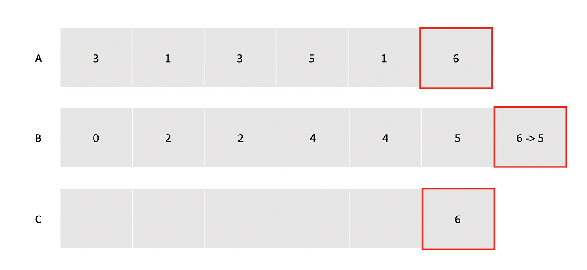

배열 A의 가장 뒤에서 부터 값을 하나씩 꺼낸다. 이번에 꺼낸 값은 6이기 때문에 이 값을 배열 B의 인덱스로 사용해서 접근한다.
배열 B의 6번 인덱스에 있는 값은 6이기 때문에 이 값을 사용해서 C에 접근한다. 이것은 배열 A에는 6보다 같거나 작은 값이 총 6개가 있음을 의미한다.
배열 C의 6번째 요소에 6을 넣는다. 배열 A에 6보다 같거나 작은 값이 6개 있기 때문에 최종 배열의 6번째 칸에 넣어주면 6보다 작은 값은 모두 이 인덱스의 앞에 위치하고 큰 값들은 뒤에 위치하게 될 것이다.
배열 B의 6번 인덱스의 값을 하나 줄여준다.

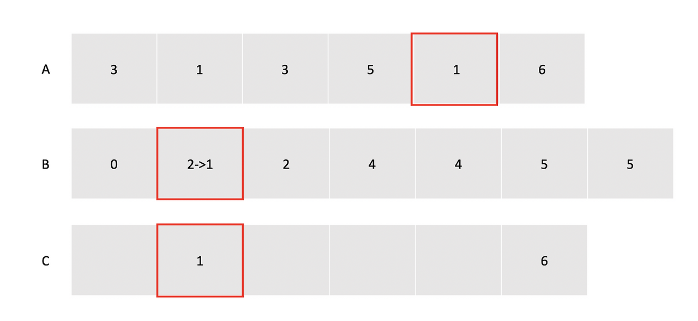

A 배열에서 다음 값인 1을 꺼낸다.
B 배열의 1번 인덱스에는 2가 들어있기 때문에
C 배열의 2번째 위치에 A에서 꺼낸 값인 1을 넣어주고,
B 배열의 1번 인덱스의 카운트를 하나 줄여준다.

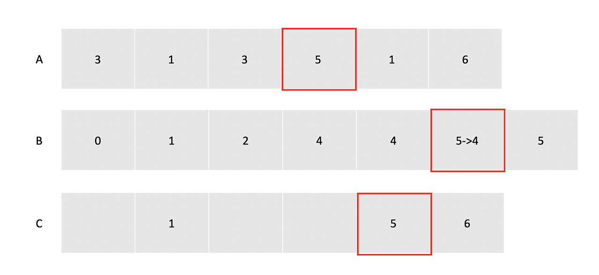

A 배열에서 다음 값인 5를 꺼낸다.
B 배열의 5번 인덱스에는 5가 들어있기 때문에
C 배열의 5번째 위치에 A에서 꺼낸 값인 5을 넣어주고,
B 배열의 5번 인덱스의 카운트를 하나 줄여준다.

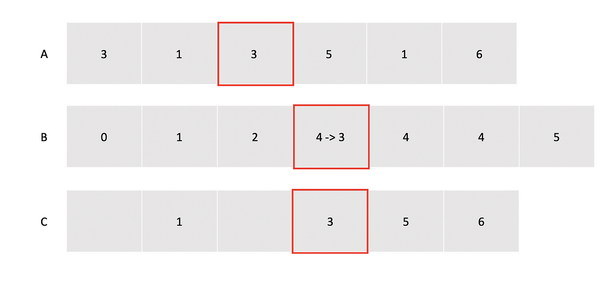

A 배열에서 다음 값인 3를 꺼낸다.
B 배열의 5번 인덱스에는 4가 들어있기 때문에
C 배열의 4번째 위치에 A에서 꺼낸 값인 3을 넣어주고,
B 배열의 3번 인덱스의 카운트를 하나 줄여준다.
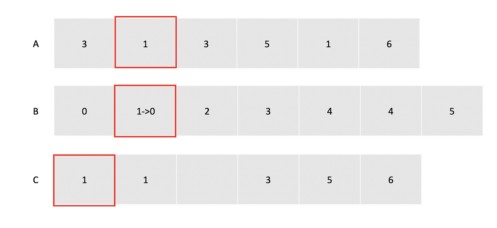

A 배열에서 다음 값인 1를 꺼낸다.
B 배열의 1번 인덱스에는 1이 들어있기 때문에
C 배열의 1번째 위치에 A에서 꺼낸 값인 1을 넣어주고,
B 배열의 1번 인덱스의 카운트를 하나 줄여준다.
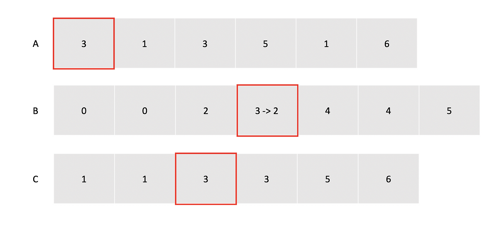
A 배열에서 다음 값인 3를 꺼낸다.
B 배열의 3번 인덱스에는 3이 들어있기 때문에
C 배열의 3번째 위치에 A에서 꺼낸 값인 3을 넣어주고,
B 배열의 3번 인덱스의 카운트를 하나 줄여준다.

**특징**
앞서 잠깐 언급했던 것 처럼 이 알고리즘의 치명적인 단점은 카운팅을 위한 배열의 길이가 입력받은 배열 값들 중 최댓값에 의해 결정된다는 것이다. 만약 우리가 입력받은 배열의 값들이 (1, 100000) 이라고 한다면, 이 배열은 두 개의 값만을 가지고 있음에도 불구하고 카운팅 배열의 크기는 100000으로 설정되어야 한다.

또한 이 알고리즘의 시간 복잡도는 Օ(n * k) 가 되는데, 배열을 참조하는 연산 O(n) 이 B 배열의 길이인 k, 즉 배열 내의 최대 값의 길이만큼 반복되기 때문이다. 따라서 입력받은 배열의 데이터개수가 k 보다 작다면 굉장히 유용한 알고리즘이 되겠지만, k 가 더 큰경우에는 비효율적인 알고리즘이 될 수도 있다.

즉 이 알고리즘은 정리하는 배열에 들어있는 값의 범위가 좁을때 효율적으로 작동한다.

#### 기수 정렬 (Radix Sort)

기수정렬은 낮은 자리수부터 비교하여 정렬해 간다는 것을 기본 개념으로 하는 정렬 알고리즘이다. 기수정렬은 비교 연산을 하지 않으며 정렬 속도가 빠르지만 데이터 전체 크기에 기수 테이블의 크기만한 메모리가 더 필요하다.

**정렬 방식**

1. 0~9 까지의 Bucket(Queue 자료구조의)을 준비한다.
2. 모든 데이터에 대하여 가장 낮은 자리수에 해당하는 Bucket에 차례대로 데이터를 둔다.
3. 0부터 차례대로 버킷에서 데이터를 다시 가져온다.
4. 가장 높은 자리수를 기준으로 하여 자리수를 높여가며 2번 3번 과정을 반복한다.

**Example**
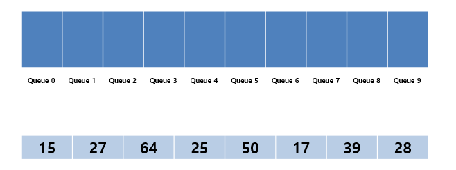

아래의 8개 데이터에 대하여 기수 정렬을 시도해 보겠습니다. 위의 그림과 같이 각 숫자에 해당하는 Queue공간을 할당하고 진행합니다.

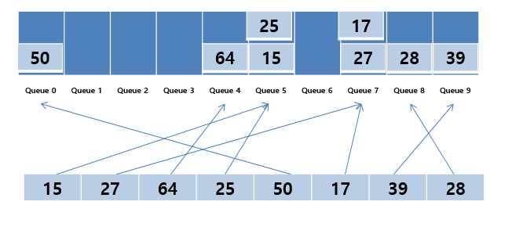
먼저 1의 자리 숫자부터 시도를 합니다. 데이터 순서대로 각 1의 자리에 해당되는 Queue에 데이터가 들어가게 됩니다. 15같은 경우는 1의 자리가 5이므로 Queue 5에 들어가는 방식입니다.
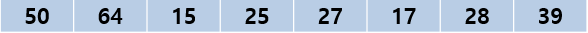
위의 그림처럼 다시 0번 Queue부터 차례대로 데이터를 가지고 와서 원래의 배열에 넣어주게 됩니다.

1의 자리에 대한 정렬이 완료되었습니다. 다음으로는 10의 자리에 대하여 같은 작업을 반복합니다.
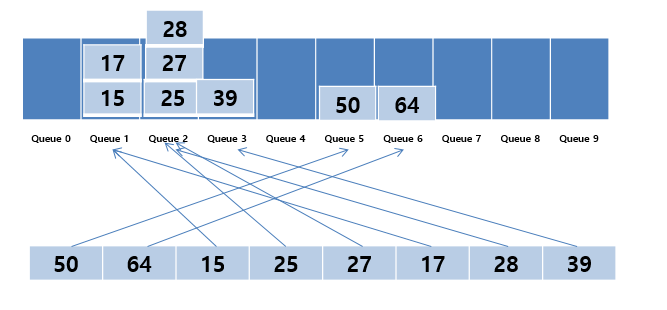
마찬가지로 각 데이터의 10의 자리에 해당되는 Queue에 데이터를 위치 시킵니다. 그런 다음 0번 Queue부터 차례대로 다시 데이터를 가지고 옵니다.
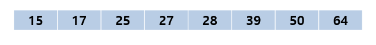
최종적으로 정렬이 완료가 됩니다.

**특징**

1. 시간 복잡도는 O(dn)
2. 자리수가 고정되어 있어서 안정성이 있는 정렬 방식

#### 버킷 정렬

버킷 정렬은 데이터를 여러 개의 "버킷"으로 나누고 각 버킷에 저장된 데이터를 정렬한 뒤, 이를 합쳐 최종 정렬을 완성하는 분산 기반 정렬 알고리즘이다. 데이터가 균등 분포되어 있을수록 높은 효율을 발휘하며, 비교 기반 정렬보다 더 빠를 수 있다.

**정렬 방식**

1. 데이터를 특정 범위를 기준으로 여러 개의 버킷으로 나눈다.
2. 각 버킷 내부의 데이터를 정렬한다 (종종 삽입 정렬, 병합 정렬, 혹은 다른 정렬 알고리즘 사용).
3. 정렬된 버킷을 합친다.

**Example**
정렬할 배열: [78, 17, 39, 26, 72, 94, 21, 12, 23, 68]

1. 버킷 분배:
   - 데이터의 최대값을 기준으로 각 버킷의 범위를 정의합니다.
   - 여기서는 최대값이 100이라고 가정하고, 각 버킷의 범위를 10으로 설정합니다.
   - 분배 결과:
     - 버킷 0: [12]
     - 버킷 1: [17]
     - 버킷 2: [21, 23, 26]
     - 버킷 3: [39]
     - 버킷 6: [68]
     - 버킷 7: [72, 78]
     - 버킷 9: [94]
2. 각 버킷 내부 정렬:
   - 각 버킷 내부는 정렬 알고리즘으로(quick, insert, ect.) 정렬합니다.
      - 버킷 0: [12] (이미 정렬 완료)
      - 버킷 1: [17] (이미 정렬 완료)
      - 버킷 2: [21, 23, 26] (정렬 수행)
      - 기타 버킷도 정렬 수행.
    - 삽입 정렬의 시간 복잡도는 O(k²)이며, 여기서 k는 각 버킷에 포함된 데이터 개수입니다.
3. 버킷 병합:
   - 병합 결과: [12, 17, 21, 23, 26, 39, 68, 72, 78, 94]
4. 최종 정렬 완료:
   - 결과: [12, 17, 21, 23, 26, 39, 68, 72, 78, 94]

