# Seraching (탐색)

탐색 알고리즘은 데이터 구조 안에서 특정 값을 찾는 알고리즘이다.
자료 구조마다 탐색 방식과 성능이 달라지기 때문에, “어디에 저장되어 있는가”가 탐색 결정의 핵심이다.

## 선형 탐색 (Linear Search)

**방법**
앞에서부터 하나씩 비교하며 찾음.

✔ **시간복잡도**
𝑂(𝑛)
✔ **언제 사용?**
정렬되어 있지 않은 배열, 리스트.
✔ **특징**
- 구현 매우 쉬움
- 정렬되어 있지 않으면 이 방식밖에 없음

## 이진 탐색(Binary Search)

**방법**
정렬된 배열에서 사용.
중간값 비교 → 절반 버림 → 반복.

✔ **시간복잡도**
𝑂(log⁡𝑛)
✔ **조건**
- 데이터 정렬되어 있어야 함
- 배열처럼 랜덤 접근(random access) 가능해야 함

✔ **특징**
- 선형 탐색보다 훨씬 빠름.

## 트리 탐색(Tree Search)

트리 구조에서 탐색 방법.

**트리 순회**
트리 순회에는 전위 순회(Preorder), 중위 순회(Inorder), 후위 순회(Postorder) 가 있다.

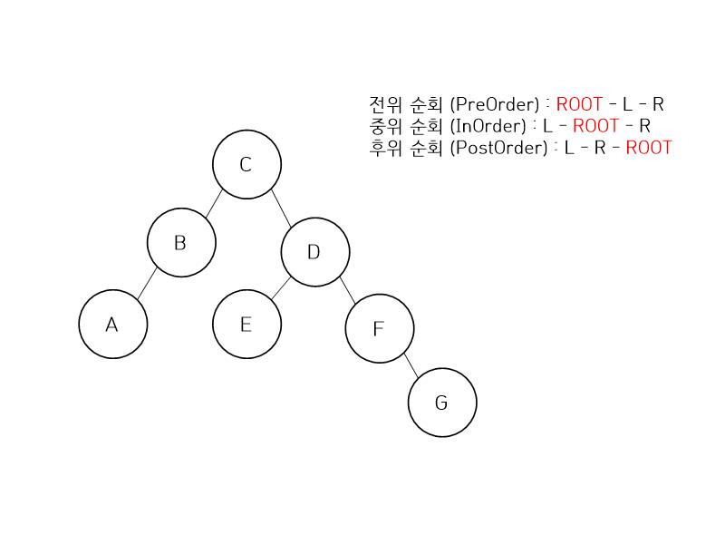

- 전위 순회는 [루트 - 왼쪽 자식 - 오른쪽 자식] 순으로 순회한다.
  - 결과는 CBADEFG 가 된다.
- 중위 순회는 [왼쪽 자식 - 루트 - 오른쪽 자식] 순으로 순회한다.
  - 결과는 ABCEDFG 가 된다.
- 후위 순회는 [왼쪽 자식 - 오른쪽 자식 - 루트] 순으로 순회한다.
  - 결과는 ABEGFDC 가 된다.

순회할때 해당 노드를 방문했다고 해서 결과값에 포함되는게 아니라 Root차례가 되야지 결과에 포함시키는 것이다.

### 이진 탐색 트리(BST) 탐색

이진탐색트리란 이진탐색(binary search)과 연결리스트(linked list)를 결합한 자료구조의 일종이다. 이진탐색의 효율적인 탐색 능력을 유지하면서도, 빈번한 자료 입력과 삭제를 가능하게끔 고안됐다.

- 각 노드의 왼쪽 서브트리에는 해당 노드의 값보다 작은 값을 지닌 노드들로 이루어져 있다.
- 각 노드의 오른쪽 서브트리에는 해당 노드의 값보다 큰 값을 지닌 노드들로 이루어져 있다.
- 중복된 노드가 없어야 한다.
- 왼쪽 서브트리, 오른쪽 서브트리 또한 이진탐색트리이다.

이진탐색트리를 순회할 때는 중위순회(inorder) 방식을 쓴다. (왼쪽 서브트리-노드-오른쪽 서브트리 순으로 순회) 이렇게 하면 이진탐색트리 내에 있는 모든 값들을 정렬된 순서대로 읽을 수 있다.

**삽입**
삽입은 항상 리프노드에서만 이루어지며 위치는 이진트리 탐색과 같은 방법으로 찾는다.

**삭제**

- 삭제할 노드가 자식이 없는 경우(리프노드)
  - 그냥 삭제하면 된다.
- 삭제할 노드에 자식이 하나 있는 경우
  - 해당 노드의 부모노드와 자식노드를 연결하면 이진트리의 속성 덕분에 문제없이 삭제 가능
- 삭제할 노드에 자식이 두개 있는 경우
  - 삭제할 노드의 위치에 successor을 복사해놓고 원본 successor을 삭제한다. (or predecessor)
    - 삭제하려는 노드의 왼쪽에 있는 서브트리의 최댓값(predecessor)
    - 삭제하려는 노드의 오른쪽에 있는 서브트리의 최솟값 (successor)
  - successor는 자식노드가 하나이거나 없는 케이스밖에 존재하지 않는다.
  - predecessor도 자식노드가 하나이거나 없는 케이스밖에 존재하지 않는다.

### AVL 탐색

AVL 트리는 스스로 균형을 잡는 이진 탐색 트리 이다.

**특징**
- AVL 트리는 이진 탐색 트리의 속성을 가진다.
왼쪽, 오른쪽 서브 트리의 높이 차이가 최대 1 이다.
- 어떤 시점에서 높이 차이가 1보다 커지면 회전(rotation)을 통해 균형을 잡아 높이 차이를 줄인다.
- AVL 트리는 높이를 logN으로 유지하기 때문에 삽입, 검색, 삭제의 시간 복잡도는 O(logN) 이다.

**Balance Factor(BF)**
Balance Factor(BF)는 외쪽 서브트리의 높이에서 오른쪽 서브트리의 높이를 뺀 값이다.

```
Balance Factor (k) = height (left(k)) - height(right(k))
```
- BF가 1이면 왼쪽 서브트리가 오른쪽 서브트리보다 높이가 한단계 높다는 것을 의미한다.
- BF가 0이면 왼쪽 서브트리와 오른쪽 서브트리의 높이가 같다는 것을 의미한다.
- BF가 -1이면 왼쪽 서브트리가 오른쪽 서브트리보다 높이가 한단계 낮다는 것을 의미한다.

#### 회전 (rotation)
AVL트리는 이진 탐색 트리이기 때문에 모든 작업은 이진 탐색 트리에서 사용하는 방식으로 수행된다.

검색 및 순회 연산은 BF를 변경하지 않지만 삽입 및 삭제에서는 BF가 변경될 수 있다.

삽입 삭제 시 불균형 상태(BF가 -1 ,0, 1이 아닌 경우) 가 되면 AVL트리는 불균형 노드를 기준으로 서브트리의 위치를 변경하는 rotation 작업을 수행하여 트리의 균형을 맞추게 된다.

**LL(Left Left) case**
y는 z의 왼쪽 자식 노드이고, x는 y의 왼쪽 자식 노드인 경우 right rotation을 수행하여 균형을 맞춘다.

right rotation 수행 과정
- y노드의 오른쪽 자식 노드를 z노드로 변경한다.
- z노드 왼쪽 자식 노드를 y노드 오른쪽 서브트리(T2)로 변경한다.
- y는 새로운 루트 노드가 된다.

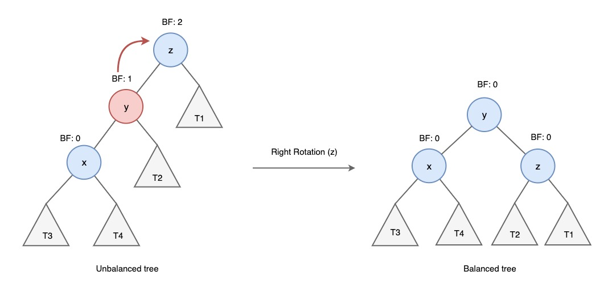

**RR(Right Right) case**
y는 z의 오른쪽 자식 노드이고, x는 y의 오른쪽 자식 노드인 경우 left rotation을 수행하여 균형을 맞춘다.

left rotation 수행 과정
- y노드의 왼쪽 자식 노드를 z노드로 변경한다.
- z노드 오른쪽 자식 노드를 y노드 왼쪽 서브트리(T2)로 변경한다.
- y는 새로운 루트 노드가 된다.

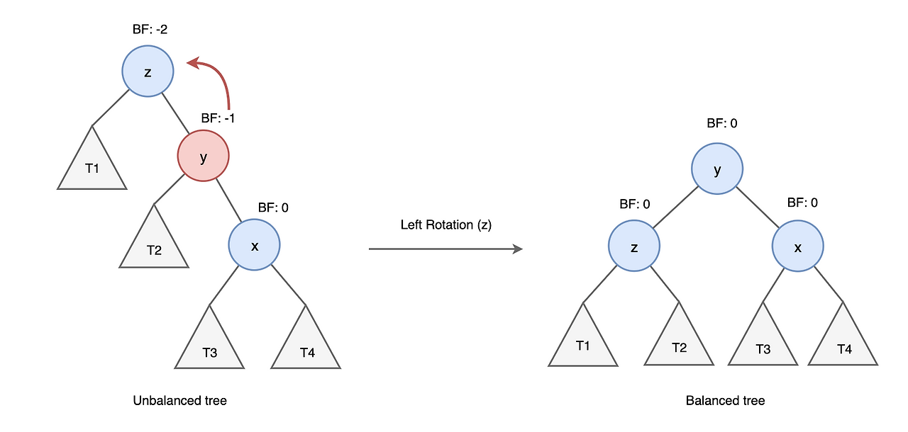

**LR(Left Right) case**
y는 z의 왼쪽 자식 노드이고, x는 y의 오른쪽 자식 노드인 경우 left , right 순으로 총 두 번의 rotation을 수행하여 균형을 맞춘다.

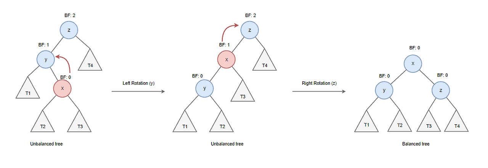

**RL(Right Left) case**
y는 z의 오른쪽 자식 노드이고, x는 y의 왼쪽 자식 노드인 경우, right, left 순으로 총 두번의 rotation을 수행하여 균형을 맞춘다.

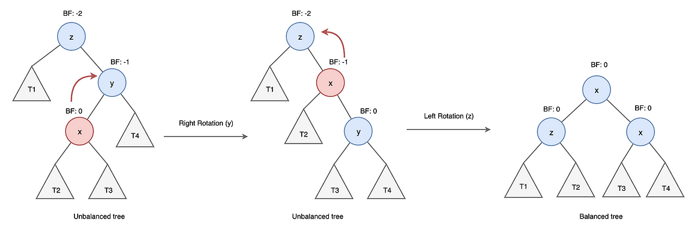

**삽입**
AVL트리의 삽입 삭제 방식은 이진 탐색 트리와 같다. 하지만 높이 균형을 유지하기 위해 노드의 높이 정보와 case별 rotation 과정이 추가된다.

### Red-Black Tree 탐색


레드-블랙 트리는 자가 균형 이진 탐색 트리이다. 레드-블랙 트리는 다음과 같은 조건들을 만족한다.

1. 모든 노드는 빨간색 혹은 검은색이다.
2. 루트 노드는 검은색이다.
3. 모든 리프 노드(NIL)들은 검은색이다.  
(NIL : null le 자료를 갖지 않고 트리의 끝을 나타내는 노드)
4. 빨간색 노드의 자식은 검은색이다.   
== No Double R (빨간색 노드가 연속으로 나올 수 없다)
5. 모든 리프 노드에서 Black Depth는 같다.   
== 리프노드에서 루트 노드까지 가는 경로에서 만나는 검은색 노드의 개수가 같다.

**삽입**

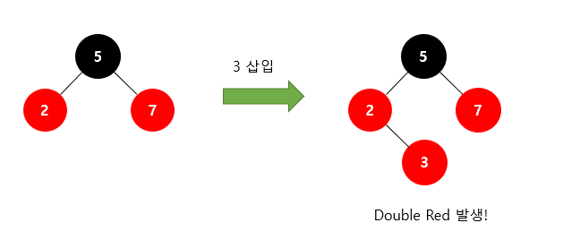
레드-블랙 트리에 새로운 노드를 삽입할 때 새로운 노드는 항상 빨간색으로 삽입한다. 
이렇게 되면 4번 조건이 위배되는 상황이 발생한다. 즉, 빨간색 노드가 연속으로 2번 나타날 수 있다(Double Red)

레드 블랙 트리는 이러한 Double Red 문제를 해결하기 위해 2가지 전략을 사용한다.

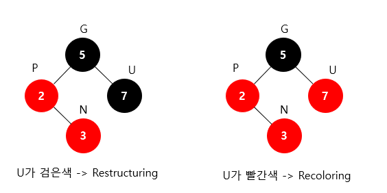
앞으로 새로 삽입할 노드를 N(New), 부모 노드를 P(Parent), 조상 노드를 G(Grand Parent), 삼촌 노드를 U(Uncle)라고 하자. 즉, 삼촌 노드는 말 그대로 부모의 형제라고 생각하면 된다. 

Double Red가 발생했을 때 
- 삼촌 노드가 검은색이라면 -> Restructuring을 수행하면 된다.
- 삼촌 노드가 빨간색이라면 -> Recoloring을 수행하면 된다.

**Restructuring**  

Restructuring은 다음 과정을 거친다.

1. 새로운 노드(N), 부모 노드(P), 조상 노드(G)를 오름차순으로 정렬한다.
2. 셋 중 중간값을 부모로 만들고 나머지 둘을 자식으로 만든다.
3. 새로 부모가 된 노드를 검은색으로 만들고 나머지 자식들을 빨간색으로 만든다.

Example  

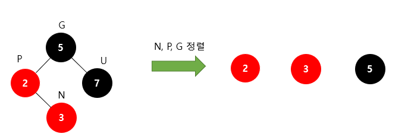
위와 같은 상황을 가정하자. Double Red가 발생했는데 삼촌 노드가 검은색이다. 따라서 Restructuring을 수행한다.
먼저 새로운 노드 N과 부모 P, 조상 G를 오름차순으로 정렬한다. 그러면 3이 중간값이 된다.

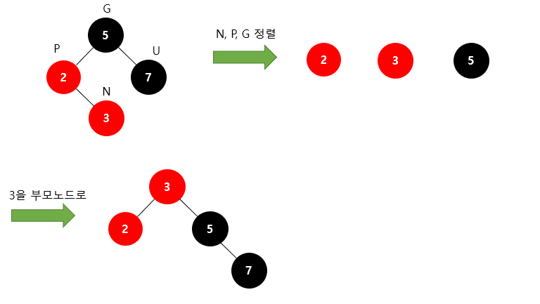
따라서 중간값인 3을 부모 노드로 바꾸고 나머지 2와 5를 자식 노드로 바꾼다.
당연히 원래 5의 자식 노드였던 7은 딸려가게 된다. 

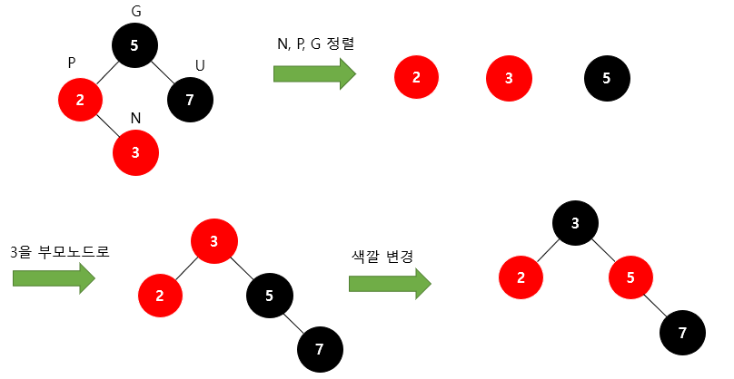
마지막으로 새롭게 부모가 된 3을 검은색으로 바꿔주고 나머지 두 자식인 2, 5의 색을 빨간색으로 바꿔주면 Double Red 문제가 해결된다!!
여기서 많이들 헷갈리는 게 완성된 트리가 규칙 3(모든 리프 노드는 검은색)을 만족하지 않는 것처럼 보일 수 있다. 값이 2인 노드는 자식 노드 NIL 2개를 가지고 있고 그 NIL들이 검은색이라고 생각하면 된다.

**Recoloring**  

Recoloring은 다음과 같은 과정을 거친다.
1. 새로운 노드(N)의 부모(P)와 삼촌(U)을 검은색으로 바꾸고 조상(G)을 빨간색으로 바꾼다.  
   1. 조상(G)이 루트 노드라면 검은색으로 바꾼다.  
   2. 조상(G)을 빨간색으로 바꿨을 때 또다시 Double Red가 발생한다면 또다시 Restructuring 혹은 Recoloring을 진행해서 Double Red 문제가 발생하지 않을 때까지 반복한다.


위와 같은 상황을 가정하자. Double Red가 발생했는데 삼촌 노드가 빨간색이다. 따라서 Recoloring을 수행한다.
먼저 부모(P)와 삼촌(U)을 검은색으로 바꾸고, 조상(G)을 빨간색으로 바꾼다.


하지만 루트 노드는 검은색이라는 조건을 지켜야 하므로, 루트 노드를 검은색으로 바꾼다.
이렇게 하면 모든 조건이 지켜지면서 Double Red 문제가 해결된다.
검은색 노드는 2번 나와도 되냐고 묻는다면 Yes이다. 빨간색 노드가 2번 나오면 안 되는 것이다. 
 
Recoloring은 간단해 보이지만 문제는 조상 노드(G)가 루트 노드가 아니면서, 조상 노드(G)가 또다시 Double Red 문제가 발생하는 경우이다.


위와 같은 상황을 가정하자. 왼쪽 트리에서 Recoloring을 진행하면 오른쪽 트리가 된다.
이때 조상 노드(G)가 또다시 Double Red가 발생하게 된다.

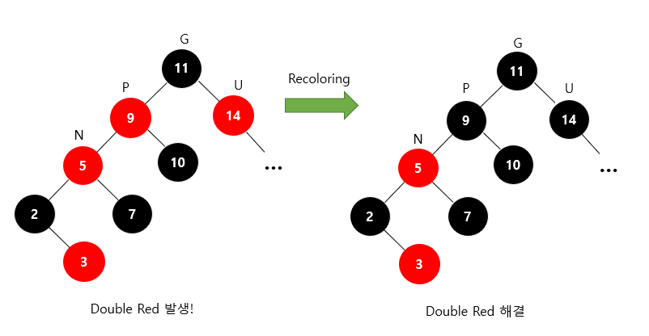
Double Red 문제가 발생한 "값이 5인 노드"를 기준으로 다시 한번 살펴보자.
해당 노드의 삼촌(U)이 빨간색이므로 다시 Recoloring을 진행해주면 Double Red 문제를 해결할 수 있다!
만약 해당 노드의 삼촌(U)가 검은색이었다면 Restructuring을 진행해주면 된다.

## 해시 탐색(Hash Search)
**방법**
Hash 함수로 key → index 변환 → 바로 접근.
**평균 시간복잡도**
O(1)

## DFS (Depth-First Search, 깊이 우선 탐색)
DFS는 그래프의 한 경로를 끝까지 탐색한 후, 더 이상 탐색할 노드가 없으면 이전 경로로 되돌아가는 방식으로 동작합니다. 스택(Stack) 자료구조나 재귀를 기반으로 구현됩니다.


## BFS (Breadth-First Search, 너비 우선 탐색)
BFS는 시작 정점에서 가까운 노드부터 순차적으로 탐색하며, 모든 인접한 노드를 탐색한 후 다음 깊이로 이동합니다. 큐(Queue) 자료구조를 기반으로 구현됩니다.

### DFS와 BFS의 유사점
- 그래프 탐색: 둘 다 그래프의 모든 정점을 탐색하기 위한 알고리즘입니다.
- 시간 복잡도: 일반적으로 두 알고리즘 모두 O(V + E)의 시간 복잡도를 가집니다.
  - V: 정점(Vertex)의 수
  - E: 간선(Edge)의 수
- 방문 처리 필요: 순환 그래프에서는 방문 여부를 기록해야 무한 루프를 방지할 수 있습니다.
- 다양한 문제 해결: 경로 탐색, 연결 요소 확인 등 그래프 관련 문제 해결에 사용됩니다.

### DFS와 BFS의 차이점

|구분|	DFS|	BFS|
|---|---|---|
탐색 방식|	한 경로를 끝까지 탐색한 후 백트래킹	|가까운 정점부터 순차적으로 탐색
자료구조|	스택(Stack) 또는 재귀(Recursion)|	큐(Queue)
구현 난이도|	재귀 호출을 사용하는 경우 간단|	큐를 명시적으로 관리해야 하므로 복잡
메모리 사용|	그래프가 넓은 경우 메모리 사용량이 적음	|그래프가 깊은 경우 메모리 사용량이 적음
최단 경로 보장|	보장하지 않음|	무가중 그래프에서 최단 경로 보장
적용 문제|	백트래킹, 퍼즐 문제, 강한 연결 요소 찾기|	최단 경로, 레벨별 탐색, 네트워크 흐름 분석

### 시간 복잡도 비교
두 알고리즘의 시간 복잡도는 동일하게 O(V + E) 입니다. 하지만 실제 성능은 그래프의 형태나 문제의 특성에 따라 달라질 수 있습니다.

DFS: 특정 경로 탐색이 필요한 문제에서 빠르게 동작합니다.
BFS: 최단 경로를 보장해야 하는 문제에 적합합니다.

### DFS와 BFS의 장단점
**DFS의 장단점**
장점:
- 백트래킹 문제에 적합
- 그래프가 넓은 경우 메모리 사용 효율적
- 구현이 간단(재귀 사용 시)
단점:
- 최단 경로를 보장하지 않음
- 순환 그래프에서 방문 처리 누락 시 무한 루프 발생 가능
 
**BFS의 장단점**
장점:
- 무가중 그래프에서 최단 경로를 보장
- 그래프의 레벨별 탐색 가능
단점:
- 큐 사용으로 인해 메모리 사용량 증가 가능
- 구현이 비교적 복잡


## 전체 탐색 알고리즘 비교 요약
| 알고리즘          | 조건         | 시간복잡도       | 비고        |
| ------------- | ---------- | ----------- | --------- |
| 선형 탐색         | 아무 배열      | O(n)        | 가장 단순     |
| 이진 탐색         | 정렬 + 랜덤 접근 | O(log n)    | 매우 빠름     |
| BST 탐색        | 정렬 구조      | 평균 O(log n) | 최악 O(n)   |
| Red-Black/AVL | 균형 트리      | O(log n)    | 항상 빠름     |
| 해시 탐색         | 해시 테이블     | 평균 O(1)     | 가장 빠름(평균) |
| DFS/BFS       | 그래프        | O(V+E)      | 구조 탐색     |


