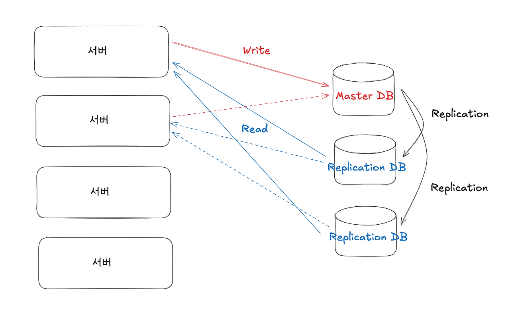
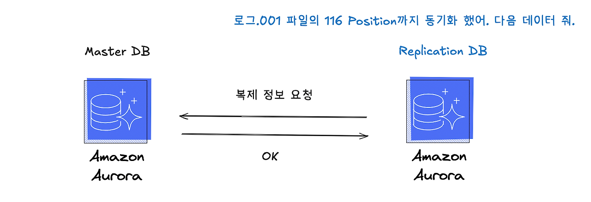
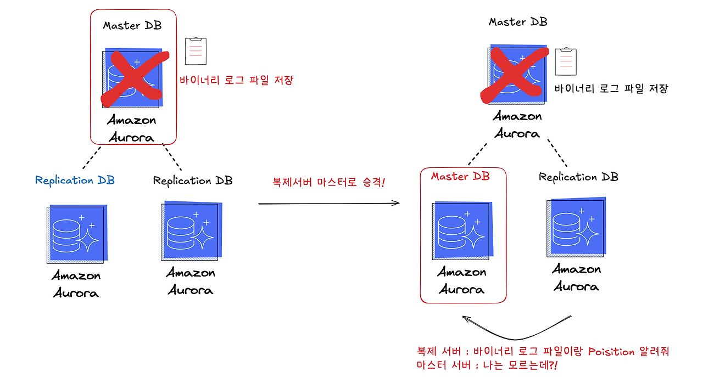
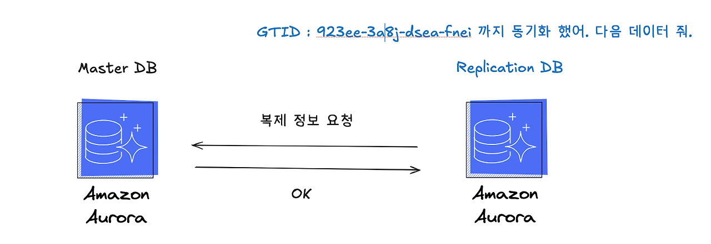
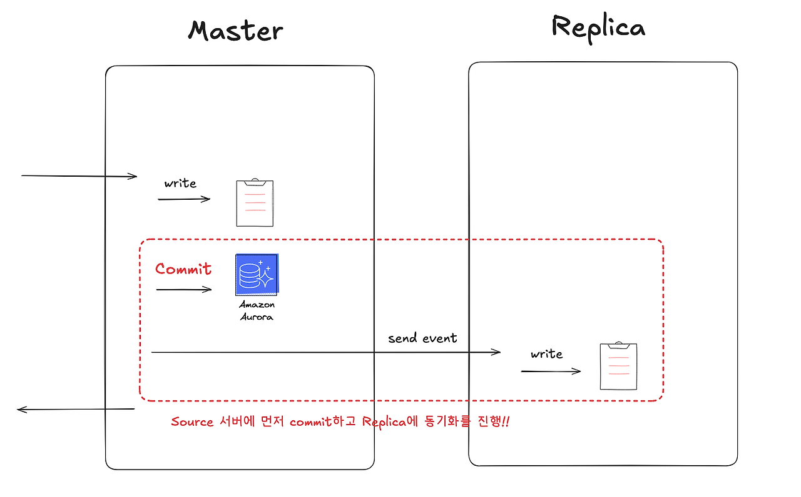
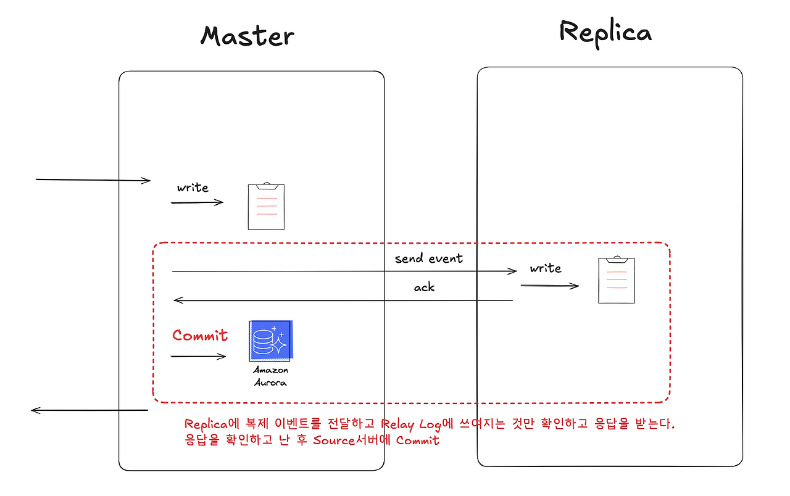
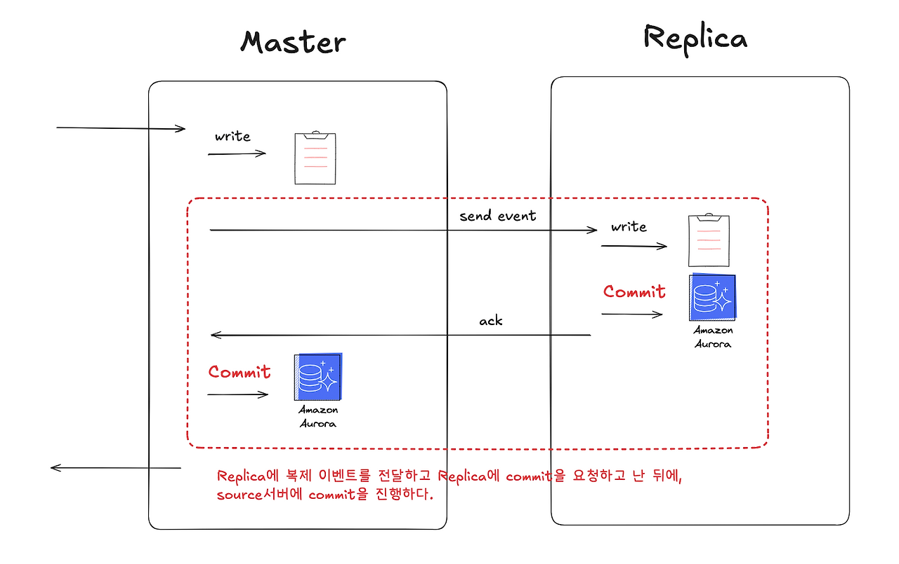
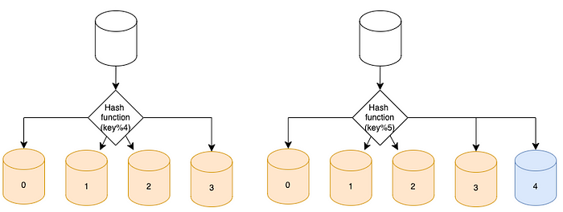

# 레플리케이션 (Replication)

Replication이란 번역하면 ‘복제’라는 뜻으로 DB를 복제한다는 뜻이다.
기준이 되는 서버를 Source(원본) 서버라 하고, Source 서버와 동일한 내용을 갖는 또 다른 서버를 Replica(복제본)라 한다.
즉, DB를 복제해서 여러 대의 DB 서버에 저장하는 방식이다.

서버에 성능을 늘리는 방법은 Scale Out, Scale In 말고도 DB Replication을 사용할 수 있다.  
보통 복제서버를 만든 다음에 원본 서버는 write-only로 해놓고 복제서버는 read-only로 사용함으로써 서버에 가해지는 부하를 분산시킨다. 

## DB Replication은 어떨까? 



이렇게 DB를 복제하고 Master DB에는 쓰기 작업만, Replication DB에는  읽기 작업만 하도록 설정할 수 있습니다. DB replication을 통해 Write-Only와 Read-Only를 분리하면 다음과 같은 주요 이점을 얻을 수 있습니다

1. 성능 향상

   - **부하 분산**: Write 작업은 Master DB에서만 처리하고 Read 작업은 Replica DB에서 처리함으로써 부하를 분산시킬 수 있습니다.
   - **읽기 성능 개선**: 읽기 요청이 Replica로 분산되면서 Master DB의 부하가 줄어들고, 읽기 작업이 병렬적으로 처리될 수 있습니다.
2. 확장성

   - 일반적으로 고부하 쿼리는 Read 작업에서 많이 발생합니다. 또한 Read 작업이 증가할 경우, Replica를 추가로 생성하여 처리 능력을 확장할 수 있습니다.
3. 가용성

   - Replica DB를 통해 읽기 요청을 처리할 수 있어, Master DB에 장애가 발생하더라도 읽기 작업은 계속 수행될 수 있습니다.
   - 여러 Replica를 두면 장애 발생 시에도 서비스 중단 시간을 최소화할 수 있습니다.
 
4. 트랜잭션 충돌 최소화

   - Master DB에서 읽기 작업을 분리하면, Write 트랜잭션과 Read 트랜잭션 간의 충돌 가능성이 줄어들어 전체 성능이 향상됩니다.

**즉, 부하분산이 아니더라도 고가용성[^1]을 얻을 수 있다는 장점이 있습니다.** 조금 더 풀어서 설명한다면, 꼭 대용량 트래픽을 받는 상황이 아니더라도 평소에도 데이터베이스 성능을 개선할 수 있고, 데이터베이스에 장애가 발생하더라도 다른 복제된 서버가 정상적으로 운영되고 있기에 장애에 대한 피해를 최소하 할 수 있습니다.


[^1]: 고가용성 = 시스템이 장애가 나더라도
서비스가 중단되지 않거나, 중단 시간이 극히 짧도록 설계된 특성

### Replication의 장점

- **select 성능 향상**
  - 대게 read 작업은 자원을 많이 소비 합니다. Replication을 구성하면 N개의 Slave를 가질 수 있기 때문에 Read에 대한 부하가 그만큼 분산 됩니다.

- **데이터 백업**
  - Master의 내용을 복제하기 때문에 데이터 베이스를 지워 먹는다고 하더라도 Slave 중 하나를 Master로 활용하면 되기 때문에 데이터를 백업하는 용도로도 사용할 수 있습니다.

### Replication의 단점

- **데이터 정합성을 보장할 수 없음**
  - Slave는 Master의 복사본을 사용하기 때문에 그것이 정말 완벽하고 할 수없습니다. 예를 들어 Slave가 Master의 쿼리 처리량을 따라가지 못한다면 데이터 정합성이 보장되지 않습니다.

- **Binary Log File 관리**
  - Master는 Binary Log가 무분별하게 쌓이는 것을 막기위해 데이터 보관 주기를 설정하지만 Master는 Slave까지 관리 않기 때문에 Master에서 Binary Log File을 삭제 했다고 Slave에서 Binary Log를 삭제하지 못합니다.

- **Fail Over 불가**
  - master에서 Error가 발생 했을 경우 Slave로 Failover하는 기능을 지원하지 않습니다. Slave 역시 Master와 Log 위치가 다르다면 관리자가 작업을 해야 합니다.

## DB 복제는 어떻게 동작하는 걸까?

MySql 복제 타입은 두 가지가 있습니다.

- **바이너리 로그 파일 위치 기반 복제** : 파일명과 위치를 기반으로한 물리적인 방식
- **글로벌 트랜잭션 아이디 기반 복제** : 유니크한 식별자 매핑을 통한 놀리적인 방식

### 복제 방식 : 바이너리 로그 파일 위치 기반 복제 



해당 방식은 특정 바이너리 로그 파일과 position의 조합 타입으로 복제 정보를 요청한다.
즉 파일의 어느 위치까지 읽었는지 기록하는것이다.



하지만 바이너리 로그 파일 위치 기반 복제는 **마스터 서버에 장애가 발생했을때 문제가 발생할 수 있습니다.** 장애가 발생하기전 마스터 서버에만 바이너리 로그 파일을 소유하고, 장애 발생으로 인해 레플리카 서버가 마스터로 승격하였을때, 해당 마스터 서버에는 바이너리 로그 파일을 가지고 있지 않는 동기화 이슈가 있습니다. 즉, 특정 복제 이벤트가 다른 데이터베이스에서 동일한 위치에 저장되는 것이 보장되지 않습니다. 따라서 장애가 발생하면 오히려 데이터 복구를 어렵게 만들수 있습니다.

### 복제 타입 : 글로벌 트랜잭션 아이디 기반 복제 



글로벌 트랜잭션 아이디 기반 복제는 복제 시스템 내의 모든 DB가 복제 이벤트를 동일하게 식별할 수 있는 방식 입니다. GTID를 사용하게 되면 모든 데이터베이스에서 하나의 이벤트를 동일한 식별자로 알 수 있게 된다. 따라서 장애 상황에서도 유연하게 대처가 가능합니다.

각 트랜잭션에 전역적으로 유일한 ID를 부여하여 트랜잭션 실행 여부를 기준으로 복제를 수행한다.

( ** GTID : 복제 시스템 내에 모든 DB가 공유하는 유니크한 트랜잭션 ID)


## 복제 동기화 방식

복제 동기화 방식에는 크게 3가지가 있습니다.

1. 비동기 복제 방식
2. 반동기 복제 방식
3. 동기 복제 방식

### 비동기 복제 방식



Primary(DB 원본) 이 먼저 쓰기를 완료하고,
Replica(DB 복제본) 는 나중에 따라간다.

### 반동기 복제 방식



Primary가 쓰기를 완료한 뒤,
최소 1개 이상의 Replica가 수신했다는 응답을 받아야 커밋 완료.

### 동기 복제 방식



Primary와 Replica 모두에 쓰기가 완료되어야
클라이언트에게 성공 응답을 보냄.

### 복제 지연에 대한 이슈

Relicas 서버에 데이터를 복제할때 동기방식이 아니라면 복제 지연이 발생할 수 밖에 없습니다. 

- 비동기 방식 : 복제지연 발생 
- 반동기 방식 : 복제지연 발생
- 동기 방식 : 복제지연 없음

일반적으로 DB Replication 구조를 사용하게 된다면 Master DB는 쓰기 전용, Replica는 읽기 전용으로 사용하게 된다. 그렇다면 내가 데이터베이스에 값을 저장하고 그 값을 읽으려고 하는데, 복제에 4초가 걸린다면, 내가 읽으려고 하는 값은 Replica DB에 없을 것이다. 이러한 문제를 **복제 지연** 이라고 한다. 

# 샤딩 (Sharding)

샤딩은 대규모 데이터베이스를 샤드(shard)라고 부르는 작은 단위로 분할하는 기술을 말한다. 즉, 데이터베이스에서 부하 분산을 위해 다수의 데이터베이스에 데이터를 분산 저장하는 기법이다.  모든 샤드는 같은 스키마를 쓰지만 샤드에 보관되는 데이터 사이에는 중복이 없다. 


샤딩은 Scale-in 과 같은 Horizontal Partitioning이라고 볼 수 있다.

## 샤딩(Sharding)을 적용하기에 앞서.

- 샤딩(Sharding)을 적용한다는것은?
  - 프로그래밍, 운영적인 복잡도는 더 높아지는 단점이 있습니다.
- 가능하면 Sharding을 피하거나 지연시킬 수 있는 방법을 찾는 것이 우선되어야 합니다.
  - Scale-in
    - Hardware Spec이 더 좋은 컴퓨터를 사용합니다.
  - Read 부하가 크다면?
    - Cache나 Database의 Replication을 적용하는 것도 하나의 방법입니다.
  - Table의 일부 컬럼만 자주 사용한다면?
    - Vertically Partition도 하나의 방법입니다.
    - Data를 Hot, Warm, Cold Data로 분리하는 것입니다. 

### 데이터베이스 샤딩의 장점

**데이터 처리 속도 및 처리량 향상**

장 큰 장점으로 데이터 처리 속도 및 처리량 향상입니다. 샤딩을 통해 데이터를 여러 서버에 분산 저장 함으로써, 단일 서버에 집중되는 부하를 줄이고 전체 시스템의 처리량과 속도를 증가시킬 수 있습니다.분할된 데이터가 여러 서버에 분산 저장되어 있으므로 병렬 처리가 가능해지며 데이터베이스의 응답 시간이 감소하여 데이터베이스의 읽기와 쓰기 성능이 개선됩니다.
 
**탈중앙화를 통한 안정성과 보안성 향상**
분할된 각 샤드는 독립적으로 운영되며, 한 샤드의 장애가 전체 시스템에 영향을 미치지 않습니다. 바이러스 및 해킹으로 부터 보안성을 확보하고 시스템의 안정성과 가용성을 향상시킬 수 있습니다. 또한 독립적으로 운영됨에 따라 유지 보수와 관리를 용이하게 합니다. 특정 샤드의 백업, 복구, 업그레이드 작업이 다른 샤드에 영향을 미치지 않습니다. 

### 데이터베이스 샤딩의 단점

**복잡성**
샤딩은 데이터 처리 속도를 높여 효율성을 증가시키지만 여러 서버에 데이터가 분산되어 있기 때문에 데이터를 조합하고 찾는 과정은 매우 복잡합니다. 데이터 하나를 출력하기 위해 여러 개의 노드가 서로 정보를 공유하는 과정이 필요합니다. 
 
**데이터 처리 지연**
샤드 간 통신이 빈번해지면 오히려 데이터 처리가 지연되는 경우가 있습니다. 시스템 전체적인 안정성은 샤딩을 통해 강화할 수 있으나 샤드 간 불균형이 일어나 저장 데이터 비율이 자주 변화한다면 재배치가 발생할 수 있습니다. 이 과정에서 트래픽까지 증가한다면 샤딩을 최적화 하는 것에 최선을 다해야 합니다. 
 
위와 같은 샤딩의 문제점을 해결하기 위해서는 샤드의 수를 늘리는 스케일업 작업이 대표적입니다. 또한 샤딩이 최적화 되어 있는지 주기적으로 검토하고 적절한 샤드 키의 선택, 데이터 분산의 복잡성, 샤드간 데이터 일관성 유지 등 많은 것들을 고려하여 적용하여야 합니다. 

## 샤딩(Sharding) 종류

Shard Key를 어떻게 정의하느냐에 따라 데이터를 효율적으로 분산시키는 것이 결정됩니다.

### Range sharding 

샤드 증설 시 데이터 재분배가 필요없고 가장 마지막 샤드에 키를 넉넉히 설정한 후, 필요 시점에 샤드를 증설합니다. 그러나 Range Sharding은 활성 레코드가 많은 특정 샤드(Hot Spot)에 부하가 몰릴 수 있는 문제점이 있습니다.


### Hash based Sharding

샤드 키를 해시 함수를 통해 분배하는 방법입니다. 주로 Modular 연산을 해시 함수로 사용하며 비교적 고르게 분배할 수 있습니다. 하지만 샤드 추가시 레코드의 재분배가 발생하는 과정이 필요합니다. 보통 두배수로 늘려 이동해야 하는 레코드를 최소화 합니다.(두 배로 늘릴 경우 하나의 샤드가 반으로 분할되기만 하면됨.)



### Composite Sharding

Range + Hash Sharding을 복합적으로 사용합니다. 

crc32(key) % 65535;# 0 ~ 8191 => 샤드1 # 8192 ~ 16383 => 샤드2# 16384 ~ 24575 => 샤드3 # 24576 ~ 32767 => 샤드4# 32768 ~ 40959 => 샤드5 # 40960 ~ 49151 => 샤드6# 49152 ~ 57343 => 샤드7 # 57344 ~ 65535 => 샤드8

위 경우에는 샤드 증감이 조금 더 수월해집니다. Modular의 경우 샤드를 둘로 쪼갤 키 집합이 순차적이지 않으나 이 경우엔 Range를 반으로 분할하면 됩니다. 마찬가지로 합치는 것도 둘을 하나로 합치면 됩니다. 

## 샤딩 운영 전략

### 다이나믹 샤딩 (Dynamic Sharding)

샤드 수·샤드 배치를 서비스 중단 없이 동적으로 변경할 수 있는 샤딩 방식
핵심은 “샤딩 전략이 고정되어 있지 않다”는 점이다.

정적 해시 샤딩의 치명적 문제
```
hash(key) % N
```
- N이 바뀌면?
→ 거의 모든 데이터가 재배치
- 실서비스에서 사실상 불가능

#### 핵심 구성요소 3개

1. 샤드 메타데이터

   - “이 키는 어느 샤드에 있다”를 관리

2. 유연한 라우팅

   -  hash % N 같은 고정 수식 X

3. 점진적 데이터 이동

   -  한 번에 옮기지 않음

### 엔티티 그룹 (Entity Group)

항상 같은 샤드에 같이 있어야 하는 엔티티들의 논리적 묶음

샤딩에서 가장 어려운 문제는 이거다:
샤드가 나뉘면 트랜잭션은 어떻게 하지?
엔티티 그룹은 이 문제를 풀기 위한 개념이다.

#### 왜 필요한가?

- 샤드 내부 트랜잭션 → 빠르고 안전
- 샤드 간 트랜잭션 → 매우 비쌈/복잡

그래서 설계할 때 같이 써야 하는 애들은 같은 샤드에 둔다


