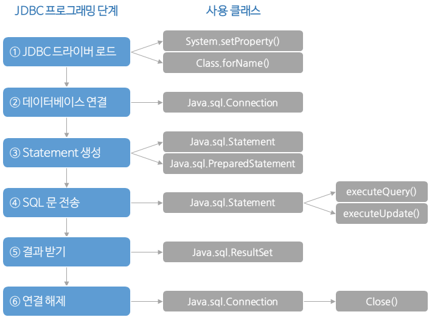
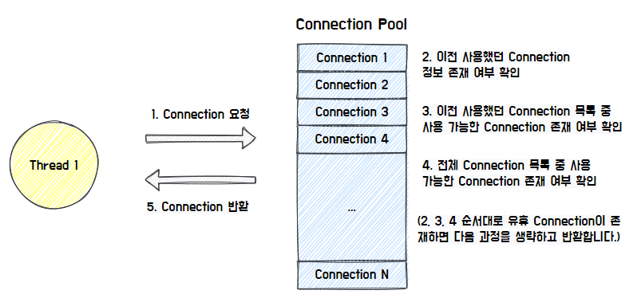
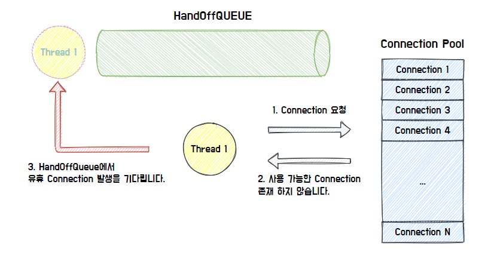
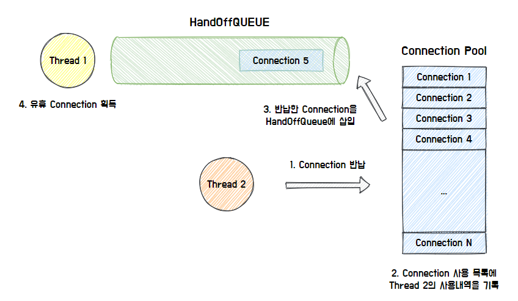

# 커넥션 풀 (Connection Pool)

## DB Connection

DB Connection 이란 애플리케이션과 데이터베이스 서버가 통신할 수 있도록 하는 기능이다.

### Connection 객체가 반환되는 과정

1. **DB 드라이버 로드**: 우선 사용하려는 DB 에 해당하는 `JDBC 드라이버`를 로드해야 한다.
2. **DB 연결 정보 설정**: 연결하려는 DB 의 URL, 사용자 이름, 비밀번호 등의 연결 정보를 설정한다.
3. **Connection 객체 생성**: `DriverManager` 클래스를 사용하여 DB 와 연결 하고, 이 연결을 나타내는 `Connection` 객체를 얻는다.

>**(참고) jdbc 드라이버란**
자바가 다양한 데이터베이스를 지원할 수 있는 이유는 각 데이터베이스에 맞는 JDBC 드라이버가 구현되어 있기 때문이다.
이 드라이버는 Java 애플리케이션과 각 DB 간의 통신을 중개하여, 동일한 JDBC API 를 사용하여도 각 DB에 적합한 프로토콜로 요청을 전달하고 응답을 받을 수 있다.
즉, DBMS 종류(MySQL, MsSQL, Oracle 등)에 상관 없이 하나의 JDBC API를 사용해서 데이터베이스 작업을 처리할 수 있게 된다. 

#### JDBC 실행 과정

1. DB 벤더에 맞는 드라이버 로드
2. DB 서버의 IP, ID, PW 등을 DriverManager 클래스의 getConnection() 메소드를 사용하여 Connection 객체 생성
3. Connection에서 PreparedStatement 객체를 받음
4. executeQuery를 수행하고 ResultSet 객체를 받아 데이터를 처리
5. 사용하였던 ResultSet, PreparedStatement, Connection을 close

### Connection 이후

1. **Connection 객체 사용**: 반환된 Connection 객체를 사용하여 DB 관련 작업(쿼리 실행, 트랜잭션 관리 등)을 수행한다.
2. **연결 종료**: DB 작업을 마치면 Connection 객체를 명시적으로 닫아야 한다. 리소스 누수를 방지하고 DB 연결을 제대로 해제하기 위함이다.

<u>**그런데 DB 를 연결할 때마다 Connection 객체를 새로 만드는 것은 비용이 많이 들고 비효율적이다.**</u>

1. **네트워크 비용**: DB 연결을 설정하는 과정은 네트워크 통신을 동반한다.
새로운 Connection 객체를 생성할 때마다 DB 서버와의 네트워크 연결을 해야 하며, 이 과정은 일정 시간이 소요된다.
따라서 빈번한 Connection 생성은 불필요한 네트워크 비용을 발생시킨다.
2. **리소스 사용**: 각 Connection 객체는 DB 서버의 연결 세션을 나타낸다. DB 서버는 동시에 처리할 수 있는 연결 세션 수에 제한이 있으며, 무분별한 Connection 생성은 서버 리소스를 소모할 수 있다.
3. **비용적 측면**: Connection 객체 생성은 시간과 메모리를 소모한다.
특히 DB 연결 설정 및 인증 과정은 비용이 큰 작업이다.

## DB Connection Pool

위에서 살펴본 Connection 객체의 반복적인 생성과 해제를 피하고, 효율적으로 데이터베이스 연결을 관리하기 위해 Connection 풀링이 사용된다.

간단하게 말하자면, 애플리케이션 시작 시 미리 일정 수의 Connection 객체를 생성하여 Pool 에 보관한다. 이후에 DB 작업이 필요할 때마다 Pool 에서 Connection 객체를 가져다 사용하고, 작업이 끝나면 Pool 에 반환한다

### 커넥션 풀(DBCP)의 동작 원리

- Thread가 Connection을 요청하면 Connection Pool의 각자의 방식에 따라 유휴 Connection을 찾아서 반환한다. Hikari CP의 경우, 이전에 사용했던 Connection이 존재하는지 확인하고, 이를 우선적으로 반환하는 특징이 있다.

- 가능한 Connection이 존재하지 않으면, HandOffQueue를 Polling하면서 다른 Thread가 Connection을 반납하기를 기다린다. (지정한 TimeOut 시간까지 대기하다가 시간이 만료되면 예외를 던진다.)

- 최종적으로 사용한 Connection을 반납하면 Connection Pool이 Connection 사용 내역을 기록하고, HandOffQueue에 반납된 Connection을 삽입한다.
- 이를 통해 HandOffQueue를 Polling하던 Thread는 Connection을 획득하고 작업을 이어나간다.

### Connection Pool 의 장점

1. **성능 향상**: 미리 연결된 DB 연결을 Pool 에 유지하고, 요청이 들어올 때마다 해당 연결을 재사용함으로써 응답 시간을 단축하고 애플리케이션의 성능을 향상시킨다.
2. **자원 관리**: 연결을 생성하고 유지하는 데 필요한 자원을 최적화한다. 불필요한 연결을 만들지 않고, 연결을 재사용함으로써 메모리와 CPU 등의 자원을 효율적으로 관리할 수 있다.
3. **동시성 관리**: 동시에 여러 요청을 처리할 수 있는 연결을 제공하므로, 다수의 사용자가 동시에 애플리케이션에 접속해도 안정적으로 처리할 수 있다.
4. **연결 풀링**: 연결의 개수를 제한하고, 초과하는 요청이 들어올 경우 대기하도록 처리함으로써 데이터베이스 서버의 부하를 관리하고 과부하를 방지한다.
5. **커넥션 오버헤드 감소**: 반복적인 데이터베이스 연결/해제 작업에 따른 오버헤드를 감소시킨다.

### Connection Pool 의 단점

1. **리소스 사용**: 일정 수의 연결을 미리 생성 및 유지해야 하므로, 메모리 등의 리소스를 일정 부분 소비한다.
2. **설정 및 관리의 복잡성**: 다양한 환경에서 최적의 성능을 발휘하기 위해서는 일정한 관리와 모니터링이 필요하다. 설정 파라미터의 조절이 필요한 경우에는 초기 설정 및 튜닝에 시간이 소요될 수 있다.
3. **커넥션 누수**: 애플리케이션에서 연결을 올바르게 반환하지 않거나 예외가 발생하는 경우, 커넥션 풀에서 연결이 제대로 반환되지 않을 수 있다. 이 경우 커넥션 누수가 발생할 수 있다.

### Connection Pool 이 커지면 성능이 무조건 좋아질까?

#### 커넥션 풀을 크게 설정하면
많은 메모리를 사용하지만, 동시에 많은 사용자가 대기 시간이 줄어들어 성능이 향상될 수 있다.

#### 커넥션 풀을 작게 설정하면
메모리 소모는 줄어들지만, 동시 접속자가 많아지면 대기 시간이 길어질 수 있다.
따라서 커넥션 풀의 크기를 적절히 조절하여 최적의 성능을 유지해야 한다.

### Connection Pool 의 적절한 크기

1. **시스템 리소스 및 성능 모니터링**: 시스템의 리소스 사용량과 성능을 모니터링하여 커넥션 풀의 최적 크기를 결정해야 한다.
   - ex) 메모리 사용량, CPU 부하, 네트워크 성능 등
2. **부하 예측과 테스트**: 애플리케이션의 부하 예측을 토대로 커넥션 풀의 크기를 조절하고, 실제 동작하는 환경에서 테스트하여 최적의 성능을 확인해야 한다.

