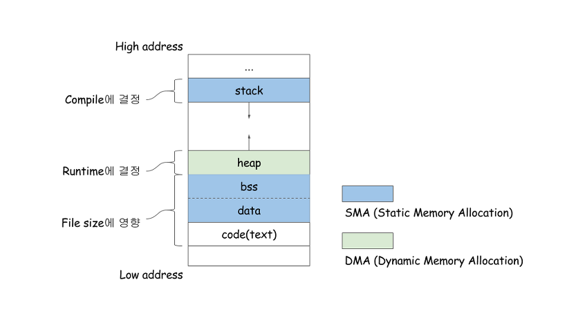

# 프로세스
### 프로세스란?
- 컴퓨터에서 실행되고 있는 프로그램들은 모두 프로세스
- 운영체제 프로세스와 사용자 프로세스로 분류
- 프로세스는 각각 독립된 메모리 영역(Code, Data, Stack, Heap의 구조)을 할당받음
- 기본적으로 프로세스당 최소 1개의 스레드를 가지고 있음
- 각 프로세스는 별도의 주소 공간에서 실행, 한 프로세스는 
- 다른 프로세스의 변수나 자료구조에 직접 접근 불가
- 다른 프로세스의 자원에 접근하려면 IPC[^1](Inter-Process - Communication)을 사용해야 함
(파이프, 파일, 소켓 등을 이용한 통신 방법)  
### 프로세스의 메모리구조
 

- 코드 영역 : 실행할 프로그램의 코드가 저장되는 영역으로 텍스트 영역이라고도 함
CPU는 코드 영역에 저장된 명령어를 하나씩 처리 
- 데이터 영역 : 메모리의 데이터 영역은 프로그램의 전역 변수와 정적변수가 저장되는 영역
프로그램 시작과 함꼐 할당되고, 종료되면 소멸 
- 힙 영역 : 사용자가 직접 관리할 수 있고, 관리 해야만 하는 메모리 영역
사용자에 의해 동적으로 할당되고 해제됨
낮은 주소에서 높은 주소의 방향으로 할당 
- 스택 영역 : 함수의 호출과 관련된 지역 변수와 매개변수가 저장
함수의 호출과 함께 할당, 함수 호출 완료 후 소멸
스택 영역에 저장되는 함수 호출 정보를 스택 프레임이라고 함  
[^1]: 이게ipc지