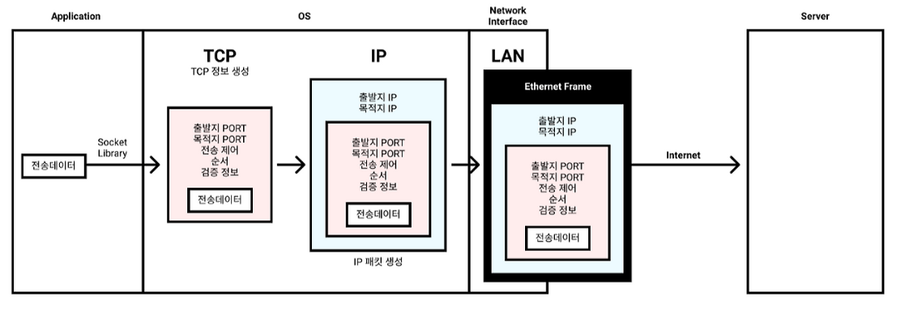
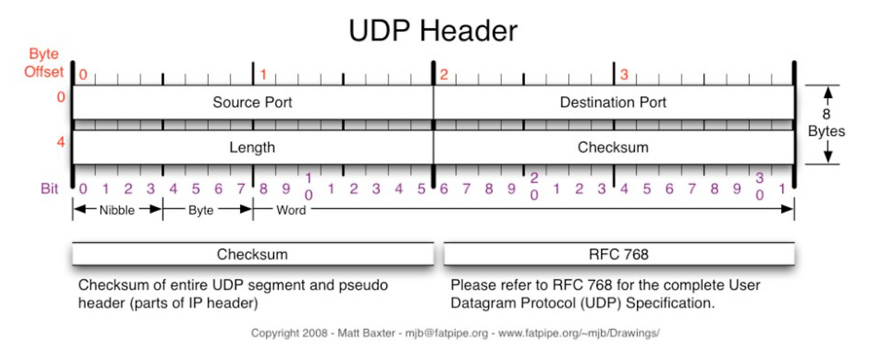

# TCP와 UDP
### 전송계층(Transport Layer)의 역할
“프로세스 간(end-to-end) 데이터 전달을 책임지는 계층”
- IP(Internet Protocol)가 인터넷 프로토콜로서 복잡한 인터넷 망 속에서 클라이언트와 서버 간에 통신할 수 있게 IP 주소와 패킷과 같은 규칙을 통해 통신을 하게 하는 것이라면, 
- TCP(Transmission Control Protocol)는 IP 규칙으로만 통신하기에 부족하거나 불안정하던 여러 단점들(패킷 순서가 이상하거나 패킷이 유실)을 커버해, 패킷 전송을 제어하여 신뢰성을 보증하는 프로토콜로 보면 된다.

- 신뢰성, 흐름 제어, 오류 제어 등의 기능을 제공한다.
- 데이터 단위: 세그먼트(Segment) (TCP) / 데이터그램(Datagram) (UDP)

### TCP와 UDP의 개요 비교
| 항목         | **TCP**                                 | **UDP**                   |
| ---------- | --------------------------------------- | ------------------------- |
| **풀네임**    | Transmission Control Protocol           | User Datagram Protocol    |
| **연결 방식**  | 연결 지향형 (3-way handshake)                | 비연결형                      |
| **전송 보장**  | 있음 (재전송, 순서 보장)                         | 없음 (손실 가능)                |
| **순서 보장**  | 있음                                      | 없음                        |
| **오류 검출**  | 있음 (Checksum)                           | 있음 (Checksum)             |
| **흐름 제어**  | 있음 (Sliding Window)                     | 없음                        |
| **혼잡 제어**  | 있음 (Slow Start, Congestion Avoidance 등) | 없음                        |
| **속도**     | 느리지만 안정적                                | 빠르지만 불안정                  |
| **헤더 크기**  | 20~60바이트                                | 8바이트                      |
| **대표 서비스** | HTTP(S), FTP, SMTP, SSH                 | DNS, DHCP, VoIP, 스트리밍, 게임 |

## TCP (Transmission Control Protocol)
신뢰성 있는 연결형(connected) 프로토콜로,
데이터 손실이나 순서 뒤바뀜 없이 정확히 도착하도록 보장한다.

### TCP의 데이터 전송과정


1. 전송 데이터를 TCP 포장한다. (TCP Segment)   
2. 포장한 데이터를 IP 포장한다. (IP Packet)   
3. 포장한 전송데이터를 이더넷 포장한다. (Freame)
4. 인터넷을 통해 상대 컴퓨터 서버에 도달하여 포장된걸 하나씩 풀며 전송데이터를 받게된다.

### 핵심 기능
| 기능                             | 설명                                  |
| ------------------------------ | ----------------------------------- |
| **연결 설정/해제**                   | 3-way handshake / 4-way termination |
| **데이터 순서 보장**                  | 시퀀스 번호(Sequence Number)             |
| **데이터 무결성 확인**                 | ACK 응답 (Acknowledgement)            |
| **흐름 제어 (Flow Control)**       | 수신 버퍼 크기 기반 슬라이딩 윈도우                |
| **혼잡 제어 (Congestion Control)** | 네트워크 혼잡 시 전송 속도 자동 조절               |
| **오류 제어 (Error Control)**      | 손실 세그먼트 재전송, 중복 ACK 감지              |

### 3-Way Handshake (연결 설정)


1. 클라이언트 → 서버 : 연결 요청 (SYN)
   - 통신을 요청하는 쪽에서는 랜덤으로 Sequence number을 생성한다. 
2. 서버 → 클라이언트 : 요청 수락 (SYN+ACK)
   - 서버도 요청을 받은 뒤에는 자신도 Sequence number을 만들어 보낸다.
3. 클라이언트 → 서버 : 확인 응답 (ACK)
   - 그러면 마지막으로 클라이언트가 서버의 넘버 + 클라이언트 넘버 + 1을 해서 서버에 ACK에 전달한다.

>주의할 점  
Client는 서버로부터 Sequence number을 받은 시점에서 부터 연결되었다고 판단하고  
서버는 Client로 부터 ACK를 받은 시점에 연결되었다고 판단한다는 것이다.   

>연결할때는 Segmanet가 전달되는데 단순 연결, 관리 목적의 Segment이기 때문에 Payload가 존재하지 않는다.  
또한 Seq번호를 교환할 때 정책교환도 같이한다. 이때 Maximum segment size(MSS)도 교환한다.

### 4-way handshaking (연결 종료)


특별한 이유가 없다면 보통 Client가 연결과 연결종료를 주도한다.

1. 연결을 끊겠다고 Client가 FIN를 보내고 자신의 상태를 FIN_WAIT1으로 바꾼다.
2. 그러면 요청을 받은 서버가 클라이언트의 종료 요청을 수락하면서  ACK를 보낸고 자신의 상태를 CLOSE_WAIT1으로 바꾼다.
3. ACK를 받은 Client는 FIN_WAIT2 상태로 바뀐다.
4. 이후에 Server측에서 FIN를 보내고 자신의 상태를 LAST_WAIT로 바꾼다.
5. 이후에 Client는 ACK를 보낸 뒤 TIME_WAIT상태에 들어갔다가 일정 시간이 지나면 종료된다.
6. 마지막 ACK를 받은 서버는 신호를 받고 종료된다.

> socket은 중요한 자원이기 때문에 Server는 TIME_WAIT[^1]를 하게 설정하면 안된다.  
> 서버에 Time_Wait가 쌓이면 포트가 점유되어있으므로 새 연결을 만들 수 없다.

### TCP Segment 구조


| 필드 이름 | 역할 |
| --- | --- |
| **Source Port** | 데이터를 보내는 쪽의 포트 번호 |
| **Destination Port** | 데이터를 받는 쪽의 포트 번호 |
| **Sequence Number** | 송신 측이 보낸 **데이터의 순서**를 나타냄 (바이트 단위) |
| **Acknowledgment Number** | 수신 측이 다음에 받고자 하는 **기대 바이트 번호** (즉, 이전까지는 잘 받았다는 뜻) |
| **HLEN (Header Length)** | TCP 헤더의 길이 (4비트, 단위는 32비트 word) |
| **RSVD (Reserved)** | 예약 필드 (현재는 사용되지 않음, 0으로 설정) |
| **Flags** (Control Bits) | 다양한 제어 기능: |
| - **URG** | Urgent pointer 사용 여부 |
| - **ACK** | Acknowledgment number 유효 여부 |
| - **PSH** | Push function – 데이터를 즉시 애플리케이션으로 전달 |
| - **RST** | 연결 강제 초기화 |
| - **SYN** | 연결 설정 시작 |
| - **FIN** | 연결 종료 요청 |
| **Window Size** | 수신 측이 받을 수 있는 **남은 버퍼 크기 (Flow Control)** |
| **Checksum** | **TCP 헤더 + 데이터의 오류 검출**을 위한 값 |
| **Urgent Pointer** | URG 플래그가 켜져 있을 때, **긴급 데이터의 끝 위치**를 알려줌 |
| **Options** | MSS, 윈도우 스케일, 타임스탬프 등 **추가 기능**을 위해 사용됨 (가변 길이) |

## UDP (User Datagram Protocol)
“빠르지만 믿을 수 없는” 비연결형 프로토콜
송신자는 그냥 보내고, 수신자는 받을 수 있으면 받는 구조.

### 주요 특징
| 항목                     | 설명                                       |
| ---------------------- | ---------------------------------------- |
| **비연결형**               | handshake 없음 → 즉시 전송 가능                  |
| **신뢰성 보장 없음**          | 재전송/순서보장 없음                              |
| **헤더 단순 (8바이트)**       | Source Port, Dest Port, Length, Checksum |
| **낮은 지연(Low Latency)** | 실시간 통신에 적합                               |
| **브로드캐스트/멀티캐스트 가능**    | 네트워크 그룹 송신 가능                            |

### UDP가 사용되는 곳
| 서비스                       | 이유                 |
| ------------------------- | ------------------ |
| **DNS**                   | 요청-응답이 작고 빠름       |
| **VoIP / 화상통화**           | 약간 손실돼도 실시간성이 더 중요 |
| **스트리밍(YouTube, Twitch)** | 빠른 전송, 약간 손실 허용    |
| **게임**                    | 실시간 위치 갱신, 지연 최소화  |
| **DHCP**                  | 단순 브로드캐스트 기반 통신    |

“한두 개 패킷이 손실돼도 괜찮은” 서비스에서 UDP가 유리하다.

> DNS가 계층구조를 사용하는 이유는 전 세계 모든 도메인을 한 서버가 관리한다는 것은 불가능 하기 때문이다. 따라서 여러 DNS서버가 분산하여 작업하며, 이름충돌도 방지할 수 있다.
> ```
>naver.com
>naver.net
>naver.co.kr
>```
>또한 계층별로 나누어져 있기 때문에 빠르게 탐색이 가능하다.


### UDP 헤더


UDP의 헤더는 매우 단순하다.  

### TCP를 버리고 UDP를 선택한 HTTP 3.0
학부에서는 아무래도 TCP는 인터넷 통신에서 필수적으로 쓰이는 녀석이라 자세히 배우고, UDP는 빠르다 정도로 간단히 배우고 휙 넘어가버리는 모양인데, 이제는 그럴수가 없다. 위의 제목에서와 같이 HTTP/3 에서는 TCP를 버리고 UDP를 채택했기 때문이다.

TCP는 구조상의 한계로 개선해도 여전히 느리다.  
그러나 UDP는 빠르다. 신뢰성이 없다고 알려져있지만 탑재가 안되어있는 것 뿐이다.  
UDP는 커스터마이징이 가능하기 때문에 구현을 어떻게 하느냐에 따라 TCP와같은 신뢰성을 가질수도 있다.

[^1]: 연결이 완전히 종료되기 전에 남아있을지도 모르는 지연 패킷(delayed packet) 을 정리하고, 상대방이 FIN에 대한 ACK을 못 받았을 경우 재전송을 허용하기 위해 존재하는 상태.
