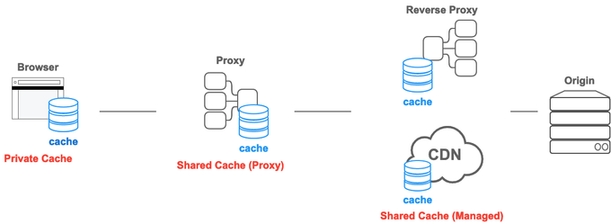

# 프록시 (Proxy)

Proxy = 클라이언트와 서버 사이에 끼어서 HTTP 요청/응답을 중계하는 중간 서버.

>💡 클라이언트와 서버 사이에 프록시 서버가 존재하면, 클라이언트가 호출하는 엔드포인트는 프록시 서버가 되는 건가?
>- 프록시를 사용하면 클라이언트는 프록시 서버로 요청을 보내야 합니다. 프록시 서버는 이러한 요청을 받아 실제 서버로 전달하고, 서버의 응답을 다시 클라이언트에게 전달합니다.
>- 이를 통해 클라이언트는 직접 서버와 통신하지 않고, 프록시 서버를 통해 간접적으로 통신하게 됩니다.
>- 단, DNS를 이용하면 프록시 서버의 역할을 보다 간편하게 수행할 수 있습니다. DNS를 통해 도메인 이름을 프록시 서버의 IP 주소로 매핑하면, 클라이언트는 별도의 설정 변경 없이도 프록시 서버를 통해 통신할 수 있습니다.

>💡 프록시 서버가 AWS Gateway랑 비슷한 역할을 하는 거 같은데 똑같은 거야?
>- 둘 다 요청을 중계하고 보안을 강화하며 로드 밸런싱과 캐싱 등의 기능을 제공합니다.
>- AWS Gateway는 주로 API 요청을 관리하고 게이트웨이 서비스로서의 역할을 수행하는데 주력합니다.프록시는 다양한 네트워크 트래픽을 중계하고, 웹 브라우징, 콘텐츠 필터링, 접근 제어 등 더 넓은 범위의 기능을 제공합니다.

## 프록시 서버의 이점

1. 보안 강화

- 사용자의 IP 주소를 숨기고 익명성을 제공하므로, 사용자의 개인 정보를 보호할 수 있습니다.
- 예를 들어, 사용자가 카페에서 공용 WI-FI를 이용하여 인터넷에 접속할 때, 프록시 서버를 통해 접속하면 실제 IP 주소가 숨겨져 개인 정보가 보호가 됩니다.

2. 캐싱

- 자주 요청되는 데이터를 캐시에 저장하여, 빠른 응답을 제공합니다. 이를 통해 네트워크 트래픽을 줄이고, 서버의 부하를 감소시킬 수 있습니다.
- 예를 들어, 자주 방문하는 사이트의 데이터를 캐싱하면, 다음번에 사이트에 접속할 때 더 빠르게 로딩이 됩니다.

3. 콘텐츠 필터링

- 조직이나 학교에서는 프록시 서버를 사용하여 특정 웹사이트나 콘텐츠에 대한 접근을 제한할 수 있습니다.
- 예를 들어, 회사의 IT 관리자들이 프록시 서버를 설정하여 직원들이 업무 시간 동안 소셜 미디어 사이트에 접속하지 못하도록 할 수 있습니다.

4. 접근 제어

- 네트워크 접근을 제어하고 모니터링할 수 있는 기능을 제공합니다. 이를 통해 비정상적인 트래픽을 감지하고 차단할 수 있습니다.
- 예를 들어, 회사에서 프록시 서버를 사용하여 특정 직원만 특정 데이터베이스 접근 할 수 있도록 설정할 수 있습니다.

5. 로깅 및 모니터링

- 모든 요청과 응답을 기록하여, 네트워크 사용 현황을 모니터링하고 분석할 수 있는 기능을 제공합니다.
- 예를 들어, IT 관리자가 프록시 서버 로그를 분석해서 사용자가 어떤 웹 사이트에 방문했는지 확인하고 불법적인 사이트에 접근하지 못하도록 차단 할 수 있습니다.

6. ACL (Access Control List)

- 액세스 제어 목록을 사용하여 특정 사용자나 그룹의 네트워크 리소스에 대한 접근을 세밀하게 제어할 수 있습니다.
- 회사에서 프록시 서버를 사용하여 관리자 그룹만 중요한 파일 서버에 접근 할 수 있도록 설정할 수 있습니다.

## 프록시의 종류

표준 정의(RFC 7230)에서는 프록시를 다음 두 가지 역할로 구분한다.

- Forward Proxy (정방향 프록시)
- Reverse Proxy (역방향 프록시)

### Forward Proxy

**1) 정의**

Forward Proxy는 클라이언트 앞에 위치하며,
클라이언트는 실제 서버에 직접 요청하지 않고 프록시에게 요청을 전부 대신 보낸다.

대표적 예: 회사/학교 프록시, VPN의 일부 구성

**2) 구조**

```
Client → Forward Proxy → Origin Server
```

클라이언트는 목적지 서버의 IP에 직접 연결하지 않는다.
프록시가 대신 요청을 보내고 응답을 받아 클라이언트에 전달한다.

**3) 기능**

- 접근 제어(회사/학교에서 특정 사이트 차단)
- 캐싱(자주 요청하는 리소스는 프록시가 바로 반환)
- 로그/감시
- 콘텐츠 필터링
- 우회(차단된 사이트 접근 용도 등)

**4) 왜 사용하는가**

- 네트워크 정책 관리가 쉬움
- 많은 클라이언트가 공유하는 캐시로 트래픽 절감
- 클라이언트의 IP를 숨길 수 있음

### Reverse Proxy

**1) 정의**

Reverse Proxy는 서버 앞에 두는 프록시이며,
외부에서 볼 때 프록시는 서버처럼 보인다.

예: Nginx, Apache httpd, HAProxy, Cloudflare

**2) 구조**

```
Client → Reverse Proxy → Multiple Backend Servers
```
사용자는 실제 서버를 직접 만지지 않는다.
Reverse Proxy가 요청을 받아 어떤 백엔드 서버로 보낼지 결정한다.

**3) 기능**

- 로드 밸런싱(여러 서버에 트래픽 분배)
- SSL Offloading(HTTPS를 프록시에서 종료)
- 캐싱
- DDoS 완화
- 서버 IP 보호
- 압축/정적 파일 처리

**4) 왜 사용하는가**

- 서버 확장 용이
- 보안 강화
- 백엔드 구조를 숨길 수 있음
- 캐싱과 압축으로 성능 개선

>💡 로드 밸런싱(LB, Load Balancing)
>- 네트워크 트래픽을 여러 서버에 고르게 분산시키는 기술로, 웹 애플리케이션의 성능과 >가용성을 높이는 데 중요한 역할을 합니다.
>- 이를 통해 하나의 서버에 과도한 부하가 걸리는 것을 방지하고, 많은 사용자가 동시에 >서비스를 이용할 수 있도록 합니다.
>
>💡 그럼, 포워드 프록시와 리버스 프록시가 같이 존재할수도 있는가?
>
>- 포워드 프록시와 리버스 프록시가 동시에 존재할 수 있습니다.
>- 예를 들어, 회사 내에서는 포워드 프록시를 사용하여 직원들의 인터넷 접근을 관리하고 >외부 공격으로부터 서버를 보호하기 위해 리버스 프록시를 사용할 수 있습니다.
>- 이러한 설정을 통해 네트워크 보안과 효율성을 극대화할 수 있습니다.

## 프록시를 거칠 때 HTTP 요청은 어떻게 변하는가

1. **Request Line 형태가 바뀐다**

Forward Proxy를 사용할 경우:
```
GET http://example.com/page HTTP/1.1
```
Reverse Proxy 또는 직결의 경우:
```
GET /page HTTP/1.1
```
**Forward Proxy만 절대 URL을 사용한다.**

2. **Via 헤더 추가**

프록시는 응답 메시지에 자신을 식별하는 Via 헤더를 추가해
“어떤 프록시를 거쳤는지” 표시해야 한다(RFC 규정).

예:
```
Via: 1.1 proxy1.example.com
```

3. **X-Forwarded-For(XFF)**
Reverse Proxy는 클라이언트 원래 IP를 백엔드 서버가 알 수 있도록 이 헤더를 추가한다.
```
X-Forwarded-For: 203.0.113.12
```
프록시 없으면 서버는 클라이언트의 진짜 IP를 모른다.

## 프록시가 캐시를 수행할 때의 동작 (RFC 7234)

프록시는 캐시 서버 역할을 할 수 있다.
1. 요청–응답을 본다.
2. 응답이 캐싱 가능한지 Cache-Control 규칙으로 판단한다.
3. 동일 요청이 다시 오면
   - fresh 상태면 서버 대신 캐시 응답을 준다.
   - stale이면 ETag/Last-Modified 검증을 시도한다.

프록시 캐시의 장점:
- 네트워크 트래픽 감소
- 서버 부하 감소
- 응답 속도 증가

## CONNECT 메서드와 프록시 (HTTPS 기반 핵심)

HTTPS 경우 프록시가 내용을 볼 수 없다.
그래서 Forward Proxy는 CONNECT 메서드로 “터널”을 만든다.

구조:
```
Client ---CONNECT---> Proxy ------ encrypted HTTPS ------> Server
```
프록시는 암호화된 내용을 해독할 수 없다.

이 방식이 있어야 HTTPS가 프록시 환경에서도 동작한다.

## 프록시를 사용하면 생기는 문제들

1) 캐싱 부작용
구버전 응답이 남아 있어 최신 변경이 반영되지 않을 수 있다.

2) 인증 문제
프록시가 있는 구조에서 HTTP 인증이 꼬일 수 있다
(RFC 7235: Proxy-Authenticate / Proxy-Authorization).

3) IP 정보 손실
Reverse Proxy 앞단에서는 서버가 클라이언트의 실제 IP를 못 본다.
이를 해결하려고 X-Forwarded-For 같은 헤더를 사용.

4) HTTPS 검사 시 프록시 침해 가능성
SSL Inspection 프록시는
중간에서 HTTPS를 해독하고 다시 암호화하는 구조(사실상 MITM).
회사/공공망에서 자주 사용되지만 보안 리스크가 있다.


|프록시 종류|	설명|
|---|---|
|HTTP Proxy|	웹 트래픽을 중계하며, 웹 브라우징 시 클라이언트의 요청을 대신 처리합니다.
|DNS Proxy|	DNS 요청을 대신 처리하여 도메인 이름을 IP 주소로 변환하는 역할을 합니다.
|SMTP Proxy|	이메일 전송 프로토콜인 SMTP 트래픽을 중계하며, 이메일 송수신을 대신 처리합니다.
|FTP Proxy|	파일 전송 프로토콜인 FTP 트래픽을 중계하며, 파일 업로드와 다운로드를 대신 처리합니다.
|Socket Proxy|	다양한 프로토콜의 소켓 통신을 중계하며, 클라이언트와 서버 간의 소켓 연결을 대신 처리합니다.
|WebSocket Proxy|	WebSocket 트래픽을 중계하며, 실시간 양방향 통신을 지원합니다.
|VPN Proxy|	가상 사설망(VPN)을 통해 트래픽을 중계하며, 클라이언트의 위치를 숨기고 네트워크 보안을 강화합니다.

# 캐시(Cache)

HTTP 캐시 = 이미 받은 응답을 저장해 두었다가, 동일 요청이 다시 오면 서버에 재요청하지 않고 저장된 응답을 재사용하는 메커니즘.

캐시는 브라우저, 프록시 서버, CDN 등 여러 위치에서 존재할 수 있다.

RFC 규정상 캐시는 **Freshness(신선도)** 또는 **Validation(검증)** 두 방식으로 동작한다.

데이터 접근을 위해 네트워크를 사용해야 하는 웹 환경에서도 캐시는 유용하게 사용된다. HTTP 캐싱을 활용하면 웹 사이트의 로딩 시간을 개선할 수 있다.
 
특히 자주 변하지 않는 정적 파일(js, css, 이미지 등)들을 캐시를 사용하지 않으면, 요청마다 새롭게 다운로드 해야 한다.

## 캐시가 존재하는 위치

1) **브라우저 캐시 (Client Cache)**
클라이언트 로컬 디스크·메모리에 저장됨.
가장 접근 비용이 낮고 가장 흔한 캐시.

2) **중간 프록시 캐시 (Proxy Cache)**
Forward Proxy / Reverse Proxy / CDN이 제공하는 캐싱.
여러 사용자에게 공통으로 재사용 가능.

3) **서버 캐시**
서버 애플리케이션 내부에서 동작하는 캐시(메모리 캐시, Redis 등).
HTTP 캐시(표준)와는 별개지만 역할은 동일: 응답 비용 절감.

## 캐시가 동작하는 기본 원리

캐시는 다음 세 단계를 반드시 따른다.

### 저장(Store)

응답이 캐싱 가능한지 판단하고, 가능하면 저장한다.

판단 기준:
- Cache-Control 헤더
- Expires 헤더
- 요청 메서드(GET만 캐싱이 일반적)
- 인증 관련 헤더 존재 여부

### 신선도(Freshness) 판단

캐시가 저장된 응답이 여전히 유효한지 검사한다.

주요 규칙:
- Cache-Control: max-age=60 → 60초 동안 fresh
- Expires: <날짜> → 지정 시간 전까지 fresh
- fresh 상태면 서버에 가지 않는다.

### 검증(Validation)

fresh 기간이 끝났어도 바로 폐기하지 않는다.
서버에 **“이거 그대로 써도 되냐?”** 라고 묻는다.

검증 헤더:

- ETag / If-None-Match
- Last-Modified / If-Modified-Since

서버가 변경되지 않았다고 판단하면:
→ 304 Not Modified 응답
→ 기존 캐시를 재사용한다.

## HTTP 캐시 종류



**Private Cache**
웹 브라우저에 저장되는 캐시로, 다른 사람이 접근할 수 없다. 단 서버 응답에 Authorization 헤더가 포함되어 있다면 Private Cache에 저장되지 않는다.
 
**Shared Cache**
웹 브라우저와 서버 사이에서 동작하는 캐시이다. Proxy Cache와 Managed Cache로 나뉜다.

**Proxy Cache**

(포워드) 프록시에서 동작하는 캐시


**Managed Cache**

AWS Cloudfront 와 같은 CDN 서비스나 리버스 프록시에서 동작하는 캐시
관리자 패널에서 직접 캐시에 대한 설정을 관리하거나 리버스 프록시 설정에서 관리

## 캐싱에 영향을 주는 핵심 헤더들

### Cache-Control

1. **max-age**
```
Cache-Control: max-age=300
```
300초 동안 fresh.

2. **no-store**
```
Cache-Control: no-store
```
아예 저장 금지.
민감한 정보(계좌 정보 등)에 사용.

3. **no-cache**
```
Cache-Control: no-cache
```
“캐시 금지”가 아니라 재검증(required) 이라는 의미다.
→ 캐시는 저장할 수 있으나 항상 서버에 확인해야 한다.

4. **must-revalidate**
만료된 캐시는 반드시 서버에 확인해야 함.
예: 결제·재고 데이터

5. **public / private**
- public: 중간 프록시도 캐싱 가능
- private: 브라우저만 캐싱

### ETag와 Last-Modified의 원리

#### ETag(엔티티 태그)

서버가 리소스에 대해 만드는 “버전” 같은 문자열.
예: ``ETag: "v1.234"``
검증 요청: ``If-None-Match: "v1.234"``

서버가 같다고 판단 → 304 Not Modified

#### Last-Modified

리소스가 마지막으로 수정된 시간.

서버: ``Last-Modified: Tue, 10 Dec 2023 10:00:00 GMT``
검증 요청: ``If-Modified-Since: Tue, 10 Dec 2023 10:00:00 GMT``

## 캐시는 왜 이렇게 구성되었나

1) **서버 트래픽 감소**
→ 같은 데이터 요청이 반복되면 프록시·브라우저가 처리
→ 원 서버 부담 감소

2) **네트워크 지연 감소**
→ 라운드트립(RTT) 없이 로컬에서 응답 가능
→ 모바일 환경에서 매우 중요

3) **CDN 최적화**
→ 전 세계적으로 분산 캐시를 배치해 콘텐츠 배포 속도 증가

## 캐시의 실질적인 문제점

1) **최신성이 보장되지 않을 수 있음**
캐시가 fresh로 판단하면 서버 변경 사항을 반영하지 못한다.

2) **stale 데이터가 남아 다음 요청을 오염시킴**
특히 public 캐시에서 private 데이터가 캐싱되면 심각한 문제.

3) **협상 헤더(언어·압축 등)와 충돌 가능**
Vary 헤더가 필요하다.

# Keep-Alive 

HTTP 프로토콜에서 클라이언트와 서버 간 여러 요청을 단일 TCP 연결을 재사용하는 방식으로 처리하는 기능을 말한다. HTTP/1.1 프로토콜부터 도입됐다. 이 기능을 활성화하면 여러 HTTP 요청 및 응답 과정에서 발생하는 네트워크 오버헤드를 줄일 수 있다.

keep-alive를 사용하는 경우 HTTP 요청 헤더에 Connection: Keep-Alive 라는 값을 포함시킨다.

**장점**

keep-alive가 없으면 클라이언트와 서버는 각 요청과 응답에 대해 매번 새로운 TCP 연결을 생성하고 닫아야 한다. 이 방식은 네트워크 리소스가 비효율적으로 사용된다. 반면 keep-alive를 사용하면 단일 TCP 연결에서 여러 요청과 응답이 이루어지기 때문에 네트워크 지연 시간이 줄어들고 웹 사이트 성능이 좋아진다.

초기 HTTP/1.0 프로토콜에서는 각 HTTP 요청에 대해 매번 TCP 연결을 새로 생성해야 했기 때문에 위에서 언급한 문제들이 존재했다. 이를 해결하기 위해 HTTP/1.1 프로토콜에 해당 기능이 도입됐다.

- HTTP/1.0: 기본이 close, 옵션으로 keep-alive
- HTTP/1.1: 기본이 keep-alive, 옵션으로 close

## Keep-Alive가 없다면? 

TCP 하나 만들 때마다 드는 비용을 쪼개보면:

1. 3-way handshake

- SYN → SYN/ACK → ACK 왕복 필요
- RTT(round-trip time)가 크면 이 부분이 응답 지연의 당 부분을 차지

2. slow start

- TCP는 처음부터 대역폭 풀로 안 쓰고 조심스럽게 전송량을 늘려감
- 연결을 계속 재생성하면 매번 slow start부터 다시 시작

3. 커넥션 관리 비용

- 서버 입장에서 TCP 연결 수가 많으면 커널 레벨에서 관리 오버헤드 증가
- 하지만 “짧게 많이” vs “길게 적게”는 상황에 따라 tade-off

## “몇 초 동안, 몇 개까지” 유지되는가?

일반적인 헤더 예시:
```
Connection: keep-alive
Keep-Alive: timeout=5, max=100
```

의미:
- **timeout=5**
→ 이 연결은 마지막 요청 이후 5초 동안 추가 요청이 오면 유지,
그 이상 놀고 있으면 서버가 끊어도 된다는 힌트.

- **max=100**
→ 이 연결에서 최대 100개의 HTTP 요청까지 처리하고, 그 이후엔 끊어도 된다는 힌트.

주의할 점:

- 이건 “힌트”지 절대 규칙이 아님. 서버 구현마다 다르게 처리될 수 있다.
- 어떤 서버는 Keep-Alive 완전히 끄기도 하고, timeout을 매우 짧게 잡기도 한다.

## Keep-Alive와 파이프라이닝, HTTP/2/3와의 관계

1. **HTTP/1.1 Keep-Alive + Pipelining**

HTTP/1.1에서 한 TCP 연결로:
- 요청1 보내고
- 응답1 기다린 다음
- 요청2 보내는 식으로 사용 → 이것만으로도 이득.

여기서 더 나간 게 파이프라이닝(pipelining):
- 요청1, 요청2, 요청3을 연속으로 쏟아보내고
- 응답1, 응답2, 응답3을 순서대로 받는 방식.

하지만:
- 중간에 느린 요청 하나가 있으면 그 뒤 요청들이 줄줄이 막힘(head-of-line blocking)
- 많은 서버/프록시 구현에서 제대로 지원 안 함
→ 실무에선 거의 죽은 기능이다.

2. **HTTP/2, HTTP/3와의 관계**
HTTP/2, HTTP/3에서는 개념이 더 진화:

- 하나의 TCP(HTTP/3는 UDP 기반 QUIC) 연결 안에 stream 여러 개를 다중화(multiplexing).
- 각각의 stream은 독립적인 HTTP 요청/응답 흐름.
- HTTP/1.x + Keep-Alive + pipelining의 한계를 제거하려고 나온 것.

즉:
- HTTP/1.1:
  - Keep-Alive = “연결 재사용”
  - 요청은 논리적으로 직렬(파이프라이닝은 거의 미사용)
- HTTP/2+:
  - 애초에 다중화가 기본 설계
  - 여전히 연결 재사용 개념은 있지만, 한 단계 더 진화한 형태