# HTTP/2.0

HTTP 2.0은 기존 HTTP 1.1 버전의 성능 향상에 초점을 맞춘 프로토콜이다. 인터넷 프로토콜 표준의 대체가 아닌 확장으로써, HTTP 1.1의 성능 저하 부분과 비효율적인 것들을 개선되어 탄생한 것이 HTTP 2.0라고 생각하면 된다. 

HTTP 1.1까지는 한번에 하나의 파일만 전송이 가능했다. 비록 파이프라이닝 기술이 있었지만, 여러 파일을 전송할 경우 선행하는 파일의 전송이 늦어지면 HOLB(Head Of Line Blocking)이 발생하였다.
따라서 HTTP 2.0에서는 이 문제를 해결하기 위해 여러 파일을 한번에 병렬로 전송한다.

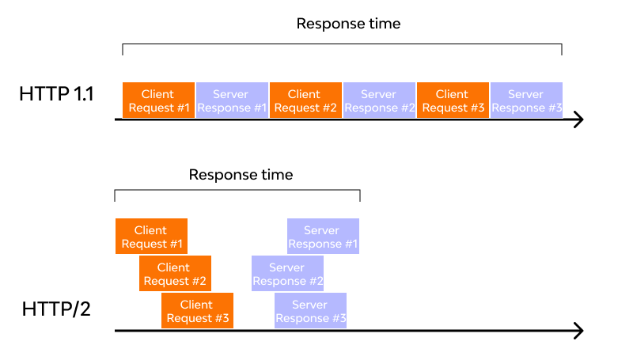

그래서 일반적으로 HTTP/2를 사용만해도 웹 응답 속도가 HTTP/1/1에 비해 15~50% 향상 된다고 한다.

## HTTP/1.0 

### 단기 커넥션

하나의 데이터를 전송하기 위해서 하나의 TCP Connection을 맺어야 한다.
TCP는 신뢰성 있는 데이터 전송을 위해 연결 시 3-way handshake, 연결 해제 시 4-way handshake 과정을 거치며 
결국, 여러 API 호출 시 Latency 증가 는 너무 당연한 얘기다.

너무 비효율이여서 HTTP Header 에 Keep-alive 옵션을 사용하여 일정 시간동안 Connection을 끊지 않는 방식도 사용이 되었다.

그러나, HTTP/1.0 에서는 표준이 아니었기 때문에 지원이 안되는 곳도 있었다.

## HTTP/1.1

### Persistence Connection
지속연결을 제공하는 HTTP/1.1은 웹페이지당 하나의 TCP연결을 이용할 수 있게 하였고, 서버에서의 소켓수를 줄이고 공정한 네트워크 대역폭을 가질 수 있도록 하였습니다. 하지만 하나의 TCP상에서 웹 페이지의 모든 객체를 보내면 문제가 발생할 수 있습니다.

예시를 들어보겠습니다.

웹 페이지의 상단에 비디오 클립이 있다고 가정해봅시다. 다른 작은 객체들이 앞에 있는 비디오 객체가 링크를 통과할때까지 기다려야 합니다. TCP는 순서 보장 프로토콜이기 때문에 패킷이 순서대로 도착하지 않으면 뒤의 패킷들도 재조립을 기다리며 전달되지 않습니다. 이에 여러 요청을 하나의 TCP연결에 얹으면 패킷 손실이 생길 때 모든 요청이 함꼐 지연될 수 있습니다. 이러한 문제를 **HOL 블로킹 문제**[^1]라고 합니다.


[^1]: 큐의 맨 앞(Head)에 있는 요청이 지연되면, 뒤의 요청들이 모두 대기하게 되는 현상

HTTP/1.1에서는 이 문제를 피하기 위해 브라우저가 여러 개의 TCP연결을 병렬적으로 열었습니다. 하지만 TCP연결을 여러 개 열면서 생긴 오버헤드 (핸드셰이크, 혼잡 제어), 네트워크 효율 저하 등의 단점이 있었습니다.

## HTTP/2.0 개선점

### Binay Framing Layer

HTTP 1.1과 HTTP 2.0의 주요한 차이점은 HTTP 메세지가 1.1에서는 text로 전송되었던 것과 달리, 2.0에서는 binary frame로 인코딩되어 전송된다는 점이다.

>기존 text 방식으로 HTTP 메세지를 보내는 방식은, 본문은 압축이 되지만 헤더는 압축이 되지 않으며 헤더 중복값이 있다는 문제 때문에 HTTP 2.0에서는 바이너리로 변경 되었다.

또한 HTTP 헤더에 대해서 배웠을때 헤더와 바디를 \r 이나 \n 과 같은 개행 문자로 구분한다고 하였는데, HTTP/2.0에서 부터는 헤더와 바디가 layer로 구분된다.

이로인해 데이터 파싱 및 전송 속도가 증가하였고 오류 발생 가능성이 줄어들었다.

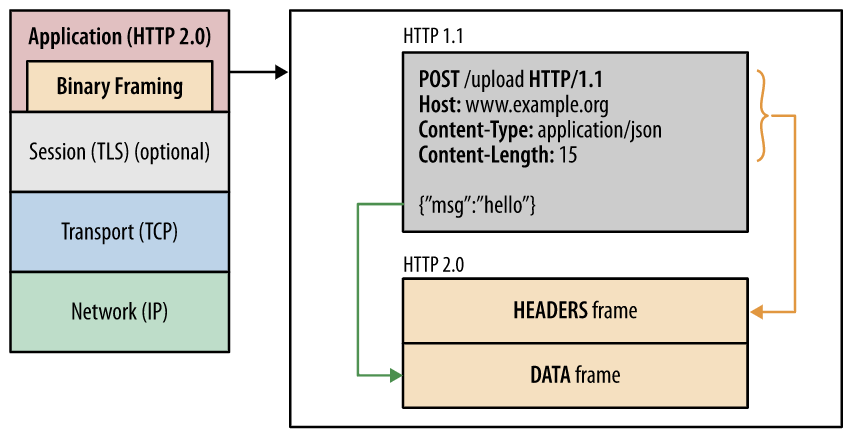

### Stream 과 Frame 단위

HTTP/1.1에서는 HTTP 요청와 응답은 통짜 텍스트 Message 단위로 구성되어 있었다.

HTTP/2 로 오면서 Message라는 단위 외에 Frame, Stream이라는 단위가 추가되었다.

**Frame** : HTTP/2에서 통신의 최소 단위이며, Header 혹은 Data 가 들어있다. 
**Message** : HTTP/1.1과 마찬가지로 요청 혹은 응답의 단위이며 다수의 Frame으로 이루어진 배열 라인
**Stream** : 연결된 Connection 내에서 양방향으로 Message를 주고 받는 하나의 흐름

즉, HTTP/2 는 HTTP 요청을 여러개의 Frame들로 나누고, 이 frame들이 모여 요청/응답 Message가 되고, 그리고 Message는 특정 Stream에 속하게 되고, 여러개의 Stream은 하나의 Connection에 속하게 되는 구조이다.

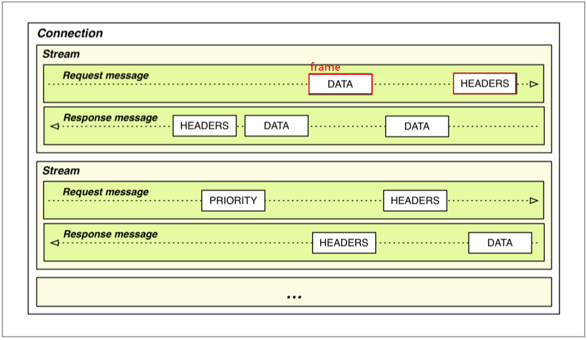

이 처럼 프레임 단위로 이루어진 요청과 응답 메세지는 하나의 스트림을 통해 이루어지며, 이러한 스트림들이 하나의 커넥션 내에서 병렬적로 처리된다. 하나의 커넥션에서 여러개의 스트림이 동시에 열리니 속도가 빠를수밖에 없다.

### Multiplexing

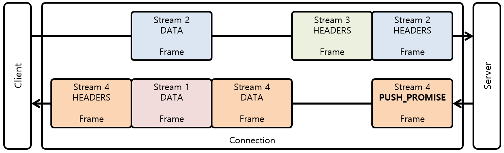

바로 위에서 frame - message - stream - connection 그림에서 봤듯이, HTTP 헤더 메세지를 바이너리 형태의 프레임으로 나누고 하나의 커넥션으로 동시에 여러개의 메세지 스트림을 응답 순서에 상관없이 주고 받는 것을 멀티플렉싱(multiplexing)이라고 한다.

- HTTP/1.1의 Connection Keep-Alive, Pipelining, Head Of Line Blocking을 개선했다.
- latency만 줄여주는게 아니라 결국 네트워크를 효율적으로 사용할 수 있게 하고 그 결과 네트워크 비용을 줄여준다.
- 특히 클라우드 시스템을 이용한다면 비용과 직결된다.

#### HTTP 2.0 통신 과정

HTTP 2에서는 **하나의 커넥션에 여러 개의 스트림이 동시에 요청/응답** 한다.

HTTP 1.1은 요청과 응답이 메시지라는 단위로 구분되어 있었지만, HTTP 2부터는 Stream을 통해 요청과 응답이 묶일 수 있어 다수 개의 요청을 병렬적으로 처리가 가능해졌다. 따라서 응답 프레임들은 요청 순서에 상관없이 먼저 완료된 순서대로 클라이언트에 전달이 가능하다.


1. Request 1을 전송 받기 위해, 우선 Framing Layer을 통해 바이너리 프레임 단위로 쪼개고 하나의 TCP Connection을 만들고 통신한다.
2. 다음으로 Request 2, 3, 4을 요청하는데 기존의 커넥션을 이용하며, 쪼개진 프레임들은 메세지 통로를 통해 동시다발적으로 요청/응답 받는다.
3. 커넥션 낭비도 없고 병렬적으로 자원이 전송받기에 매우 빠르다.

### Server Push 

HTTP 2.0에서는 클라이언트의 요청에 대해 미래에 필요할것 같은 리소스를 똑똑하게 미리 보낼 수 있다. 

예를 들어 클라이언트로부터 HTML 문서를 요청하는 하나의 HTTP 메세지를 받은 서버는 그 HTML 문서가 링크하여 사용하고 있는 이미지, CSS 파일, JS 파일 등의 리소스를 스스로 파악하여 클라이언트에게 미리 push해서 미리 브라우저의 캐시에 가져다 놓는다.

즉, 서버는 요청하지도 않은 리소스를 미리 보내어 가까운 미래에 특정 개체가 필요할때 바로 사용 되도록 성능 향상을 이끌어 내는 것이다. 그래서 클라이언트가 HTML 문서를 파싱해서 필요한 리소스를 다시 요청하여 발생하게 되는 트래픽과 회전 지연을 줄여준다는 장점이 있다.

#### HTTP 2.0 + Push 통신 과정


1. 서버가 클라이언트로부터 Request 1을 전송 받으면, index.html 에 있는 자원들을 파싱한다.
2. 클라이언트가 따로 요청하지 않아도, 서버가 알아서 미리 자원들을 클라이언트에 보낸다.
3. 따라서 총 로드 시간이 줄어드는 이점이 있다.

### Stream Prioritization

HTTP 1.1에서 파이프라이닝 이라는 혁신적인 기술이 있었지만, 우선 순위 문제 때문에 HOLB(Head Of Line Blocking)가 발생하여 사장되었다고 소개했었다.

HTTP 2에서는 리소스간 의존관계(우선순위)를 설정하여 이런 문제를 해결하였다.

위에서 봤던 것 처럼 HTTP 메세지가 개별 바이너리 프레임으로 분할되고, 여러 프레임을 멀티플렉싱 할 수 있게 되면서 요청과 응답이 동시에 이루어져 비약적인 속도 향상이 되었다.

하지만 하나의 연결에 여러 요청과 응답이 뒤섞여 버려 패킷 순서가 엉망 징창이 되었다. 따라서 스트림들의 우선순위를 지정할 필요가 생겼는데, 클라이언트는 우선순위 지정 트리를 사용하여 스트림에 식별자를 설정함으로써 해결 하였다.

- 각각의 스트림은 1-256 까지의 가중치를 갖음
- 하나의 스트림은 다른 스트림에게 명확한 의존성을 갖음

#### 스트림 우선순위 통신 과정

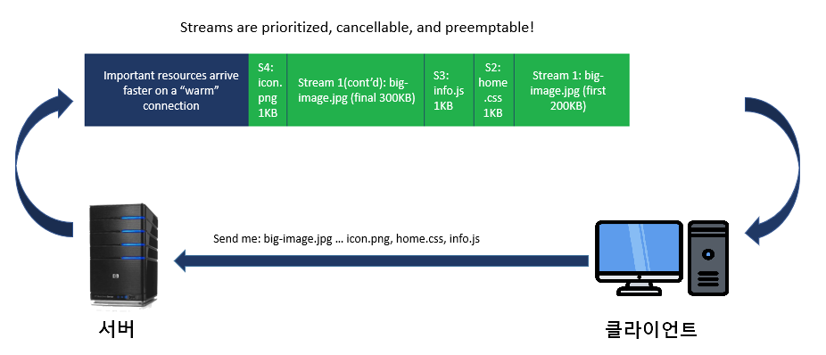

1. 클라이언트는 서버에게 스트림을 보낼때, 각 요청 자원에 가중치 우선순위를 지정하고 보낸다.
2. 그렇게 요청 받은 서버는 우선순위가 높은 응답이 클라이언트에 우선적으로 전달될 수 있도록 대역폭을 설정한다.
3. 응답 받은 각 프레임에는 이것이 어떤 스트림인지에 대한 고유한 식별자가 있어, 클라이언트는 여러개의 스트림을 interleaving을 통해 서로 끼워놓는 식으로 조립한다.

### HTTP Header Data Compression

HTTP 1.1 에서 헤더는 아무런 압축 없이 그대로 전송되었다. 이를 개선하기 위해 HTTP 2.0에서는 HTTP 메시지의 헤더를 압축하여 전송한다.

또한 HTTP 1.1 에서는 연속적으로 요청되는 HTTP 메세지들에게서 헤더값이 중복되는 부분이 많아 역시 메모리가 낭비되었는데, HTTP 2.0 에서는 이전 Message의 헤더의 내용 중 중복되는 필드를 재전송하지 않도록하여 데이터를 절약할 수 있게 되었다. 

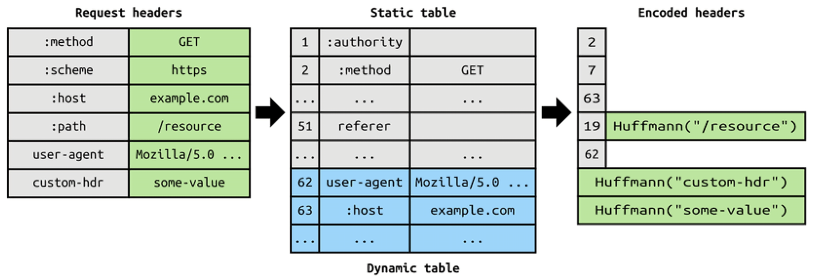

만일 메세지 헤더에 중복값이 존재하는 경우, 위의 그림에서 Static / Dynamic Header Table 개념을 사용하여 중복 헤더를 검출하고, 중복된 헤더는 index값만 전송하고 중복되지 않은 Header 정보의 값은 호프만 인코딩(Huffman Encoding) 기법을 사용하는 HPACK 압축 방식으로 인코딩 처리 하여 전송하여, 데이터 전송 효율을 높였다고 보면 된다.

## HTTP 2.0 문제점

### 여전한 RTT (Round Trip Time)

아무리 혁신적으로 개선되었다 하더라도, HTTP 1.1 이나 HTTP 2는 여전히 TCP를 이용하기 때문에 Handshake의 RTT(Round Trip Time)로인한 지연 시간(Latency)이 발생한다. 결국 원초적으로 TCP로 통신하는게 문제인 것이다.

### TCP 자체의 HOLB (Head Of Line Blocking)

분명 HTTP 2에서 HTTP 1.1의 파이프라이닝 HOLB 문제를 멀티플렉싱(Multiplexing)을 통해 해결했다고 하였다.

하지만 기본적으로 TCP는 패킷이 유실되거나 오류가 있을때 재전송하는데, 이 재전송 과정에서 패킷의 지연이 발생하면 결국 HOLB 문제가 발생된다. TCP/IP 4 계층을 보면, 애플리케이션 계층(L4)에서 HTTP HOLB를 해결하였다 하더라도, 전송 계층(L3)에서의 TCP HOLB 를 해결한건 아니기 때문이다.

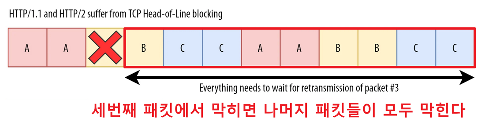

### 중개자 캡슐화 공격

위에서 배웠듯이 HTTP 2.0은 헤더 필드의 이름과 값을 바이너리로 인코딩한다. 이를 다르게 말하면 HTTP 2.0 이 헤더 필드로 어떤 문자열이든 사용할 수 있게 해준다는 뜻이다.

그래서 이를 악용하면 HTTP 2.0 메시지를 중간의 Proxy 서버가 HTTP 1.1 메시지로 변환할 때 메시지를 불법 위조할수 있다는 위험성이 있다. 다행히 거꾸로 HTTP/1.1 메시지를 HTTP/2.0 메시지로 번역하는 과정에서는 이런 문제가 발생하지 않는다.

## HTTP / 3.0

HTTP 2.0의 등장과 함께 기존의 프로토콜 데이터 체계를 프레임과 스트림 개념으로 재구축한 결과 기존 보다 혁신적으로 성능이 향상되게 되었다. 하지만 여전히 HTTP는 TCP 기반 위에서 동작되기 때문에, TCP 자체의 핸드쉐이크 과정에서 발생하는 지연 시간과, 기본적으로 TCP는 패킷이 유실되거나 오류가 있을때 재전송을하는데 이 재전송하는 패킷에 지연이 발생하면 결국 HOLB(Head Of Line Blocking) 문제가 발생되었다.
즉, HTTP 2.0은 TCP/IP 4 계층의 애플리케이션 계층(L4)에서 HTTP의 HOLB를 해결하였지만, 전송 계층(L3)에서의 TCP HOLB 를 해결한건 아니기 때문이다.
애초에 TCP로 인터넷 통신을 하는 것이 발목을 잡은 것이다.
 
점점 기술이 발전하고 다채로운 휴대 통신 기기가 널리 보급되면서 기업들은 다양한 컨텐츠를 여러 기기에 신속하게 전달하기 위해 TCP의 한계를 극복하고 최적화하는 것이 급선무의 과제였다.
그러자 IT 기업의 선두주자인 구글은 SPDY 프로토콜에 이어 새로운 UDP 기반인 QUIC 프로토콜을 고안하게 된다. 그리고 이 새로운 QUIC 프로토콜이 TCP/IP 4계층에도 동작시키기 위해 설계된 것이 바로 HTTP 3.0 이다.
**즉, HTTP/1.1과 HTTP/2는 TCP를 전송에 사용하지만, HTTP/3은 UDP(QUIC)를 사용한다고 보면 된다.**

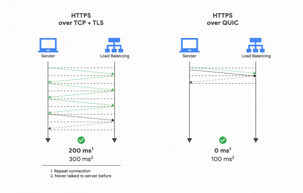

HTTP 3.0은 HTTP 2.0가 가지는 장점들을 모두 가지면서 TCP가 가지는 원초적인 단점을 보완하는데 중점으로 개발되었다. 그래서 지금까지 거론되었던 HTTP/2 의 문제를 거의 해결하였다고 보면 된다. RTT(Round Trip Time)를 제로 수준으로 줄였고, 패킷 손실에 대한 빠른 대응, 사용자 IP가 바뀌어도 연결이 유지되는 것이 특징이다.

통신 인프라가 빈약한 나라에서는 큰 차이가 느껴질지도 모르겠지만, 사실 한국에서 HTTP/2를 사용하든 HTTP/3를 사용하든 워낙에 땅이 좁은데다 통신 인프라는 세계에서 끝내주게 잘되어 있기 때문에 소비자들은 체감을 못 할 것이다.

### QUIC 프로토콜

HTTP/3의 가장 큰 특징은 기존의 HTTP/1, HTTP/2와는 다르게 UDP 기반의 프로토콜인 QUIC(Quick UDP Internet Connections)을 사용하여 통신하는 프로토콜이라는 점이다. 'Quick UDP Internet Connections' 라는 이름에서 알수 있듯이 말 그대로 UDP를 사용하여 빠르게 인터넷 연결을 하는 새로운 프로토콜이다. (참고로 '퀵' 이라고 읽는다)

HTTP/2의 기반이 되는 SPDY는 사장되었지만, HTTP/3의 기반이 되는 QUIC는 RFC 9000으로 표준화되어 있다는 점도 다르다.

#### QUIC의 계층 위치


위의 TCP/IP 4 Layer에서 볼 수 있듯이 HTTP/3은 계층 형태는 약간 특이하다.

왜냐하면 QUIC은 TCP + TSL + HTTP의 기능을 모두 구현한 프로토콜이기 때문이다. TCP의 프로토콜의 무결성 보장 알고리즘과 SSL이 이식됨으로써 높은 성능과 동시에 신뢰성을 충족시켰다고 보면 된다. 그래서 계층 위치도 약간 비스듬하게 걸쳐 있게 표현된 것이다. 

쉽게 말하자면, Application 계층의 HTTP/3은 QUIC를 동작시키기 위해 있는 것이라고 보면 되고, 위에서 배웠다시피 QUIC는 UDP 기반으로 만들어졌기에 Transport 계층의 UDP 위에서 동작한다고 보면된다.

#### 어째서 TCP가 아닌 UDP인가

##### TCP는 구조상 한계로 개선해도 여전히 느리다

사실 TCP는 인류가 지금과 같이 엄청난 속도로 발전할 것이라곤 상상 할 수 없는 시기에 만들어졌다. TCP가 만들어지던 시절에 클라이언트와 서버가 동시 다발적으로 여러 개 파일의 데이터 패킷을 교환할 것이라고 상상하지 못했기 때문이다.

그래서 모바일 기기와 같이 네트워크 환경을 바꾸어가면서 서버와 클라이언트가 소통할 수 있을 것이라고 생각하지 못했다. 그 때문에 와이파이를 바꾸면 다시 새로운 커넥션을 맺어야 되서 끊김 현상이 일어나는 것이다.

 

또한 TCP를 사용한 통신에선 패킷은 신뢰성을 위해 무조건 순서대로 처리되어야 한다. 또한 패킷이 처리되는 순서 또한 정해져있으므로 이전에 받은 패킷을 파싱하기 전까지는 다음 패킷을 처리할 수도 없다. 만일 중간에 패킷이 손실되어 수신 측이 패킷을 제대로 받지 못했으면 다시 보내야 한다.

이렇게 패킷이 중간에 유실되거나 수신 측의 패킷 파싱 속도가 느리다면 통신에 병목이 발생하게 되는데, 이러한 현상을HOLB(Head of line Blocking)라고 부른다.

이 HOLB는 TCP 설계도상 어쩔수 없이 발생하는 문제이기 때문에 HTTP/1.1 뿐만 아니라 HTTP/2도 가지고 있는 아주 고질적인 문제였다.

따라서 이런 고질적인 문제들을 해결하기 위해 HTTP/3는 TCP를 버리고 UDP를 선택하였다. 

##### UDP는 신뢰성이 없는게 아니라 탑재를 안했을 뿐이다

처음 TCP와 UDP에 대해서 배웠을때, UDP는 하얀 도화지 같이 기능이 거의 없어서 빠르지만 대신에 신뢰성이 낮기 때문에, 인터넷 통신에선 조금 느리더라도 신뢰성이 높은 TCP를 사용한다라고 배웠을 것이다.

 |	|TCP|	UDP|
 |---|---|---|
연결 방식|	연결 지향형 프로토콜	|비 연결 지향형 프로토콜|
전송 순서|	보장|	보장하지 않음|
신뢰성|	높음|	낮음|
전송속도(상대적)|	느림|	빠름|
혼잡제어|	O|	X|
헤더 크기|	20바이트|	8 바이트|

UDP는 User Datagram Protocol이라는 이름에서도 알 수 있듯이 데이터그램 방식을 사용하는 프로토콜이기 때문에 패킷의 목적지만 정해져있다면 중간 경로는 신경쓰지 않기 때문에 핸드쉐이크 과정이 필요없다.

결론으로는 UDP는 TCP가 신뢰성을 얻기 위해 내제된 과정을 거치지 않기 때문에 속도가 더 빠를 수 밖에 없다는 것인데, 그렇다면 UDP를 사용하게되면 빠르지만 신뢰성과 패킷의 무결성을 보증할 없다는 뜻인데 이것을 인터넷 통신에 사용해도 문제가 없는 걸까?

이부분은 오해인것이, <u>UDP는 신뢰성이 없는게 아니라 탑재를 안했을 뿐이다.</u>

UDP의 진짜 장점은 커스터마이징이 가능하다는 점이다.

즉, 아래 사진과 같이 UDP 자체는 헤더에 들은게 없어 신뢰성이 낮고 제어 기능도 없지만, 이후 개발자가 애플리케이션에서 구현을 어떻게 하냐에 따라서 TCP와 비슷한 수준의 기능을 가질 수도 있다는 말이다.

### HTTP 3.0 개선점

#### 연결 시 레이턴시 감소

기존 TLS+TCP에서는 TLS 연결을 위한 핸드쉐이크와 TCP를 위한 핸드쉐이크가 각각 발생했다.

그래서 TCP는 연결을 생성하기 위해 기본적으로 1 RTT 가 필요하고, 여기에 TLS를 이용한 암호화 통신까지 한다면 총 3 RTT가 필요하게 된다.

>**RTT (Round Trip Time)**
RTT(Round Trip Time)란, 요청(SYN)을 보낼 때부터 요청에 대한 응답(SYN+ACK)을 받을 때까지의 왕복 시간을 의미한다.

QUIC에서는 이를 한단계로 줄였다.

UDP 위에서 동작하는 QUIC는 통신을 시작할 때 3 Way Handshake 과정을 거치지 않아도 되기 때문에 첫 연결 설정에 1 RTT만 소요된다.  그 이유는 연결 설정에 필요한 정보와 함께 데이터도 보내버리기 때문이다.

QUIC 내에 아예 TLS 인증서를 내포하고 있기 때문에, 최초의 연결 설정에서 필요한 인증 정보와 데이터를 함께 전송한다. 그래서 클라이언트가 서버에 어떤 신호를 한번 주고, 서버도 거기에 응답하기만 하면 바로 본 통신을 시작할 수 있다는 것이다

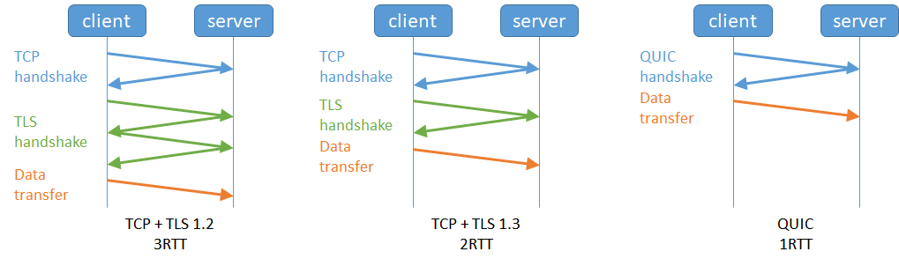

위의 그림에서 볼 수 있듯이 TCP+TLS는 서로 자신의 세션 키를 주고 받아 암호화된 연결을 성립하는 과정을 거치고 나서야 세션 키와 함께 데이터를 교환하기 때문에 핸드쉐이크 과정이 여러번 발생하게 된다.

하지만 QUIC은 서로의 세션 키를 교환하기도 전에 데이터를 교환할 수 있기 때문에 연결 설정이 더 빠르다. 다만, 최초의 요청을 보낼 때는 클라이언트는 서버의 세션 키를 모르는 상태이기 때문에, 목적지인 서버의 Connection ID를 사용하여 생성한 특별한 키인 초기화 키(Initial Key)를 사용하여 통신을 암호화 한다.

그리고 한번 연결에 성공했다면 서버는 그 설정을 캐싱해놓고 있다가, 다음 연결 때 캐시를 불러와 바로 연결을 하기 때문에 추가적인 핸드 쉐이크 없이 0 RTT만으로 바로 통신을 시작할 수도 있다는 장점도 있다. 

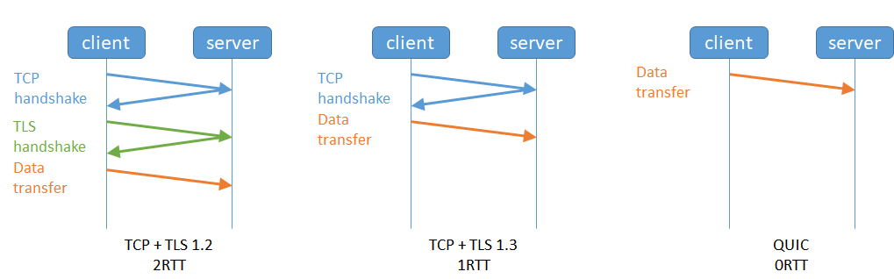

#### 잔존하던 HOLB 현상을 해결

##### HTTP의 HOLB (Head Of Line Blocking)

기존 HTTP/1.1 같은 경우 파이프라인(pipeline) 기술을 통해 병렬적으로 리소스를 빠르게 얻도록 하려고 하였지만, 만일 첫번째 요청에 딜레이가 생기면 나머지 요청이 빨리 처리됬음에도 불구하고 딜레이가 되는 심각한 현상이 있었다.

그래서 이를 극복하기 위해 HTTP/2 에서는 리소스들을 하나의 커넥션에서 병렬적으로 보내도록 개선하였다.

##### TCP의 HOLB (Head Of Line Blocking)

이처럼 HTTP 레이어의 HOL Blocking 은 해결됬지만, 문제는 TCP 레이어의 HOL Blocking 문제가 여전히 잔존해 있었던 것이다.

HTTP/2를 사용하는 일반적인 브라우저는 TCP 연결 한개로 수십, 수백 개의 스트림 데이터를 병렬 전송을 한다. 그런데 만일 두 엔드포인트 사이 네트워크 어딘가에서 하나의 패킷이 빠지거나 없어진다면, 없어진 패킷을 다시 전송하고 목적지를 찾는 동안 전체 TCP 연결이 중단되게 된다. 

즉, HTTP/2에서 스트림에서 여러가지 프레임들이 뒤 섞여 이동되게 되는데, 만일 어느 하나의 프레임에 문제가 생기면 상관없는 그 뒤의 프레임까지 영향이 가게 된다. 따라서 결국은 HTTP의 HOLB처럼 스트림 내 패킷들은 전체가 지연이 되게 된다.

거기다가 HTTP/2는 1개의 TCP 커넥션으로 전부를 처리하고 있기 때문에 패킷 손실률이 증가하면 여러 개의 TCP를 사용하는 HTTP/1.1보다 성능 저하가 커질 수 있다.

##### 독립 스트림으로 HOLB 단축

그래서 TCP를 버려버리고 새로 QUIC 프로토콜로 구축해서 아예 스트림 자체를 독립적으로 여러개로 나누어서 처리하도록 하였다. 이를 독립 스트림이라고 한다.

QUIC 연결을 통해 두 가지 다른 스트림을 설정했을 때, 이들을 독립적으로 다루므로 만약 특정 스트림에서 HOLB가 발생하더라도, 다른 스트림에는 영향을 미치지 않는다.

#### 패킷 손실 감지에 걸리는 시간 단축

HOLB 해결에 이어 QUIC는 흐름 제어하는 시간까지 단축하였다.

QUIC도 TCP와 마찬가지로 전송하는 패킷에 대한 흐름 제어를 해야한다. QUIC는 기본적으로 TCP와 유사한 방법으로 패킷 손실을 탐지하지만 여기에 몇 가지 알고리즘 개선 사항을 추가하였다.

예를들어 HTTP 2.0에서는 아래 그림과 같이 하나의 스트림에 A, B, C 패킷 프레임들이 비순서대로 전달될때, 만일 세번째 프레임에서 패킷 손실이 일어나면, 패킷 B만 중지되어야 하지만 위에서 배운바와 같이 전혀 연관없는 패킷 A와 C도 모두 막혀 대기를 해야된다.

이러한 문제를 해결하기 위해 QUIC는 헤더에 패킷의 전송 순서를 나타내는 별도의 패킷 번호 공간을 부여했다.

이를 이용해 QUIC는 패킷 번호를 파악해 개별 파일을 구분하여 중간에 패킷 로스가 발생해도 해당 파일의 스트림만 정지가 되도록 할 수 있다.

하나의 스트림에서 문제가 발생한다고 해도 다른 스트림은 지킬 수 있게 되어 이런 문제에서 자유로워 졌다.


#### 더욱 향상된 멀티플렉싱

HTTP/3도 당연히 HTTP/2와 같은 멀티플렉싱을 지원한다.

그리고 독립 스트림 방식으로 기존의 멀티플렉싱을 더욱 강화시켰다고 보면 된다.

#### 보안을 더욱 강화

HTTP/3와 그 기반 기술인 QUIC은 TLS 암호화를 기본적으로 사용한다.

물론 UDP와 TLS가 결합된 기술로는 DTLS라는 기술도 있지만 'TCP의 재구현'이 목표 중 하나인 QUIC와는 지향하는 바가 다르다.

이처럼 기본적으로 QUIC 내에 TLS 이 포함되어있기 때문에 TCP와 달리 헤더 영역도 같이 암호화된다.

#### 네트워크가 변경 되도 연결이 유지

TCP의 경우 클라이언트와 서버가 서로를 구분하기 위해서는 클라이언트 IP, 클라이언트 PORT, 서버 IP, 서버 PORT, 이렇게 네 가지가 필요하다. 그래서 클라이언트의 IP가 바뀌는 상황이 발생하면 연결이 끊어져 버린다.

우리가 핸드폰을 들고 와이파이존에서 LTE 데이터를 사용하게 됐을 때, 동영상 끊김과 같이 일시적 지연이 일어나는 이유는 클라이언트 IP가 이때 바뀌기 때문이다. 그래서 다시 연결을 생성하기 위해 결국 핸드쉐이크 과정을 다시 거쳐야한다는 것이고, 이 과정에서 다시 지연시간이 발생하게 되는 것이다.

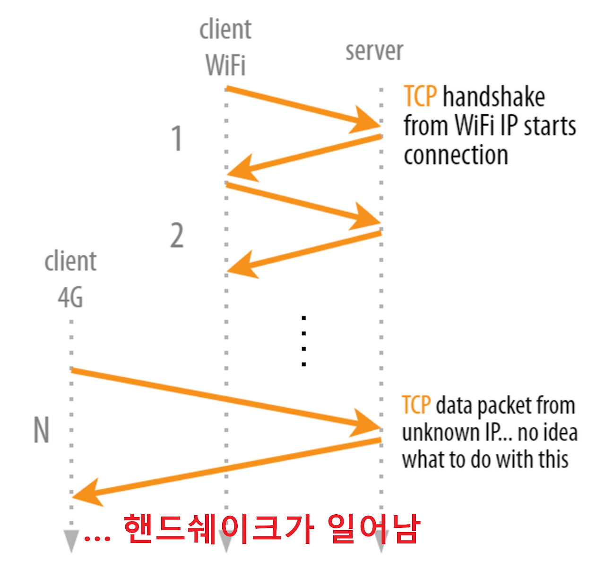

##### Connection ID

반면 QUIC은 Connection ID를 사용하여 서버와 연결을 생성한다.

Connction ID는 각 연결은 연결 식별자나 연결 ID를 가지므로 이를 통해 연결을 식별한다.

Connection ID는 랜덤한 값일 뿐, 클라이언트의 IP와는 전혀 무관한 데이터이기 때문에 클라이언트의 IP가 변경되더라도 기존의 연결을 계속 유지할 수 있다. 그래서 새로 연결을 생성할 때 거쳐야하는 핸드쉐이크 과정을 생략할 수 있다. 따라서 휴대폰으로 인터넷을 할 때, 중간에 와이파이에서 LTE로 변경해도 스트림이 계속 유지가 된다. 

하지만 똑같은 Connection ID만 사용한다면 해커가 네트워크를 통해 사용자를 추적하여 보안 문제가 일어날 수도 있을 것이다. 그래서 QUIC는 새 네트워크가 사용될 때마다 Connection ID를 변경한다.

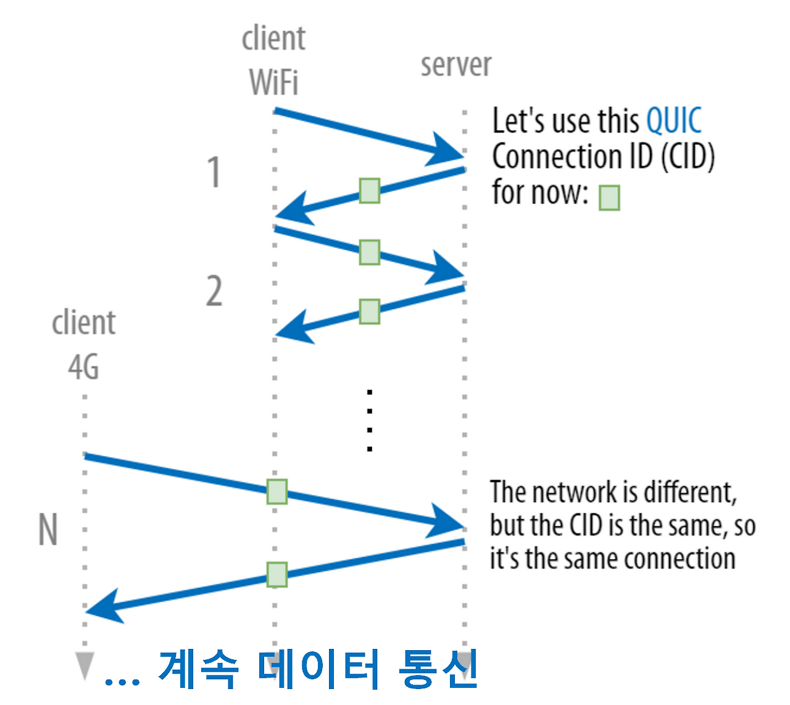

위의 말과 행동이 다르겠다고 생각하겠지만, 내부적으로 클라이언트와 서버가 모두 연결을 위해 무작위로 생성한 Connection ID에 대해 인지하고 있고, 네트워크가 바뀔때 Connection ID를 바꾸더라도 이게 이전 Connectin ID와 동일하다고 인지하여 연결을 유지하는 것이다.

### HTTP 3.0 우려점

#### 기존 체계 호환성 문제

HTTP/1.1 이나 HTTP/2 기반의 프론트엔드단 최적화를 이미 적용한 기업의 경우 QUIC 도입에 부담스러울 수 있다.

예를들어 브라우저의 병렬 다운로드를 통해 리소스를 빠르게 받아오는 도메인 분할(domain sharding) 기법을 이미 적용하여 최적화를 시킨 기업은 오히려 멀티플렉싱 기반의 HTTP/2 혹은 HTTP/3에서 성능이 반감될 수 있다.

또한 브라우저의 콘텐츠 Prefetch 기능을 적용한 경우, 이를 Server Push 기능으로 변경해야 할지에 대한 기술적인 판단과 충분한 성능 비교 테스트가 필요하게 된다. ​

#### 암호화로 네트워크 제어가 힘듬

QUIC는 기존에는 암호화하지 않던 헤더 필드도 암호화한다. 

그래서 이런 헤더의 정보를 사용하는 ISP나 네트워크 중계회사들은 기존에 암호화하지 않던 헤더 필드 영역들을 읽을 수 없어 네트워크 혼잡을 관리하기 위한 네트워크를 최적화하기 힘들다. 예를 들어 패킷이 ACK인지 재전송인지 알 수 없다. RTT 추정 은 더 어렵다.

이러한 이유로 기업들이 HTTP 3 도입을 주저하고 있다.

#### 암호화로 리소스가 많이 듬

QUIC은 패킷별로 암호화를 한다.

이는 기존의 TLS-TCP에서 패킷을 묶어서 암호화하는 것보다 더 큰 리소스 소모를 불러올 수 있다는 단점이 있다.

#### QUIC는 CPU를 너무 사용함

QUIC은 너무 많은 CPU 시간을 차지한다.

따라서 보급형 스마트폰과 IoT 장치같은 마이크로 애플리케이션들은 이용에 어려움을 겪을 수도 있다.

물론 시간이 지나면 개선될수도 있다. 다만 문제는 추가적인 CPU 사용이 배포자에게 얼마나 영향을 끼치는가 이다.

#### UDP의 보안적인 문제

DNS에서 TCP나 UDP를 53포트를 이용해 통신하게 되는데, 53 포트가 아닌 UDP 트래픽이 최근에는 도스 공격에 주로 사용되기 때문에 많은 서비스들에서 차단하거나 속도를 제한하고 있다.

그래서 QUIC에서는 초기 패킷이 최소 1200바이트여야 한다는 조건과 서버가 클라이언트로부터 응답 패킷을 받지 않으면 요청 크기의 3배 이상은 절대 보내면 안 된다는 프로토콜의 제약사항으로 이를 해결하려고 노력중이다.

기존에도 HTTP/2의 여러 보안 취약점이 발견되어 모든 업체가 이에 대한 보안 패치를 적용한 사례가 있듯이, 이처럼 새로운 기술이 나오면 보안 문제는 항상 대두되길 마련이다.

# 웹 소켓 (Web Socket)

**웹 소켓(WebSocket)** 은 HTML5에서 새롭게 도입된 통신 프로토콜로,
브라우저와 서버가 지속적으로 연결된 상태에서 양방향 통신을 할 수 있게 해준다.

## 웹 소켓의 등장 배경

초기의 인터넷 통신 방식은 주로 HTTP를 이용한 클라이언트(요청) - 서버(응답) 모델을 통해 진행되었습니다.
즉, 클라이언트가 서버에 요청(Request)을 보내고, 서버가 이에 응답(Response)하는 반이중 통신 방식을 따릅니다.
 
이 방식이 페이지를 요청하는 등의 간단한 작업에는 효과적입니다.
하지만, 실시간으로 데이터를 주고받는 데에 한계점이 발생하게 됩니다.

클라이언트가 서버에게 요청하지 않는 이상 서버는 클라이언트에게 먼저 데이터를 보낼 수 없습니다.
 
이 특징으로 실시간 데이터를 주고받는 상황을 구현하기 위해서,
클라이언트는 항상 새로운 데이터가 있는지 확인을 하기 위해 서버에 지속적으로 요청을 보낼 수밖에 없습니다.
 
이렇게 되면 트래픽을 불필요하게 증가시키고, 이로 인해 서버의 비용이 증가될 뿐더러 요청과 응답사이의 지연시간이 있기 때문에 실시간 통신의 효율성을 저하시킬 수 있습니다.

### 웹 소켓 이전의 통신 방식

#### 폴링(Polling)


클라이언트가 주기적으로 서버에 요청을 보내는 방식입니다.
즉, 일정 시간를 정해 놓고 새로운 데이터가 있는지 요청을 보내서 확인하게 됩니다.
 
이때, 새로운 데이터가 없더라도 서버는 응답을 보냅니다.
 
그래서 클라이언트는 응답을 받으면 처리하고 일정 시간 후에 다시 요청을 보내는 과정을 반복하게 되는 것이죠.

이 방식에는 단점이 분명히 존재합니다.

- 불필요한 요청(Request) 수 ➡️ 서버 비용 증가
- 요청과 응답 사이의 지연 시간이 발생합니다.

#### 롱 폴링(Long Polling)


롱 폴링은 폴링에서 조금 더 개선된 방식입니다.
 
먼저, 동일하게 클라이언트는 서버에게 요청(Request)을 보냅니다.
이후 서버는 새로운 데이터가 없다면 일정 시간 동안 응답을 하지 않고 새로운 데이터가 있을 때까지 기다립니다.
 
만약 일정 시간 동안 새로운 데이터가 없다면 Time Out이 발생하고, 이때 서버는 Time Out에 대한 응답을 보냅니다..
반면에 새로운 데이터가 있다면 즉시 새로운 데이터에 대한 응답(Resonse)을 보냅니다.

폴링과 아주 유사합니다.
유사하지만 폴링에 비해서 불필요한 요청(Request) 수는 줄어들게 됩니다.
 
폴링에 비해서 줄어든 것이지 불필요한 요청은 계속 진행됩니다.
또한, 요청과 응답 사이에 발생하는 지연 시간은 불가피할 수 있습니다.

#### 서버 센트 이벤트(Server-Sent Event)


서버 센트 이벤트 방식은 위 방식들과는 조금 다르게 동작합니다.
 
클라이언트는 최초로 한 번 서버에 연결을 요청합니다.
그럼 서버는 요청을 받고, 이후 새로운 데이터가 생길 때마다 적절히 처리하여 클라이언트에게 응답을 보냅니다.
 
즉, HTTP 통신을 종료하지 않고 연결을 유지하는 방식입니다.

SSE를 사용하여 실시간으로 클라이언트에게 응답을 보낼 수 있습니다.
또한, 이벤트 기반으로 서버에서 보낸 메시지에 대해 이벤트 처리가 가능합니다.
연결이 끊어진 경우에도 SSE는 자동으로 재연결을 시도합니다.
 
하지만 이 방식은 클라이언트의 최초 요청 이후 서버만 일방적으로 응답을 하게 됩니다.
즉, 우리가 청취하는 라디오와 같다고 볼 수 있습니다.
 
위에서 알아본 방식들로 HTTP 통신으로 실시간 통신 방식을 구현할 수 있습니다.
하지만, 단지 실시간 통신을 구현하기 위한 방법일 뿐, 완벽한 실시간 통신을 보장하지는 않습니다.
 
그래서 이 문제점을 해결하기 위해 바로 웹 소켓(Web Socket)이 등장했습니다.

## 웹 소켓(Web Socket)이란?


웹 소켓은 HTML5에 등장 실시간 웹 애플리케이션을 위해 설계된 통신 프로토콜이며, TCP(Transmission Control Protocol)를 기반으로 합니다.
TCP를 기반으로 한 웹 소켓은 신뢰성 있는 데이터 전송을 보장하며, 메시지 경계를 존중하고, 순서가 보장된 양방향 통신을 제공할 수 있습니다.
 
HTTP와 다르게 클라이언트와 서버 간에 최초 연결이 이루어지면, 이 연결을 통해 양방향 통신을 지속적으로 할 수 있습니다.
즉, 전화 통화와 같이 양쪽 모두에서 정보를 주고받을 수 있다는 의미입니다.
 
이 '지속적 연결'을 통해서 서버는 클라이언트에게 실시간으로 데이터를 보낼 수 있으며, 반대로 클라이언트도 서버에게 데이터를 보낼 수 있습니다.
이때 데이터는 ‘패킷(packet)’ 형태로 전달되며, 전송은 연결 중단과 추가 HTTP 요청 없이 양방향으로 이뤄집니다.

웹소켓 연결을 하려면 new WebSocket을 호출하면 되는데, 이때 ws라는 특수 프로토콜을 사용합니다.

소켓이 정상적으로 생성되면 아래 네 개의 이벤트를 사용할 수 있게 됩니다.

- open – 연결이 성공적으로 되었을 때 발생
- message – 데이터를 수신하였을 때 발생
- error – 연결 상 에러가 생겼을 때 발생
- close – 연결이 종료되었을 때 발생

### 웹 소켓 핸드셰이크(handshake)

new WebSocket(url)을 호출해 소켓을 생성하면 즉시 연결이 시작됩니다.
 
웹 소켓은 HTTP 기반으로 초기 handshake를 수행합니다.이후, 데이터 전송은 웹 소켓 프로토콜을 이용하여 통신하게 됩니다.

new WebSocket("wss://yong-nyong-tistory.com/socket")을 호출해 최초 요청을 전송했다고 가정합시다.
 
이때의 요청(Reqeust) 헤더를 살펴보면 아래와 같습니다.

```
GET /socket
Host: yong-nyong-tistory.com
Origin: https://yong-nyong-tistory.com
Connection: Upgrade
Upgrade: websocket
Sec-WebSocket-Key: Ivyio/9s+lYongNyongczP8Q==
Sec-WebSocket-Version: 13
```

- **Origin** – 클라이언트 origin을 나타냅니다.
- **Connection**: Upgrade – 클라이언트 측에서 프로토콜을 바꾸고 싶다는 신호를 보냈다는 것을 나타냅니다. (https ➡️ wss)
- **Upgrade**: websocket – 클라이언트 측에서 요청한 프로토콜은 'websocket’이라는 것을 의미합니다. (https ➡️ wss)
- **Sec-WebSocket-Key** – 보안을 위해 브라우저에서 생성한 키로, 서버가 웹소켓 프로토콜을 지원하는지를 확인하는 데 사용됩니다.
- **Sec-WebSocket-Version** – 웹소켓 프로토콜 버전을 나타냅니다.

다음으로 서버가 해당 요청을 받으면 웹 소켓 연결을 수락하는 응답을 보냅니다.
해당 응답에는 '101 Switching Protocols' 상태 코드와 함께 응답합니다.

```
101 Switching Protocols
Upgrade: websocket
Connection: Upgrade
Sec-WebSocket-Accept: hsBYongNyong24s99EO10UlZ22C2g=
```

이 과정을 통해서 클라이언트와 서버 간 실시간 통신이 가능한 통로가 열리게 되는 것입니다.
 
이렇게 웹 소켓 연결이 성립되면, 클라이언트와 서버 간에 실시간 양방향 통신이 가능해집니다.

## 웹 소켓(Web Socket)의 한계점

- **브라우저 지원**: 웹 소켓은 HTML5 사양의 일부입니다. 즉, HTML5를 지원하지 않는 브라우저에서는 사용할 수 없습니다.
- **서버 비용**: 웹 소켓은 지속적인 연결을 유지하므로, 많은 수의 웹소켓 연결을 동시에 관리해야 하는 경우 서버의 부하가 증가할 수 있습니다.
- **다양한 에러처리**: 만약 연결이 끊어졌을 시 어떤 이유에서 연결이 끊어졌는지와 같은 상세한 에러 처리에 대한 한계가 있습니다. 웹소켓은 연결이 끊어진 이유에 대해서 정확히 알 수 없습니다.
- **재연결 처리**: 알 수 없는 에러로 인해 연결이 끊어지면 지속적인 연결을 해야 하는 웹 소켓 특성상 재연결을 할 수 있도록 구현해야 합니다. 웹소켓은 자동으로 재연결을 진행하지 않습니다.
