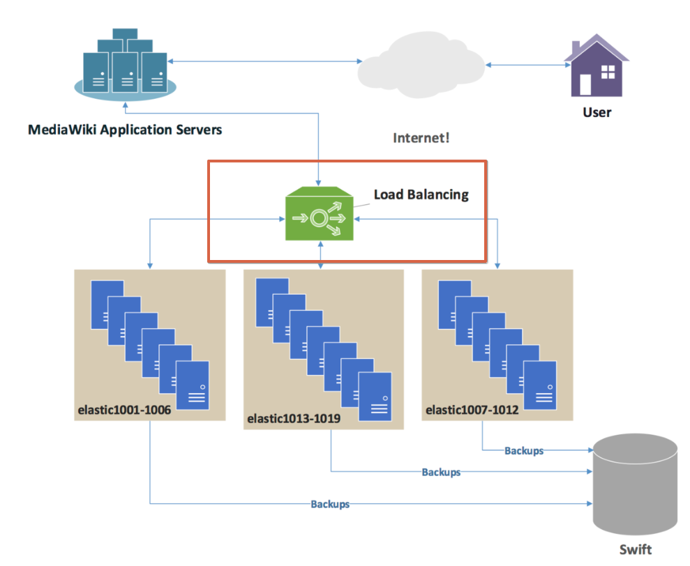

# 콘텐츠 전송 네트워크 (CDN)

CDN, 즉 콘텐츠 전송 네트워크는 전 세계에 분산된 서버 네트워크로 구성되어 사용자에게 빠르고 효율적으로 콘텐츠를 전달하는 시스템입니다. 이는 웹 페이지, 비디오, 이미지 등의 정적 콘텐츠를 사용자에게 더 가까운 위치에서 제공하여 로딩 시간을 줄이고 서버 과부하를 방지하는 역할을 합니다.

## CDN의 작동 원리

CDN은 여러 지리적 위치에 접속 지점(POP) 또는 CDN 엣지 서버 그룹을 통해 작동합니다. 이는 캐싱, 동적 가속, 엣지 로직 계산의 원리를 바탕으로 합니다. 여기에서는 간단하게 주요 내용을 살펴보고 아래에 별도에 섹션에서 더 자세하게 다루겠습니다.

- **캐싱**: 이는 웹 사이트의 정적 콘텐츠를 네트워크의 여러 서버에 저장하는 프로세스입니다. 사용자가 웹 콘텐츠를 요청하면, 이 요청은 웹 애플리케이션 서버나 원본 서버에 도달하고, 이 서버는 사용자에게 응답을 보내면서 가장 가까운 CDN POP에도 복사본을 보냅니다. 이후 해당 지역의 다른 사용자들이 동일한 콘텐츠를 요청할 때, 캐싱된 서버가 응답을 제공합니다.
- **동적 가속**: 이는 동적 콘텐츠에 대한 요청에 응답하는 시간을 단축시킵니다. 동적 콘텐츠는 사용자마다 다를 수 있어 캐싱이 어렵습니다. 이 경우 CDN 서버는 오리진 서버와의 연결을 최적화하여 응답 시간을 단축시킵니다.

CDN은 세 가지 종류의 서버에 의존합니다.

- **오리진 서버**: 오리진 서버에는 콘텐츠의 원본 버전이 포함되어 있으며 원본 소스 역할을 합니다. 콘텐츠를 업데이트해야 할 때마다 오리진 서버에서 변경이 이루어집니다. 오리진 서버는 콘텐츠 공급업체가 소유하고 관리할 수도 있고 Amazon의 AWS S3 또는 Google Cloud Storage 같은 써드파티 클라우드 공급업체의 인프라에서 호스팅할 수도 있습니다.
- **엣지 서버**: 엣지 서버는 전 세계 여러 지리적 위치에 위치하며, 이를 ‘PoP(Point of Presence)’라고도 합니다. 이러한 PoP 내의 엣지 서버는 오리진 서버에서 복사된 콘텐츠를 캐싱하고, 인근 사용자에게 해당 콘텐츠를 전송하는 역할을 담당합니다. 사용자가 오리진 서버의 콘텐츠에 대한 접속을 요청하면 지리적으로 가까운 엣지 서버에 캐싱된 콘텐츠 사본으로 리디렉션됩니다. 캐싱된 콘텐츠가 오래된 경우 엣지 서버는 오리진 서버에 업데이트된 콘텐츠를 요청합니다. CDN 엣지 서버는 CDN 호스팅 공급업체가 소유하거나 관리합니다.
- **DNS 서버**: DNS(도메인 네임 시스템) 서버는 오리진 및 엣지 서버의 IP 주소를 추적하고 제공합니다. 클라이언트가 오리진 서버에 요청을 보내면, DNS 서버는 콘텐츠를 더 빠르게 제공할 수 있는 페어링된 엣지 서버의 이름으로 응답합니다.

CDN은 최적의 경험을 제공하기 위해 두 가지 필수 기능을 수행합니다.

- **지연 시간 단축**: 지연 시간은 웹 페이지 또는 비디오 스트리밍 콘텐츠가 디바이스에 완전히 로딩되기 전에 발생하는 불편한 지연을 의미합니다. 지연 시간은 밀리초 단위로 측정됩니다. 하지만 사용자가 체감하는 시간은 매우 길며, 시간 초과 또는 로딩 오류가 발생할 수 있습니다. 콘텐츠가 사용자에게 도달하기 위해 이동해야 하는 물리적 거리를 줄여 지연 시간을 줄이는 콘텐츠 전송 네트워크도 있습니다. 따라서 CDN이 보다 광범위하고 넓게 분산되어 있으면 최종 사용자와 최대한 가까운 곳에 콘텐츠를 배치함으로써 웹사이트 콘텐츠를 보다 빠르고 안정적으로 전송할 수 있습니다.
- **부하 분산**: CDN은 전체 트래픽의 균형을 맞춰 인터넷 콘텐츠에 접속하는 모든 사용자에게 최고의 웹 경험을 제공합니다. 오프라인 환경에서 트래픽을 라우팅하는 것을 생각해 보세요. 다른 차량이 없다고 가정하면 일반적으로 지점 A에서 지점 B로 이동하는 가장 빠른 경로는 하나입니다. 하지만 이 경로가 정체되기 시작하면 다른 경로로 교통이 분산되는 것이 모두에게 좋습니다. 이렇게 되면 몇 분(인터넷 속도로 조정될 경우 밀리초) 더 걸리는 경로를 이용해야 할 수 있지만, 최단 경로에서 발생하는 교통 체증을 겪지 않아도 됩니다. 콘텐츠 공급업체는 부하 분산 기능을 통해 수요 증가와 대규모 트래픽 급증을 처리하는 동시에 고품질 사용자 경험을 제공하고 다운타임을 방지할 수 있습니다.

## CDN의 장점

**페이지 로드 시간 단축**
페이지 로드 시간이 너무 느리면 웹 사이트 트래픽이 감소할 수 있습니다. CDN은 반송률을 줄이고 사용자가 사이트에서 보내는 시간을 늘릴 수 있습니다.

**대역폭 비용 절감**
들어오는 모든 웹 사이트 요청은 네트워크 대역폭을 사용하기 때문에 대역폭 비용이 상당히 높습니다. 캐싱 및 기타 최적화를 통해 CDN은 오리진 서버가 제공해야 하는 데이터의 양을 줄여 웹 사이트 소유자의 호스팅 비용을 절감할 수 있습니다.

**콘텐츠 가용성 제고**
한 번에 너무 많은 방문자가 방문하거나 네트워크 하드웨어 오류가 발생하면 웹 사이트가 중단될 수 있습니다. CDN 서비스는 더 많은 웹 트래픽을 처리하고 웹 서버의 로드를 줄일 수 있습니다. 또한 하나 이상의 CDN 서버가 오프라인으로 전환되면 다른 운영 서버가 해당 서버를 대체하여 서비스가 중단되지 않도록 할 수 있습니다.

**웹 사이트 보안 강화**
분산 서비스 거부(DDoS) 공격은 대량의 가짜 트래픽을 웹 사이트로 전송하여 애플리케이션이 작동 중지되도록 만들려고 시도합니다. CDN은 여러 중간 서버 간에 로드를 분산하여 오리진 서버에 미치는 영향을 줄임으로써 이러한 트래픽 급증을 처리할 수 있습니다.

# 로드밸런싱(Load Balancing)

로드 밸런싱은 네트워크 또는 서버에 가해지는 부하 트래픽을 분산시켜주는 기술이다.

## 서버를 확장하는 방법 : Scale up, Scale out

서버의 부담을 줄이기 위해 서버를 확장할 때 아래와 같은 2가지 방법을 사용할 수 있습니다.

### Scale-up / 장점과 단점

Scale-up의 경우 기존 서버의 자체 사양을 높이는 것을 말합니다.

기존 서버의 자원이 한계에 도달한 경우 하드웨어적으로는 서버에 디스크를 추가하거나 CPU나 RAM과 같은 자원을 업그레이드 시키는 것을 의미합니다.
소프트웨어적으로는 AWS와 같은 클라우드 서비스의 인스턴스 사양을 높일 수 있습니다.
기존 서버의 성능을 확장하는 것이기 때문에 Vertical scaling이라고도 부릅니다.

#### 장점

- 추가적인 네트워크 연결 없이 서버의 자원을 늘릴 수 있습니다.
- 수평적 확장(Scale-out, Horizontal scaling) 방식보다 관리 비용이나 운영 이슈가 적고 확장 방식이 비교적 간단합니다.
- 서버의 개수가 1대이므로 데이터의 일관성이 유지됩니다.

#### 단점

- 하드웨어적인 비용(Cost) 부담이 크고 업그레이드 범위가 정해져 있기 때문에 성능 향상에 한계점이 존재합니다.
- 서버 한 대가 모든 부하를 감당해야 하고 만약 서버가 터진다면 바로 서비스 장애로 이어질 수 있습니다.

### Scale-out / 장점과 단점

Scale-out의 경우 서버의 개수를 늘리는 것을 말합니다.

기존 서버의 자원이 한계에 도달한 경우 비슷한 사양의 서버를 추가로 연결해 트래픽을 분산시켜 기존 서버의 부하를 줄이는 로드 밸런싱 기술을 사용할 수 있습니다.
클라우드 서비스의 경우 리소스 사용량을 별도로 모니터링하여 자동으로 서버를 증설할 수 있는 Auto scaling 기술도 지원하고 있습니다.

서버의 개수를 늘리는 것으로 Horizontal scaling이라고도 부릅니다.

#### 장점

- 유연한 확장성을 가집니다.
- 서버 한 대가 다운되더라도 나머지 서버로 서비스를 운용/유지할 수 있습니다.
- 필요한만큼 서버의 개수를 증설할 수 있어서 확장에 대한 제한 사항이 없습니다.

#### 단점

- 여러 노드를 연결해 병렬 컴퓨팅 환경을 구성해야 하기 때문에 관련 아키텍처에 대한 높은 이해도가 요구됩니다.
- 여러 서버가 존재하기 때문에 데이터 일관성이 깨질 수 있습니다. (아키텍처 설계 과정이 중요)
- 여러 노드에 균등하게 부하를 분산시키기 위해 로드 밸런서(Load Balancer)가 필요합니다.

## 로드밸런싱의 종류

로드밸런싱에는 **L4로드밸런싱**과 **L7로드밸런싱**이 많이 활용됩니다.

우리가 보통 OSI 7계층이라고 부르는 계층에는 제일 아래인 물리계층부터 응용계층까지 있고

그 중 4번째 계층인 전송계층을 L4 / 7번째 계층인 응용계층을 L7 라고 합니다.

### L4 로드밸런싱

L4는 전송계층 프로토콜의 헤더를 부하 분산에 이용하기 때문에 붙은 접두사입니다.
트래픽을 전송계층의 로드밸런서가 받아 서버들에게 적절히 나누어 주며
L4 로드 밸런서는 네트워크 계층이나 전송 계층의 정보를 바탕으로 로드를 분산합니다.

### L7 로드밸런싱

L7도 마찬가지로 트래픽을 응용계층의 로드밸런서가 받아 서버들에게 나누어 줍니다.
L7 로드 밸런서는 애플리케이션 계층에서 로드를 분산하는데 패킷의 내용을 확인하고 그 내용에 따라 로드를 특정 서버에 분배하는 것이 가능합니다.
또한, 특정 패턴의 바이러스를 감지해 네트워크 보호가 가능하며, 디도스와 같은 공격을 차단할 수 있어 보안 분야에서도 활용됩니다.

### 차이점

|	|L4 로드밸런서|	L7 로드밸랜서|
|---|---|---|
작동 계층|	OSI 모델의 4계층 (Transport 계층)|	OSI 모델의 7계층 (Application 계층)|
기반|	IP 주소와 포트 번호|	애플리케이션 레벨의 데이터 (URL, 쿠키, 헤더 등)|
속도|	빠르고 효율적|	상대적으로 느림 (데이터 분석 필요)|
처리 범위|	TCP/UDP 트래픽|	HTTP, HTTPS, FTP 등 애플리케이션 트래픽|
트래픽 분석|	패킷의 헤더만 분석|	트래픽의 내용을 분석하여 더 정교한 라우팅 가능|
사용 사례|	간단한 트래픽 분산 (예: 여러 웹 서버에 트래픽 분배)|	세밀한 트래픽 관리 (예: 특정 URL에 따라 서버 분배)|

## 로드밸런싱의 기법

1. **라운드 로빈 (Round Robin)**

순차적으로 돌아가며 세션을 할당해주는 방식입니다.

요청이 오면 단순히 그 요청을 순서대로 서버에 분배해주는데 첫 번째 요청은 첫 번째 서버, 두 번째 요청은 두 번째 서버에 할당해 줍니다. 로드밸런싱 대상 서버의 스펙이 동일하고, 처리 시간 혹은 세션지속시간이 짧은 애플리케이션의 경우 이러한 방식이 적합합니다.

2. **가중 라운드 로빈 (Weighted Round Robin)**

각 서버마다 가중치를 설정해두고 해당 가중치만큼 세션을 할당해주는 방식입니다. 특정 서버의 스펙이 좋다면 해당 서버에 가중치를 좀 더 주어 세션을 더 많이 할당해주고, 스펙이 좋지 않은 서버에는 가중치를 적게 두어 세션을 적게 할당해주는 방식입니다.

3. **최소 연결 (Least Connection)**

가장 적게 연결(가장 적은 세션)되어 있는 서버에 세션을 할당해주는 방식입니다.

서버에 분배된 세션들이 일정하지 않은 경우에 적합하며 부하를 줄이는 측면에서 많이 사용됩니다.

4. **최소 응답 (Least Response Time)**

서버의 응답시간을 고려하여 세션을 할당해주는 방식입니다. 가장 짧은 응답 시간을 보이는 서버에 우선적으로 세션을 할당해주는 방식입니다.

5. **해시 (Hash)**

특정 사용자는 특정 서버로만 할당시키는 방식입니다. 특정 IP주소나 포트를 갖는 사용자들은 특정 서버로만 세션을 맺도록 하는데 특정 IP주소나 포트에서 접속량이 특히 많을 때 관리가 편한 방식입니다.