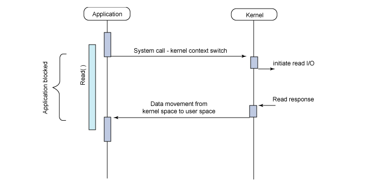
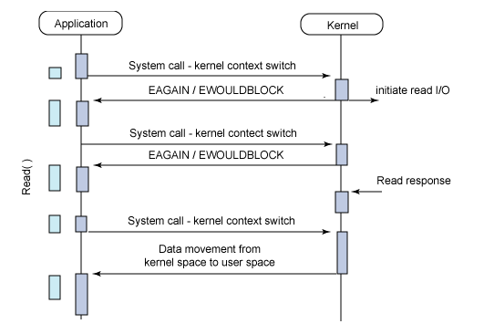
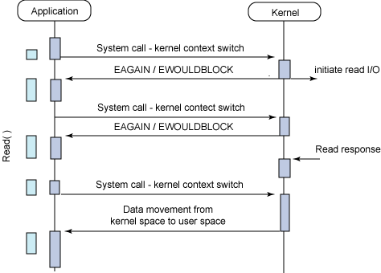
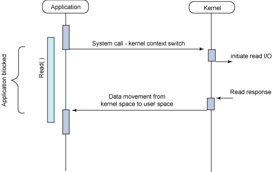
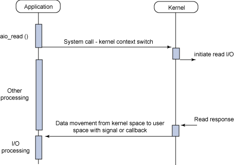

# Blocking I/O VS Non-Blocking I/O

프로그래밍에서의 입출력(I/O) 작업은 다양한 접근 방식을 통해 처리된다.

Block vs. Non-Block, 그리고 Sync vs. Async의 다양한 I/O 처리 방식을 알아보고, 각각의 특징과 사용 사례를 정리한다.

둘의 차이는 다른 주체가 작업을 수행하는 동안 물리적으로 자신의 제어권이 있는지 여부를 기준으로 한다. 이는 물리적인 실행 특성에 대한 구분이다.

---

## Blocking I/O

1. I/O 작업을 처리하기 위해 User Level에 있던 Application이 시스템 함수를 호출한다(→ system call).
   - 이 시점에 context switching이 발생한다.
2. Kernel Level에서 해당 I/O 작업을 수행하며, I/O가 끝날 때까지 유저 프로세스는 대기 상태에 놓인다.
   - 작업이 완료되기 전에는 함수가 반환되지 않기 때문에, 커널이 작업을 완료하기 전까지 유저 프로세스는 실행을 중단한 채 대기한다.
   - I/O 작업은 CPU 자원을 거의 사용하지 않으므로 Blocking 방식은 CPU 자원 낭비가 크다.
   - 애플리케이션 관점에서는 아무 동작도 하지 않는 것처럼 보이지만, 실제로는 커널에서 I/O 작업을 수행하느라 block된 상태이다.
   - 이 부분이 Blocking I/O의 문제점이며 개선 포인트이다.
   - 이러한 비효율성을 극복하기 위해 Non-Blocking 방식이 등장했다.
3. 작업이 완료되어 데이터가 반환되면, 그 시점에서 Application 단의 스레드에 걸려 있던 block이 해제된다.

---

## Non-Blocking I/O

1. 유저 프로세스가 I/O 처리를 위해 커널에 함수를 호출한다(→ system call).
2. 커널은 I/O 작업의 진행 여부와 상관없이 즉시 결과를 반환한다.
   - 이때 반환되는 결과는 반환 시점에 가져올 수 있는 데이터에 해당한다.
   - 초기에는 가져올 수 있는 데이터가 없을 수 있으나, 시간이 지나면서 점차 데이터가 준비된다.
   - 서버는 클라이언트가 요청한 사이즈에 맞는 데이터를 반환하기 위해 데이터를 축적한다.
3. 클라이언트는 반환된 값이 원하는 사이즈가 되었는지를 지속적으로 확인한다(→ polling).
   - 다수의 클라이언트 요청이 동시에 발생할 경우, polling 과정에서 CPU에 상당한 부담을 줄 수 있다.
4. 데이터 축적이 완료되면, 클라이언트는 요청한 사이즈의 데이터를 반환받는다.

Blocking과 Non-Blocking의 차이는 호출된 I/O 함수가 즉시 반환하여 제어권을 애플리케이션에 넘기느냐, 아니면 반환하지 않고 커널이 제어권을 유지하느냐의 차이이다.

- Blocking은 I/O 작업이 완료될 때까지 함수가 반환되지 않으며, 제어권이 커널에 있는 상태이다.
- Non-Blocking은 함수가 즉시 반환되며, 제어권이 다시 애플리케이션으로 돌아온 상태이다.

Blocking I/O와 Non-Blocking I/O는 동기(Synchronous), 비동기(Asynchronous)와 비슷해 보이지만 서로 다른 개념이다.

---

## 동기 (Synchronous) VS 비동기 (Asynchronous)

### 동기 (Synchronous)

프로세스의 작업을 직렬화하여 수행하는 방식이다.  
한 작업이 완전히 수행될 때까지 다른 작업은 대기 상태이며, 작업이 완료된 이후에 다음 작업을 수행한다.  
요청을 보내고 반드시 응답을 받아야 다음 작업으로 진행한다.

### 비동기 (Asynchronous)

프로세스의 작업을 병렬적으로 수행하는 방식이다.  
요청을 보낸 이후 응답을 기다리지 않고 다음 작업을 수행할 수 있다.

---

## Synchronous Blocking I/O

- Blocking: 제어권이 없으므로 I/O 작업이 끝날 때까지 스레드는 다른 작업을 수행할 수 없다.
- Synchronous: 결과가 반환되면 즉시 처리한다.

---

## Synchronous Non-Blocking I/O

- Non-Blocking: 제어권을 잃지 않으므로 I/O 작업을 기다리지 않고 다른 작업을 수행할 수 있다.
- Synchronous: 결과에 관심을 가지므로, 결과가 준비되었는지를 주기적으로 확인하고 즉시 처리한다.

### 구현 방식: Polling, Interrupt

Non-Blocking I/O에서는 I/O 결과가 즉시 반환되지 않는다.  
요청한 쪽에서 주기적으로 I/O 작업이 완료되었는지를 확인하는 방식을 polling이라고 한다.

또한, I/O 작업이 완료되었을 때 상태 변화를 interrupt로 알려주는 방식도 존재한다.

### 단점

커널이 I/O 작업으로부터 read response를 받은 시점과 애플리케이션이 실제 데이터를 수신하는 시점 사이에 시간 간격이 존재한다.  
이 시간 간격으로 인해 I/O 지연이 발생하며, 이는 비효율적이다.

---

## read / write O_NONBLOCK

O_NONBLOCK는 파일 디스크립터를 Non-Blocking 모드로 설정하는 옵션이다.  
C 언어의 open 함수에서 해당 플래그를 사용할 수 있다.

예시:

    int fd = open("example.txt", O_RDONLY | O_NONBLOCK);

이렇게 설정하면 해당 파일 디스크립터에 대한 read, write 호출은 I/O가 완료되지 않았더라도 즉시 반환된다.

---

## Asynchronous Blocking I/O

- Blocking: 제어권이 없으므로 I/O가 끝날 때까지 다른 작업을 수행할 수 없다.
- Asynchronous: 결과 처리 여부가 필수가 아니다.

I/O 결과를 즉시 처리하지 않을 것이라면, I/O가 끝날 때까지 대기하는 방식은 비효율적이다.  
이 방식은 실제로 거의 사용되지 않으며, 설계 실수로 발생하는 경우가 많다.

---

## I/O Multiplexing

- 하나의 스레드가 여러 개의 입출력 소켓을 감시하는 기술이다.
- 어떤 소켓에서 I/O 이벤트가 발생했는지를 감시한다.
- 여러 소켓이 이벤트를 발생시킬 때까지 블로킹되지 않고 대기한다.
- 단일 스레드에서 다수의 소켓 I/O를 처리할 수 있다.
- select, poll과 같은 함수를 사용한다.
- 다수의 클라이언트를 효율적으로 처리할 수 있어 서버 프로그램에서 널리 사용된다.

---

## Asynchronous Non-Blocking I/O (AIO)

- Non-Blocking: I/O 작업 수행 중에도 스레드는 다른 작업을 수행한다.
- Asynchronous: 결과 처리가 필수가 아니다.

I/O 요청은 즉시 반환되며, I/O 작업은 백그라운드에서 수행된다.  
작업이 완료되면 시그널이나 콜백, 또는 별도의 스레드를 통해 결과를 처리한다.

