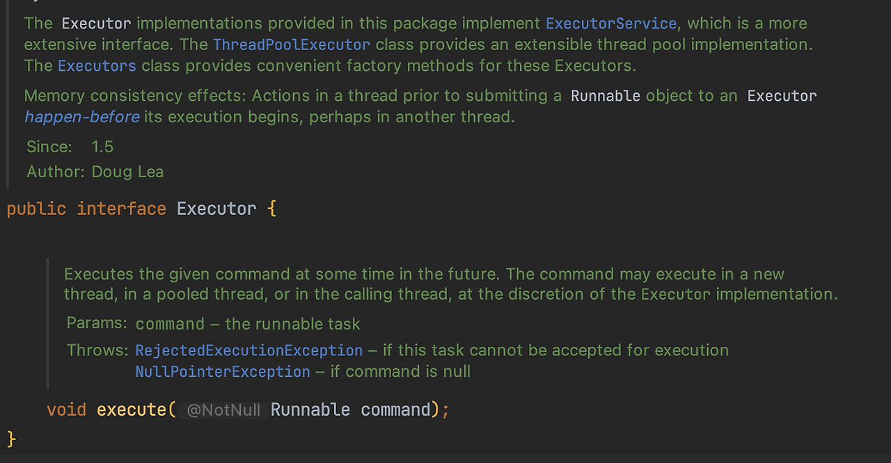
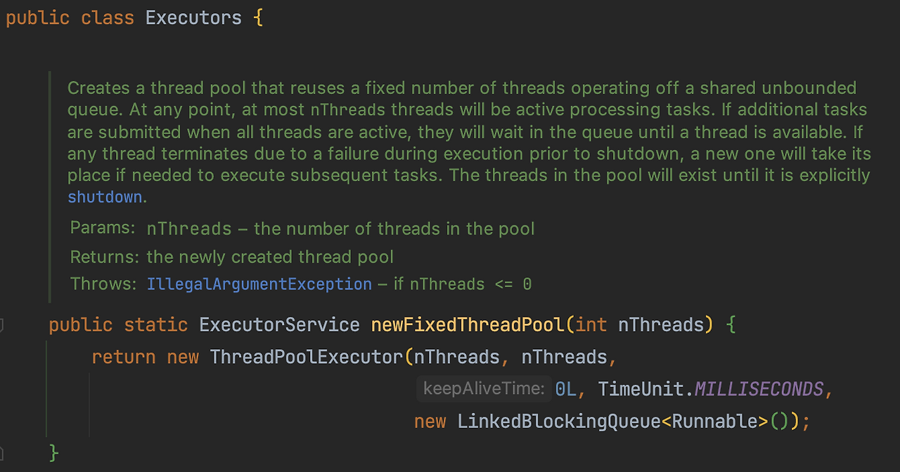
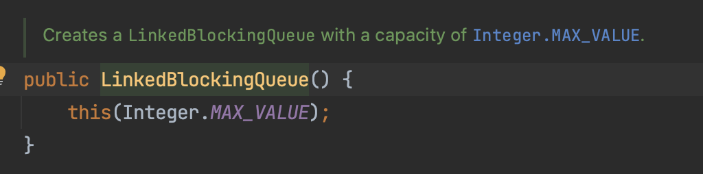
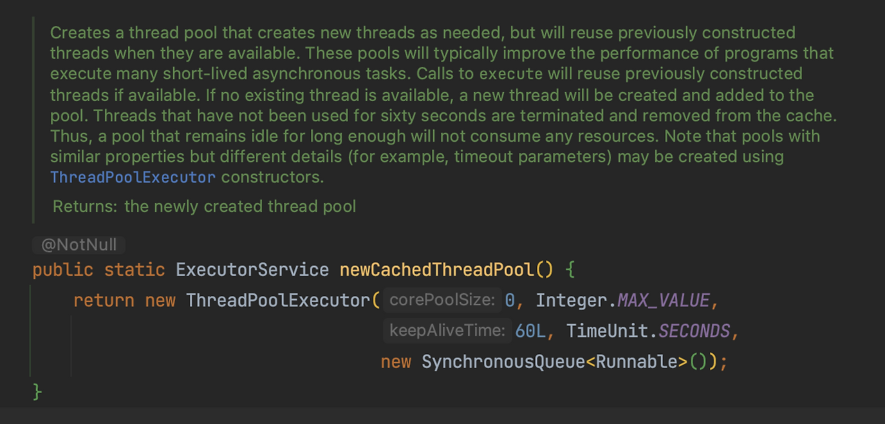

# 쓰레드 풀 (Thread Pool)

쓰레드 풀은 미리 일정 개수의 쓰레드를 생성하여 관리하는 기법이다.

이렇게 생성된 쓰레드들은 작업을 할당받기 위해 대기 상태에 있으며, 작업이 발생하면 대기 중인 쓰레드 중 하나를 선택하여 작업을 수행한다. 작업이 완료되면 해당 스레드는 다시 대기 상태로 돌아가며, 새로운 작업을 할당받을 준비를 한다.

쓰레드 풀을 사용하면 스레드 생성 및 삭제에 따른 오버헤드를 줄일 수 있고, 특정 시점에 동시에 처리할 수 있는 작업의 개수를 제한할 수 있다. 이를 통해 시스템 자원을 효율적으로 관리하고 성능을 향상시킬 수 있다.

---

## 쓰레드 풀의 장점

- 자원 효율성
  - 쓰레드 풀은 미리 정해진 개수의 스레드를 생성하여 관리하므로, 스레드 생성 및 삭제에 따른 오버헤드를 줄일 수 있다.
  - 이는 시스템 자원을 효율적으로 관리하고 불필요한 자원 소모를 방지한다.
- 응답성 및 처리량 향상
  - 쓰레드 풀은 작업을 대기 상태로 유지하여 작업 처리 속도를 향상시킨다.
  - 작업이 발생하면 대기 중인 쓰레드 중 하나를 선택하여 작업을 할당하므로, 작업을 병렬로 처리할 수 있다.
- 작업 제어
  - 쓰레드 풀을 사용하면 동시에 처리할 수 있는 작업의 개수를 제한할 수 있다.
  - 쓰레드 풀의 크기를 조절하여 시스템 부하를 제어하고, 과도한 작업 요청으로 인한 성능 저하를 방지할 수 있다.
- 쓰레드 관리
  - 쓰레드 풀을 사용하면 쓰레드의 생명 주기를 관리할 수 있다.
  - 쓰레드 풀은 스레드의 생성, 재사용, 종료를 관리하여 안전한 운영을 가능하게 한다.

---

## 단점

- 메모리 낭비
  - 미리 생성된 스레드를 관리하기 위해 메모리를 소비한다.
  - 지나치게 큰 스레드 풀은 메모리 낭비를 유발할 수 있다.
  - 스레드 풀 크기는 적절하게 설정해야 한다.

---

## 웹 애플리케이션에 쓰레드 풀을 도입하기 좋은 이유

쓰레드 풀은 동시에 실행되는 작업을 관리하는 데 사용되는 메커니즘이다.

쓰레드 풀은 작업을 처리하는 쓰레드들의 집합으로 구성되며, 이 쓰레드들은 작업이 도착하면 해당 작업을 실행하고 다음 작업을 대기한다.

실행 시간이 오래 걸리는 작업과 짧은 작업을 함께 실행할 경우, 쓰레드 풀의 크기가 충분하지 않으면 작업 실행을 방해하는 상황이 발생한다. 하나의 작업이 오랜 시간 실행되는 동안 다른 작업들이 대기하게 되어 전체 처리 속도가 저하될 수 있다.

또한, 크기가 제한된 쓰레드 풀에 작업 간 의존성이 있는 작업을 등록하면 데드락이 발생할 수 있다. 이는 작업들이 서로의 완료를 기다리며 진행되지 않는 상태를 의미한다.

일반적으로 네트워크 기반 서버 애플리케이션은 작업이 서로 동일하고 독립적이라는 특성을 가진다. 예를 들어 웹 서버는 각 요청에 대해 별도의 쓰레드를 할당하여 처리하며, 작업 간 의존성이 적다. 이러한 특성으로 인해 쓰레드 풀을 효과적으로 사용할 수 있다.

각 요청은 서로 다른 사용자나 데이터를 대상으로 하며, 요청 간 상호작용이 없는 경우가 많다. 웹 서버에서 각 클라이언트 요청은 웹 페이지를 응답하는 작업이며, 요청들은 서로 독립적으로 처리된다.

---

## Executor 인터페이스

- execute() 메서드 하나만을 가진다.
  - 실행 가능한 Runnable 인스턴스를 실행하기 위한 메서드이다.

코드 예시:

    Executor executor = Executors.newSingleThreadExecutor();
    executor.execute(() -> System.out.println("Hello World"));

---

## ExecutorService 인터페이스

- ExecutorService 인터페이스는 작업의 진행 상황을 제어하고 서비스 종료를 관리하기 위한 여러 메서드를 포함한다.
- 작업을 실행하고, 반환된 Future 인스턴스를 사용하여 실행 결과를 제어할 수 있다.

코드 예시:

    ExecutorService executorService = Executors.newFixedThreadPool(10);
    Future<String> future = executorService.submit(() -> "Hello World");
    // some operations
    String result = future.get();

- ExecutorService를 생성하고 작업을 submit한 뒤, 반환된 Future의 get 메서드를 사용하면 작업이 완료될 때까지 대기한다.
  - 실제 환경에서는 계산 결과가 필요할 때까지 future.get() 호출을 지연하는 것이 일반적이다.

---

## Executors

Executors 클래스는 static 메서드를 통해 다양한 형태의 쓰레드 풀을 제공한다.

### 주요 개념

Executors 클래스의 메서드들에서 공통적으로 사용되는 주요 설정 값은 corePoolSize, maximumPoolSize, keepAliveTime이다.

쓰레드 풀은 항상 유지되는 코어 스레드와, 필요에 따라 생성되고 제거되는 추가 스레드로 구성된다.

---

### corePoolSize (필수)

- 쓰레드 풀의 핵심 크기를 나타내는 값이다.
- 쓰레드 풀이 유지해야 하는 최소한의 쓰레드 개수이다.
- 예를 들어 corePoolSize가 5라면, 최소 5개의 쓰레드가 항상 유지된다.

---

### maximumPoolSize (선택)

- 쓰레드 풀이 생성할 수 있는 최대 쓰레드 개수이다.
- 모든 코어 스레드가 busy 상태이고 내부 큐가 가득 찬 경우, 쓰레드 수는 maximumPoolSize까지 확장될 수 있다.
- corePoolSize까지 쓰레드를 생성한 이후에는, 작업 도착 시 새로운 쓰레드를 생성하여 작업을 처리한다.
- maximumPoolSize를 설정하면 쓰레드 풀 크기를 동적으로 조절할 수 있다.

---

### keepAliveTime (선택)

- 작업을 수행하지 않는 비활성 쓰레드가 유지되는 최대 시간이다.
- corePoolSize를 초과하여 생성된 쓰레드에 대해서만 적용된다.
- 현재 쓰레드 개수가 corePoolSize보다 많고 작업이 없을 경우, keepAliveTime 이후 해당 쓰레드는 종료된다.
- keepAliveTime이 0이면 비활성 쓰레드는 즉시 종료된다.

---

## Executors.newFixedThreadPool(int nThreads)

- corePoolSize: nThreads
  - 항상 설정한 값만큼의 쓰레드를 유지한다.
- maximumPoolSize: nThreads
  - 큐에 요청이 쌓여도 추가 쓰레드를 생성하지 않는다.
- keepAliveTime: 0L
  - corePoolSize를 초과하는 쓰레드가 없으므로 의미 없는 설정이다.

- 고정 크기의 스레드 풀을 생성한다.
- 작업 큐는 사실상 무제한 크기이다.
  - Integer.MAX_VALUE
  - 작업이 과도하게 몰릴 경우 큐에 작업이 계속 쌓일 위험이 있다.
- 풀에 고정된 수의 스레드를 유지하며, 사용 가능한 스레드가 있을 때 작업을 실행한다.
- 모든 스레드가 작업 중이면, 나머지 작업은 대기 상태가 된다.
- 생성 시 지정한 크기를 유지하므로, 작업량이 많고 프로세서 자원이 충분한 경우에 유용하다.

---

## Executors.newCachedThreadPool()

- corePoolSize: 0
  - 기본 코어 쓰레드는 존재하지 않는다.
  - 요청이 없으면 쓰레드 풀이 비어 있을 수 있다.
- maximumPoolSize: Integer.MAX_VALUE
  - 요청이 쌓이면 제한 없이 쓰레드를 생성한다.
- keepAliveTime: 60L
  - 생성된 쓰레드는 60초 동안 작업이 없으면 종료된다.

Executors.newCachedThreadPool은 동적으로 크기가 조정되는 쓰레드 풀을 생성한다.
작업량에 따라 쓰레드 수를 자동으로 증가 또는 감소시킨다.
모든 쓰레드가 작업 중이면 새로운 쓰레드를 생성하여 작업을 처리한다.
반대로 일정 시간 동안 사용되지 않은 쓰레드는 종료된다.
작업을 큐에 쌓아 순차적으로 처리하는 경우에 유용하다.

