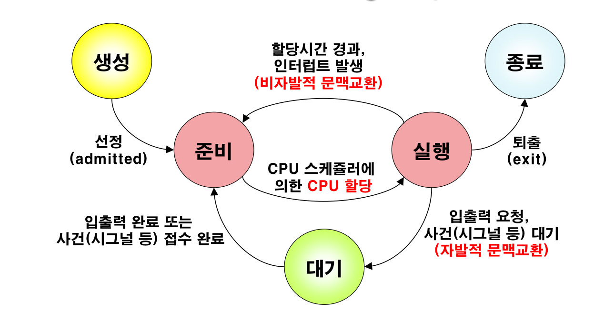

# 프로세스

### 프로세스란?

컴퓨터에서 실행되고 있는 프로그램들은 모두 프로세스라고 한다.

- 운영체제 프로세스와 사용자 프로세스로 분류
- 프로세스는 각각 독립된 메모리 영역(Code, Data, Stack, Heap의 구조)을 할당받음
- 기본적으로 프로세스당 최소 1개의 스레드를 가지고 있음
- 각 프로세스는 별도의 주소 공간에서 실행, 한 프로세스는
- 다른 프로세스의 변수나 자료구조에 직접 접근 불가
- 다른 프로세스의 자원에 접근하려면 IPC[^1](Inter-Process - Communication)을 사용해야 함
(파이프, 파일, 소켓 등을 이용한 통신 방법)  

[^1]: 독립된 프로세스가 데이터를 주고받거나 동기화 하기 위한 기술. 메모리 기반, 커널기반(Pipe사용)이 있다.

### 프로세스의 문맥구성

- 사용자 수준 문맥
  - 텍스트 영역 - 프로그램 코드영역
  - 자료 영역 - 프로그램 광역변수 부분
  - 스택 영역 - 프로그램 실행시간 스택 부분
- 커널 수준 문맥
  - CPU 내의 각종 특수 레지스터의 내용
    - 프로그램 카운트(PC)
    - 스택 포인터(SP)
    - CPU 상태 레지스터
  - CPU내의 각종 범용 레지스터 내용
  - 프로세스의 현재의 각종 자원 사용 정보
  - 커널에 프로세스 관리 정보

### 프로세스의 메모리구조

- 코드 영역 : 실행할 프로그램의 코드가 저장되는 영역으로 텍스트 영역이라고도 함
CPU는 코드 영역에 저장된 명령어를 하나씩 처리
- 데이터 영역 : 메모리의 데이터 영역은 프로그램의 전역 변수와 정적변수가 저장되는 영역
프로그램 시작과 함꼐 할당되고, 종료되면 소멸
- 힙 영역 : 사용자가 직접 관리할 수 있고, 관리 해야만 하는 메모리 영역 사용자에 의해 동적으로 할당되고 해제됨
낮은 주소에서 높은 주소의 방향으로 할당
- 스택 영역 : 함수의 호출과 관련된 지역 변수와 매개변수가 저장
함수의 호출과 함께 할당, 함수 호출 완료 후 소멸
스택 영역에 저장되는 함수 호출 정보를 스택 프레임이라고 함
- 레지스터 : CPU 내부의 초고속 저장공간
명령어 실행 중 필요한 데이터나 주소를 임시 저장한다 프로세스가 실행될 때, CPU는 해당 프로세스의 “문맥(Context)”을
이 레지스터들을 통해 기억하고 갱신한다.
- PCB : “운영체제가 프로세스를 추적하기 위한 메타데이터 구조체”이며 각 프로세스마다 1개씩 존재하고, 프로세스의 모든 상태 정보를 담고 있다. 자세한 내용은 뒷쪽에서 서술하겠다.

즉, 하나의 프로세스는 코드 + 데이터 + 상태 + 문맥(Context) 의 집합이다.

### 프로세스의 상태

- 생성(New) : 프로세스가 막 생성된 상태
- 준비(Ready) : 프로세스가 CPU에 실행되기 위해 대기하는 상태
- 실행(Running) : 프로세스에 포함된 명령어가 CPU에서 실행되고 있는 상태
- 대기(Waiting) : 프로세스가 특정 자원이나 이벤트를 기다리고 있는 상태
- 종료(Terminated) : 프로세스가 실행을 완료한 상태

### 프로세스 상태전이 동작

|동작|설명|
|---|---|
|준비 -> 실행  (Dispatch)|우선순위가 높은 프로세스를 선정하여 명령어 실행|
|실행 -> 준비  (Timer runout)|인터럽트를 발생시켜 제어권을 빼앗음(독점방지)|
|실행 -> 대기 (Block)|프로세서가 입출력, 자원등을 기다리기 위해 대기로 전환|
|대기 -> 준비 (Wake up)|입출력이 완료되거나 자원이 할당되어 다시 실행|

# 스레드

### 스레드란?

프로그램 내에서 실행되는 작업의 최소단위 이다.

- 프로세스 내에서 실행되는 여러 흐름의 단위
- Thread ID, PC, 레지스터 세트 및 스택으로 구성
- Thread는 프로세스 내에서 각각 Stack만 따로 할당받고 Code, Data, Heap 영역은 공유
- 한Thread가 프로세스 자원을 변경하면 다른 Thread도 그 결과가 반영됨
- 스레드간의 자원공유는 전역변수를 사용하므로 동기화 문제에 주의 필요

### Thread vs Process

|프로세스|쓰레드|
|---|---|
|자원을 할당받는 작업의 단위|할당받은 자원을 이용하는 실행단위|
|독립된 메모리, 주소공간 할당|할당받은 자원을 내부 스레드끼리 공유|

### 멀티스레딩

하나의 프로세스를 다수의 스레드를 통해서 실행하는것이다.

- 교착상태(DeadLock)[^2]발생 가능, 동기화 주의필요

[^2]: 두 개 이상의 작업이 서로 자원을 점유한 채 상대방의 작업이 끝날 때까지 기다리며 아무것도 완료하지 못하는 상태를 말한다.

- 자원을 공유하므로 프로세스보다 스레드간의 통신이빠르다.
- Stack만 처리하므로 ContextSwitch의 속도가 빠르다.

# PCB

운영체제가 프로세스를 관리하기 위한 데이터 구조체이며, 각 프로세스의 모든 기록을 저장해 놓는다.
운영체제는 실행중인 모든 프로세스마다 PCB를 만들어놓고 이를 통해서 각 프로세스를 식별하고 관리한다.

- 커널 영역에 저장된다
  - 즉 사용자 프로그램에서는 접근 불가
- 커널은 PCB 리스트를 유지하며, Ready Queue, Waiting Queue 등을 통해
스케줄링을 수행한다

### PCB의 역할

|역할|설명|
|---|---|
식별|(Identification) PID(프로세스 ID)를 통해 프로세스를 구분
상태 저장|(State Saving) 현재 실행 상태(Ready, Running, Waiting 등) 기록
문맥 저장|(Context Saving) 레지스터, 프로그램 카운터(PC), 스택 포인터(SP) 등 CPU 상태 저장
스케줄링 관리|(Scheduling) 우선순위, CPU 사용시간, 대기시간 등 저장
메모리 관리|(Memory Management) 코드, 데이터, 스택, 페이지테이블 주소 관리
입출력 관리|(I/O Management) 열려 있는 파일 핸들, 장치 정보, 입출력 큐 위치 등 저장

### PCB의 구성요소

|구분|항목|설명|
|---|---|---|
프로세스 식별자| PID, PPID|프로세스 고유 ID, 부모 프로세스 ID
프로세스 상태 |State| New, Ready, Running, Waiting, Terminated
CPU 문맥 정보| PC, Registers |레지스터 값, Program Counter(명령어 주소)
CPU 스케줄링 정보| Priority, CPU Time |우선순위, CPU 사용량, 대기 시간 등
메모리 관리 정보| Code/Data/Stack |주소, Page Table 해당 프로세스의 메모리 위치
I/O 상태 정보| Open Files, I/O Queue| 열려 있는 파일, 입출력 장치 큐
계정 정보| User ID, Resource Usage |사용자 정보, 자원 사용 통계

# 문맥전환 (Context Switching)

### 문맥전환이란?

CPU가 현재 실행 중인 프로세스(또는 스레드)의 상태를 저장하고,
다음 실행할 프로세스의 상태를 복원하는 과정이다.
CPU는 한번에 하나의 프로세스만 실행 가능하다 그런데 Context Switching을 이용하면 여러 프로그램이 동시에 실행되는것 처럼 보인다.

### 문맥이란?

프로세스가 CPU에서 실행 중일 때의 모든 상태 정보
즉, 프로세스가 “지금 어디까지 실행했는가”를 나타내는 데이터이다.

|항목| 설명|
|---|---|
Program Counter (PC)| 다음 실행할 명령어 주소
CPU Registers |현재 계산 중인 값, 주소
Stack Pointer (SP)| 함수 호출 스택 위치
Process State| Ready / Running / Waiting 등
Memory Info |코드, 데이터, 스택의 주소
I/O 상태 |파일 핸들, 장치 상태 등|  

이 정보가 PCB에 저장된다.

### 문맥 전환의 단계

1. 인터럽트 발생 (또는 스케줄러 호출)
→ 현재 실행 중인 프로세스를 멈춰야 함

2. 현재 프로세스의 상태 저장
→ 레지스터, PC, SP 등의 값을 PCB에 저장

3. 새로운 프로세스 선택 (스케줄링)
→ Ready Queue에서 다음 실행할 프로세스를 선택

4. 새로운 프로세스의 상태 복원
→ PCB에서 레지스터, PC 등을 CPU에 복사

5. CPU 제어권 전환
→ 새 프로세스의 코드 실행 재개

### 문맥 전환이 발생하는 상황

상황| 설명
|---|---|
타임 슬라이스 만료| CPU가 프로세스에게 할당된 시간 다 씀
I/O 요청| 디스크나 네트워크 작업으로 대기 필요
프로세스 종료| 실행이 완료되어 CPU 반환
우선순위 높은 프로세스 등장| 선점형 스케줄링에서 발생
시스템 호출 | 인터럽트 발생 커널 모드 전환 등으로 발생  

### 문맥전환 비용

하지만 문맥전환은 비용이 들며, 잦은 문맥전환은 성능저하를 일으킨다.

항목| 내용
|---|---|
레지스터 저장/복원 시간| PCB 간의 값 복사
캐시 무효화(Cache Flush)| CPU 캐시가 새 프로세스 데이터로 덮여버림
메모리 접근 지연 |새로운 페이지 테이블 로딩
커널 모드 전환 비용| 사용자 모드 → 커널 모드 → 사용자 모드 전환

그래서 OS는 여러 스캐줄링 정책을 이용해서 문맥전환의 비용을 최소화 하려고 한다.

#### 스레드 단위의 문맥전환

스레드는 서로 메모리 영역을 공유하기 때문에 문맥전환의 비용이 훨씬 더 적고 빠르다

비교 |프로세스 전환| 스레드 전환
|---|---|---|
공유 메모리| 없음| 있음 (Code/Data/Heap)
전환 비용| 높음| 낮음
필요 데이터 |PCB 전체| TCB(Thread Control Block) 일부
속도 |느림 |빠름
