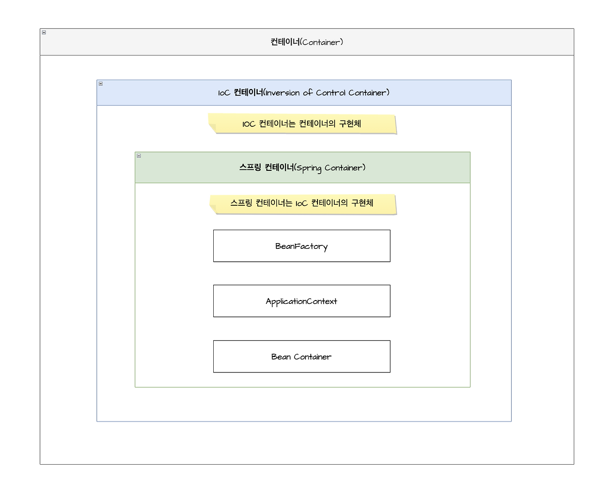
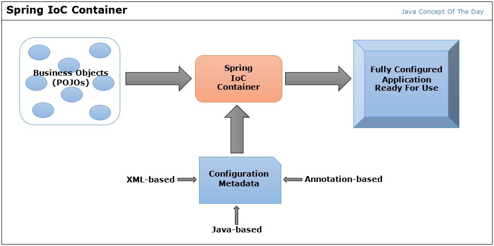
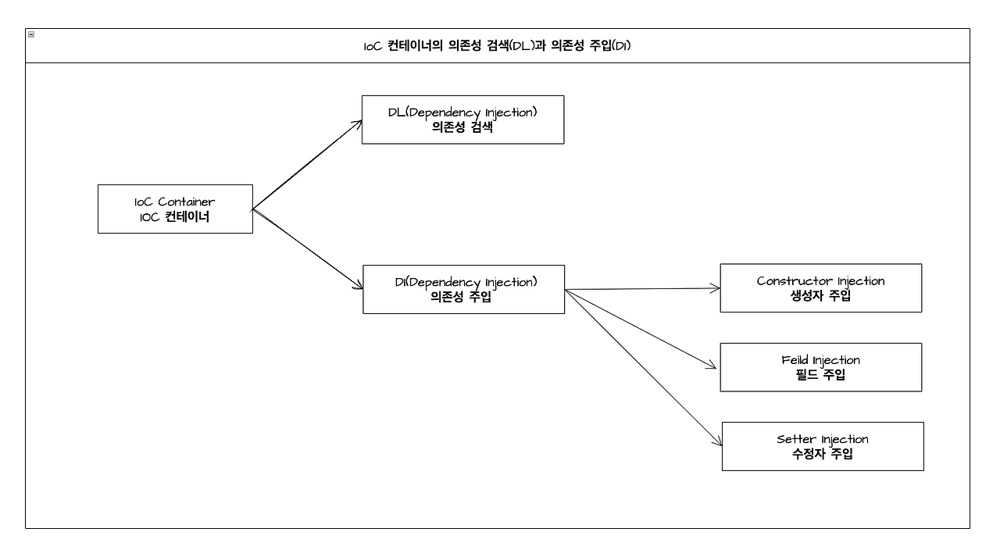

# Spring IOC, DI

DI와 IOC는 Spring FrameWork의 주요 특징이다.

## Spring Framework와 Spring Boot의 관계

- Spring Boot는 Spring Framework 위에 구축되어 Spring 애플리케이션을 생성하고 구성하는 간소화된 방법을 제공한다. 즉, Spring Framework 기반으로 Spring Boot가 수행되는 프레임워크를 의미한다.

- Spring Boot 자동 구성과 주관적인 기본 설정을 제공하여 개발자가 보일러플레이트 코드 대신 비즈니스 로직 작성에 집중할 수 있도록 개발 과정을 간소화하는 것을 목표로 한다.

## 제어의 역전 IOC(Inversion of Control)

- 소프트웨어 디자인 패턴 중 하나로 제어 흐름이 일반적인 프로그램의 흐름과는 반대로 ‘제어의 주체가 역전’되는 것을 의미한다.

- 일반적으로 프로그램은 ‘사용자 또는 개발자’가 직접 제어 흐름을 조작하고 결정한다. 하지만 IOC 패턴을 사용하면 제어 흐름의 결정 권한이 <u>Spring 컨테이너</u>에게 객체 생성 및 관리(객체 간의 의존성)를 위임할 수 있다.
  - 즉 개발자는 “무엇(무슨 기능이 필요한지)”에만 집중하고 어떻게 연결할껀지는 컨테이너에 맡긴다.

### 컨테이너, IOC 컨테이너, 스프링 컨테이너

**컨테이너(Container)**

- 객체의 인스턴스를 생성하고 관리하는 역할을 합니다. 또한 필요한 객체를 생성하고 객체 간의 의존성을 주입하는 등의 작업을 수행합니다.

**IOC 컨테이너(Inversion of Control Container)**

- 컨테이너의 일종으로, 제어의 역전 개념을 기반으로 동작합니다. 또한 애플리케이션의 ‘제어 흐름’을 관리하며, ‘객체의 생성과 의존성 주입’을 자동으로 처리합니다.

- 이를 통해 애플리케이션의 코드는 객체 생성에 집중하지 않고, 의존성 주입을 통해 객체를 사용할 수 있게 됩니다.

- 스프링이 제공하는 “컨테이너”는:
  - @Configuration, @Bean, @Component, @Service, @Repository, @Controller 같은 애노테이션을 스캔하고
  - 객체를 생성
  - 싱글톤으로 관리
  - 의존성 주입(DI) 수행
  - 라이프사이클 콜백(@PostConstruct, @PreDestroy) 처리

**스프링 컨테이너(Spring Container)**

- 스프링 프레임워크에서 제공하는 IOC 컨테이너의 구현체 중 하나입니다. 스프링 컨테이너는 POJO의 생성과 의존성 주입을 담당하며, 스프링 프레임워크에서 제공하는 다양한 기능과 모듈을 활용하여 애플리케이션을 개발할 수 있도록 도와줍니다




|분류|	컨테이너| 	IOC 컨테이너|	스프링 컨테이너|
|---|---|---|---|
|정의	|소프트웨어 컴포넌트를 저장, 관리 및 실행하는 환경	|컴포넌트의 생명주기와 의존성 관리를 자동으로 처리하는 컨테이너	|스프링 프레임워크에서 제공하는 IOC 컨테이너 구현체|
주요 기능	|컴포넌트 인스턴스화 및 관리|	객체의 생성, 의존성 주입, 설정 및 관리	|객체의 생성, 의존성 주입, 설정 및 관리
의존성 관리	|수동으로 수행해야 함	|자동으로 수행됨|	자동으로 수행됨
확장성	|제한적	|높음|	높음
사용 예시	|Java EE, .NET 등에서 사용|	Spring Framework 등에서 사용	|Spring Framework 등에서 사용

### IOC 컨테이너의 흐름



1. Configuration Meta(Annotation-based, Java-based, XML-based) → Spring IoC Container
-  IOC 컨테이너에게 ‘POJO의 생성 및 의존성 주입에 대한 정보’를 제공합니다.(Annotation-based, Java-based, XML-based)

- 이 정보를 기반으로 IOC 컨테이너는 POJO를 생성하고 필요한 의존성을 주입하여 객체 간의 관계를 설정합니다.
-  IOC 컨테이너가 POJO의 라이프사이클을 관리하고 의존성을 처리하는 데 도움을 줍니다.


2. Business Objects(POJOs) → Spring IoC Container

- IOC 컨테이너는 POJO를 관리하고 필요한 ‘의존성을 주입’하여 ‘객체 간의 관계’를 설정합니다.

- 이를 통해 POJO는 의존성을 직접 관리하지 않고 느슨한 결합도를 갖는 구조를 유지할 수 있습니다.


3.  Spring IoC Container → Fully Configured Application Ready For Use

- Configuration Metadata를 통해 POJO의 생성 및 의존성 주입에 대한 정보를 받은 뒤, POJO에서는 의존성을 주입하고 객체 간의 관계를 설정합니다.

- 이렇게 구성된 설정에 따라 애플리케이션의 구성을 완전히 설정합니다. 즉 애플리케이션을 구성하고 사용할 수 있는 상태로 만들어주는 역할을 합니다.

### Bean, BeanFactory, ApplicationContext

**Bean**

- 스프링 프레임워크에서 관리되는 ‘객체’를 의미합니다. 이러한 객체는 클래스 기반으로 생성하고 ‘빈 컨테이너’에 의해 생성, 관리, 검색됩니다.
- 빈은 애플리케이션에서 사용되는 주요한 구성 요소로 여러 기능을 수행하고 다른 빈들과 협력합니다.
- 빈은 XML, Java Config, Anntation을 기반으로 Bean 설정하고 구성할 수 있습니다. XML을 기반으로 기존의 빈의 속성과 의존성을 정의하며 어노테이션을 이용하여 Java 클래스에 직접 어노테이션을 작성하여 빈을 설정할 수 있습니다.


**BeanDefinition**

- 스프링 프레임워크에서 빈(bean)의 정의를 나타내는 구성 메타데이터입니다. 이는 빈의 클래스, 범위, 라이프사이클 콜백, 의존성 및 기타 구성 세부 정보에 대한 정보를 제공합니다.

- 스프링 컨테이너가 제공된 구성에 따라 빈 인스턴스를 생성하고 관리하는 데 사용됩니다. 이는 런타임에서 빈 객체를 생성하기 위한 역할을 합니다.


**BeanFactory**

- 스프링의 핵심 인터페이스로, 빈의 생성, 관리, 검색 등을 담당합니다.

- 빈을 등록하고 필요한 시점에 빈을 가져와서 사용할 수 있습니다. 빈의 지연 로딩을 지원하고, XML 또는 애노테이션 기반으로 빈을 설정할 수 있습니다.


**ApplicationContext**

- BeanFactory의 하위 인터페이스로, 빈 컨테이너의 기능을 확장한 것입니다.
- BeanFactory의 모든 기능을 포함하며, 추가적인 기능을 제공합니다. 예를 들어, ApplicationContext는 메시지 리소스 번들, 이벤트 발행 및 처리, AOP(Aspect-Oriented Programming) 등의 기능을 지원합니다.
- 또한 ApplicationContext는 다양한 형식으로 빈을 설정할 수 있습니다. XML, 애노테이션, 자바 설정 클래스 등을 사용하여 빈을 정의하고 관리할 수 있습니다.

## 의존성 검색 DL(Dependency Lookup) & 의존성 주입 DI(Dependency Injection)



### 의존성 검색 DL(Dependency Lookup)

- 객체가 직접 ‘의존하는 객체를 검색하고 반환받는 방식’을 의미합니다.
- 의존성 조회는 객체가 필요로 하는 의존성을 직접 알고 있어야 하며, 의존하는 객체가 변경되면 코드를 수정해야 합니다.

**사용 예시**
1. ApplicationContext 인터페이스를 구현한 ClassPathXmlApplicationContext 클래스의 인스턴스인 context를 생성합니다.

2. context를 사용하여 myBean이라는 이름의 빈을 가져옵니다. getBean 메서드는 빈의 이름을 인자로 받고, 해당하는 빈 객체를 반환합니다. 이때, 반환되는 객체는 Object 타입이므로 캐스팅을 통해 MyBean 타입으로 사용할 수 있습니다.


3. myBean 객체를 사용하여 doSomething 메서드를 호출합니다. 이는 MyBean 클래스에 구현된 메서드입니다.

### 의존성 주입 DI(Dependency Injection)

IoC는 개념이고, 이걸 구현하는 여러 패턴/방식들이 있다.
그 중 하나가 DI(Dependency Injection, 의존성 주입).

DI = 객체가 필요로 하는 의존 객체를, 스스로 생성하지 않고 “외부에서 주입 받는 방식”

**DI의 장점**
- 결합도 감소
  - OrderService가 더 이상 new OrderRepository() 를 알 필요 없
  - 인터페이스 기반으로 구현 갈아 끼우기 쉬워짐
- 테스트 쉬움
  - 가짜 구현(Mock, Stub) 쉽게 넣어줄 수 있음
- 유연한 변경
  - 설정파일/빈 설정만 바꿔서 구현체 변경 가능
  - OCP(개방-폐쇄 원칙) 지키기 쉬움
- 공통 라이프사이클 관리
  - 싱글톤 관리, 초기화/소멸, AOP, 트랜잭션 등과 연결하기 쉬움

#### DI 3가지 방식

1. 생성자 주입 (추천)
``` java
@Service
public class OrderService {

    private final OrderRepository orderRepository;

    // 스프링이 여기로 의존성을 주입
    public OrderService(OrderRepository orderRepository) {
        this.orderRepository = orderRepository;
    }
}
```
- 장점
  - final로 불변 의존성 만들 수 있음
  - 순환 참조를 컴파일 타임/런타임에서 빨리 잡아낼 수 있음
  - 테스트 코드에서 명확하게 주입 가능

스프링 부트에서 생성자 1개만 있으면 @Autowired 안 붙여도 자동 주입.

2. 필드 주입 (지양하는 편)
``` java
@Service
public class OrderService {

    @Autowired
    private OrderRepository orderRepository;
}
```

- 코드 짧고 편하지만:
  - 의존 관계가 숨겨져 있어서 테스트/설계 관점에서 별로
  - DI 컨테이너 없으면 테스트하기 힘듦
그래서 실무/클린 코드 기준으로는 비추천.

3. Setter(수정자) 주입
``` java
@Service
public class OrderService {

    private OrderRepository orderRepository;

    @Autowired
    public void setOrderRepository(OrderRepository orderRepository) {
        this.orderRepository = orderRepository;
    }
}
```

- 런타임에 구현체를 갈아끼워야 할 때
- 선택적 의존성(optional)일 때 사용

일반적인 서비스 핵심 의존성에는 잘 안 쓰고,
환경에 따라 바뀔 수 있는 의존성 등에 쓰기도 함.

# 문제

## @Configuration + @Bean vs @ComponentScan 차이는?

**@Configuration + @Bean 방식 (수동 등록, 명시적 등록)**
특징
- 개발자가 직접 빈을 정의하고 생성 순서/구성까지 전부 통제하는 방식
- XML 설정 파일을 대체하는 “자바 코드 기반 설정 방식”
- “정교한 제어가 필요한 경우” 사용

장점
- 각 빈의 생성 방식, 매개변수, 초기화 과정을 정교하게 제어 가능
- 테스트 시 mock 대체도 쉬움
- 라이프사이클, 프록시, 의존 관계 모두 명확히 보임
- 외부 라이브러리 객체도 Bean으로 등록 가능- 

단점
- 모든 걸 직접 정의해야 하니 설정 코드 많아짐
- 확장성은 떨어짐

**@ComponentScan 방식 (자동 등록)**

특징
- 패키지 내 클래스들을 스캔해서
@Component, @Service, @Repository, @Controller 등 붙은 클래스들을 자동으로 빈으로 등록하는 방식

- 스프링 부트 기본 전략

장점
- 개발자가 직접 빈을 거의 등록할 필요 없음
- 더 간결하고 개발 속도 빠름
- 스프링 부트처럼 대규모 프로젝트에서 필수

단점
- 어떤 빈이 등록되는지 추적이 어려움
- 애노테이션 위치/패키지 구조가 잘못되면 빈이 누락될 수 있음
- 의존 구조가 명확히 보이지 않음

