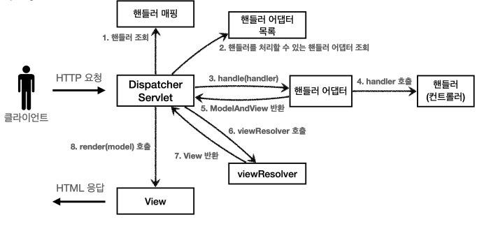

# MVC (Model, View, Controller)

스프링 MVC는 말 그대로 **“Spring이 제공하는 웹 MVC 프레임워크”** 고,
그 핵심은 요청을 한 군데(DispatcherServlet)에서 받아서 Controller → Service → View 까지 흐름을 정리해주는 구조다.

## MVC 패턴
MVC = Model / View / Controller

**Model**: 화면에 보여줄 데이터, 비즈니스 결과
**View**: HTML, JSON, 템플릿 등 “실제 응답”
**Controller**: 요청을 받고, 필요한 로직을 호출하고, 어떤 View를 쓸지 결정

- 애플리케이션의 개발 영역을 MVC (Model, View, Controller)로 구분하여 각 역할에 맞게 코드를 작성하는 개발 방식이다.
- MVC 패턴을 도입하면서 UI 영역과 도메인(비즈니스 로직) 영역으로 구분되어 서로에게 영향을 주지 않으면서 개발과 유지보수가 가능하다.
- MVC에서 모델은 애플리케이션의 정보(데이터)를 나타내며, 뷰는 텍스트, 체크박스 항목 등과 같은 사용자 인터페이스 요소를 나타내고, 컨트롤러는 데이터와 비즈니스 로직 사이의 상호동작을 관리한다.

### MVC 패턴을 사용하는 이유

MVC 패턴의 사용 목적: 각 컴포넌트가 서로 분리되어 각자의 역할에 집중할 수 있기 때문에 시스템 결합도를 낮출 수 있다. 또한, 유지보수가 쉬우며, 중복코드를 제거할 수 있고, 애플리케이션의 확장성 및 유연성이 증가한다.

### MVC의 발전
우리가 흔히 사용하고 있는 MVC 패턴은 사실 MVC1, MVC2 아키텍쳐에서 발전된 패턴이다.

**MVC1**

MVC1 패턴이란, 브라우저(사용자)로부터 요청이 들어오면 DB로부터 필요한 데이터를 받은 Model 객체(Java Bean)를 JSP 페이지(View)에 담아 응답으로 보내는 패턴이다.
MVC1에서는 JSP가 View와 Controller 역할을 모두 담당하기 때문에 JSP 페이지 내에 너무 많은 코드가 들어가게 된다. 따라서, 코드의 가독성이 떨어질 뿐만 아니라 코드가 복잡해질 가능성이 있다.
이러한 점을 보완하여 Controller 역할을 하는 Servlet이 추가된 MVC2 패턴이 등장하게 되었다.

**MVC2**

MVC2 패턴은 요청을 하나의 컨트롤러(Servlet)가 먼저 받는다.
서블릿은 요청에 대한 비즈니스 로직을 처리한 후, 이를 JSP 파일에 반영하는 역할을 수행한다.

MVC2는 MVC1 패턴보다 구조가 복잡해질 수 있으나, 이러한 문제점들을 해결하기 위해 각종 프레임워크들이 지금까지 잘 발전되어 왔고, 그 중에서 대표적인 것이 바로 스프링 프레임워크이다.

**Spring MVC**
스프링 프레임워크에서 MVC2 모델을 좀 더 발전시켜 Spring MVC가 나왔으며 이는 MVC2 모델이 기반인 웹 모듈이다.

프론트 컨트롤러(Front Controller)가 우선적으로 클라이언트로부터 모든 요청을 받게 되며, 실제 요청의 처리는 개별 컨트롤러 클래스로 위임을 한다.

개별 컨트롤러 클래스는 핸들러(Handler)라고도 하며, DI를 통해 생성해둔 Bean을 통해 비즈니스 로직 처리 결과를 Model에 담아 다시 프론트 컨트롤러로 보낸다. 프론트 컨트롤러는 받은 Model을 알맞은 View 템플릿으로 전달하여 반영시키고, 최종적으로 클라이언트로 보낼 화면을 응답 결과로 전송하는 것이다.

## Spring MVC 구조

**DispatcherServlet**
- Front Controller의 역할을 수행하며 Request를 각각의 Controller에게 위임한다.
- 가장 앞 단에서 클라이언트의 요청을 처리하는 Controller로써 요청부터 응답까지 전반적인 처리 과정을 통제한다.

**HandlerMapping**
- 요청을 직접 처리할 컨트롤러를 탐색한다.
- 구체적인 Mapping은 xml파일이나 java config 관련 어노테이션 등을 통해 처리할 수 있다.

**HandlerAdapter**
매핑된 컨트롤러의 실행을 요청한다.

**Controller**
DispatcherServlet이 전달해준 HTTP 요청을 처리하고 결과를 Model에 저장한다.
- 직접 요청을 처리하며, 처리 결과를 반환한다.
- 결과가 반환되면 HandlerAdapter가 ModelAndView 객체로 변환되며, 여기에는 View Name과 같이 응답을 통해 보여줄 View에 대한 정보와 관련된 데이터가 포함되어 있다.

**ModelAndView**
ModelAndView는 Controller에 의해 반환된 Model과 View가 Wrapping된 객체이다.

**View Resolver**
View Name을 확인한 후, 실제 컨트롤러로부터 받은 로직 처리 결과를 반영할 View 파일(jsp)을 탐색한다.

**View**
로직 처리 결과를 반영한 최종 화면을 생성한다.

1. 클라이언트: `GET /members`
2. `DispatcherServlet` (Front Controller 역할)이 요청을 받는다.
3. `HandlerMapping` 이 이 URL에 해당하는 `Controller` 메서드를 찾는다.
4. `DispatcherServlet`이 `HandlerAdapter` 를 통해 `Controller` 메서드를 호출한다.
5. `Controller`가 `Model`에 데이터 채우고, `View` 이름 리턴
   1. 예: `"members/list"`
6. `DispatcherServlet`이 `ViewResolver` 를 통해 실제 `View` 파일 위치를 찾는다.
   1. 예: `/WEB-INF/views/members/list.jsp`
   2. 또는 `templates/members/list.html` (Thymeleaf)
7. `View`가 `Model`을 렌더링해서 `HTML/JSON` 응답을 만든다.
8. 클라이언트에게 HTTP 응답 전송.

