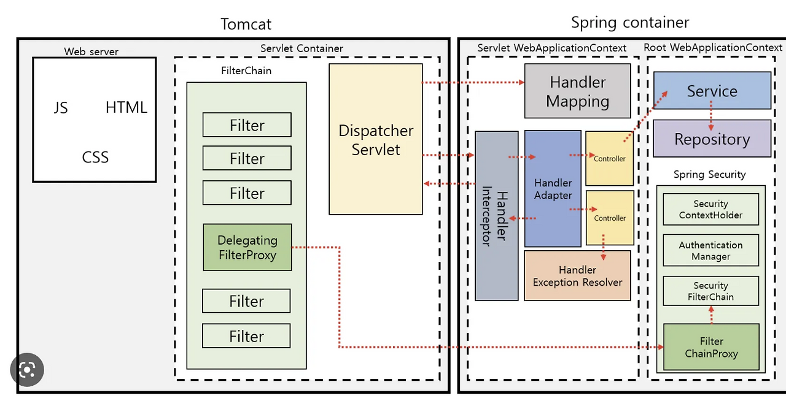

# 톰캣 (TomCat)

**아파치 톰캣(Apache Tomcat)** 은 자바 ``Servlet`` 과 ``JSP``(JavaServer Pages) 를 실행할 수 있는 ``Servlet Container`` 이자 웹 서버이다.  
톰캣은 ``HTTP`` 프로토콜을 통해 클라이언트 요청을 받고, ``Servlet`` 규격에 따라 자바 웹 애플리케이션을 실행하여 응답을 반환한다.

간단하게 말하면 Tomcat = ``WAS`` (Web Application Server)이다.

---

## 스프링과 톰캣의 관계

스프링 프레임워크는 자체적으로 웹 서버 기능을 제공하지 않는다.  
대신 서블릿 컨테이너인 톰캣 위에서 동작하여 웹 애플리케이션을 구동한다.  
스프링 MVC는 기본적으로 ``Servlet`` 기반 프레임워크이기 때문에 반드시 서블릿 컨테이너가 필요하다.

따라서 톰캣이 ``DispatcherServlet`` 을 실행시키지 않으면 스프링 MVC는 동작할 수 없다.

---

## 톰캣이 하는 일 (핵심 역할)

1. **HTTP 요청 수신**
   - 소켓을 열고  
   - ``HTTP/1.1`` 데이터를 파싱하고  
   - ``HttpServletRequest`` / ``HttpServletResponse`` 객체를 생성한다.

2. **Servlet 실행 환경 제공**
   - ``DispatcherServlet`` 과 같은 서블릿을 실행시키는 환경을 제공한다.

3. **스레드 풀 관리**
   - 요청마다 ``Worker Thread`` 하나를 할당한다.  
   - 즉, 하나의 요청은 하나의 스레드에서 처리된다.

4. **Lifecycle 관리**
   - 서블릿의 ``init`` / ``service`` / ``destroy`` 생명주기를 관리한다.

5. **JSP 컴파일**
   - ``JSP`` 파일을 ``Java Servlet`` 으로 변환하고 컴파일하여 실행한다.

---

## 동작 원리

### 1. 서블릿 컨테이너와 서블릿
- ``Servlet Container`` 는 서블릿의 생명주기를 관리하고, 클라이언트 요청과 서블릿 간 통신을 중재한다.  
- ``Servlet`` 은 HTTP 요청을 처리하고 응답을 생성하는 서버 측 컴포넌트이다.

### 2. 스프링 MVC와 DispatcherServlet
- ``DispatcherServlet`` 은 스프링 MVC의 핵심 서블릿으로, 모든 HTTP 요청을 처리한다.  
- 스프링 애플리케이션이 톰캣에 배포되면 ``DispatcherServlet`` 의 ``init()`` 이 호출되고  
  스프링 ``ApplicationContext`` 가 생성되며 빈들이 초기화된다.

---

## 요청 처리 흐름

1. 클라이언트가 브라우저를 통해 특정 URL로 요청을 보낸다.
2. 톰캣이 HTTP 요청을 수신하고 어떤 ``Servlet`` 이 처리해야 하는지 결정한다.  
   매핑은 ``web.xml`` 또는 어노테이션 설정으로 이루어진다.
3. ``DispatcherServlet`` 이 해당 요청을 처리하도록 ``service()`` 메서드가 호출된다.
4. ``HandlerMapping`` 이 적절한 컨트롤러 메서드(핸들러)를 탐색한다.
5. ``HandlerAdapter`` 가 해당 핸들러 메서드를 실행한다.
6. ``ViewResolver`` 가 어떤 뷰를 렌더링할지 결정한다.  
   REST의 경우 ``@ResponseBody`` 또는 ``ResponseEntity`` 로 응답을 직접 반환한다.
7. ``DispatcherServlet`` 이 최종 응답을 톰캣에 전달하고 톰캣은 이를 클라이언트에게 반환한다.

---

## 서블릿 생명주기와 스프링

### 초기화(init)
톰캣이 시작될 때 등록된 서블릿들을 초기화한다.  
``DispatcherServlet`` 의 ``init()`` 이 호출되면서 스프링 컨텍스트가 만들어지고 빈들이 초기화된다.

### 서비스(service)
HTTP 요청이 들어올 때마다 ``service()`` 메서드가 호출된다.  
이 메서드는 HTTP 메서드에 따라 ``doGet()`` 또는 ``doPost()`` 등을 호출한다.

### 소멸(destroy)
톰캣이 종료되거나 서블릿이 언로드될 때 ``destroy()`` 메서드가 호출되어 리소스를 정리한다.

---

## 필터(Filter)와 인터셉터(Interceptor)

### Filter
- ``Servlet Container`` 단계에서 동작한다.  
- ``DispatcherServlet`` 에 도달하기 전에 요청을 가로채서 처리하거나 로그를 남길 수 있다.

### Interceptor
- 스프링 MVC 단계에서 동작한다.  
- ``HandlerInterceptor`` 를 구현하여 컨트롤러 메서드 실행 전·후에 로직을 수행한다.

---

## 톰캣의 스레드 처리

### 요청당 스레드 할당
톰캣은 ``Thread Pool`` 을 운영하면서 각 HTTP 요청마다 ``Worker Thread`` 하나를 배정한다.

### 스레드 안전성 주의
서블릿과 스프링 컨트롤러는 멀티스레드 환경에서 동작하므로  
상태를 가지는 인스턴스 변수를 사용하면 스레드 안전 문제가 발생한다.  
스프링 빈은 기본적으로 ``Singleton`` 이므로 상태를 가지는 필드는 사용하면 안 된다.

---

## 종합적인 요청 처리 흐름 예시

1. 클라이언트가 ``GET http://localhost:8080/users/1`` 요청을 전송한다.  
2. ``Tomcat HTTP Connector`` 가 요청을 수신한다.  
3. 톰캣이 ``DispatcherServlet`` 으로 요청을 전달한다.  
4. ``HandlerMapping`` 이 ``/users/{id}`` 에 매핑된 컨트롤러 메서드를 탐색한다.  
5. ``HandlerAdapter`` 가 해당 컨트롤러의 ``getUser()`` 메서드를 실행한다.  
6. ``UserService`` 를 통해 사용자 정보를 조회한다.  
7. 컨트롤러가 ``ResponseEntity`` 로 응답을 생성한다.  
8. ``DispatcherServlet`` 이 응답을 ``HttpServletResponse`` 에 작성하고 톰캣은 이를 클라이언트에게 반환한다.

