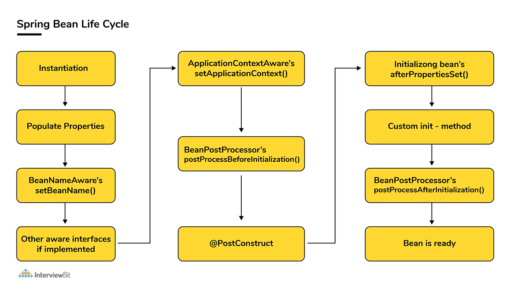

# 빈 생명주기(Bean LifeCycle)

Spring DI 컨테이너는 Bean으로 등록된 객체의 생명주기 관리를 위임받아서 관리하고, 객체가 필요한 곳에서 이 Bean을 의존성 주입받아서 사용할 수 있다.

스프링 컨테이너가 생성될 때 객체(Bean)를 생성하고 의존성을 주입하는데, 의존관계 주입 후 Bean을 초기화하고, 스프링 컨테이너를 종료하기 전에 객체를 소멸시켜야 한다.

## Bean

Bean은 Spring Framework에서 매우 중요한 개념 중 하나로, Spring 컨테이너에 의해 관리되는 객체를 의미합니다. Spring 애플리케이션에서는 모든 객체가 Bean으로 관리될 수 있으며, 이들 Bean은 애플리케이션의 다양한 컴포넌트들 간의 의존성을 정의하고 관리하는 역할을 합니다.

1. **Spring 컨테이너에 의해 관리됨:**
   - Bean은 Spring IoC(Inversion of Control) 컨테이너에 의해 생성되고, 관리됩니다. - 컨테이너는 Bean의 생명주기를 관리하고, 의존성을 주입하며, 필요에 따라 Bean을 생성하거나 소멸시킵니다.
2. **싱글톤 기본 스코프:**
   - 기본적으로 Spring Bean은 싱글톤 스코프를 가집니다. 즉, 동일한 Bean 정의에 대해 Spring 컨테이너는 단일 인스턴스만을 생성하고, 애플리케이션 내에서 공유합니다.
   - 싱글톤 외에도 프로토타입(Prototype), 요청(Request), 세션(Session) 등의 다양한 스코프가 있습니다.
3. **의존성 주입 (Dependency Injection):**
   - Spring은 의존성 주입을 통해 Bean들 간의 의존 관계를 설정합니다. 이를 통해 객체 간의 결합도를 낮추고, 코드의 유연성과 테스트 용이성을 높일 수 있습니다.
4. **설정 방식의 유연성:**
   - Spring Bean은 XML, Java Config, 어노테이션 등 다양한 방법으로 설정할 수 있습니다.
   - 예를 들어, @Component, @Service, @Repository, @Controller 등의 어노테이션을 사용하면 Spring이 자동으로 해당 클래스를 Bean으로 등록합니다.

## 생명주기(Bean Lifecycle)

일반적인 싱글톤 타입의 스프링 빈의 생명주기


스프링 컨테이너 생성 → 스프링 빈 생성 → 의존관계 주입 → **초기화 콜백** → 사용 → **소멸 전 콜백** → 스프링 종료

- 초기화 콜백(init) : Bean이 생성되고, Bean의 의존성 주입이 완료된 뒤 호출된다.
- 소멸 전 콜백(destroy) : 스프링이 종료되기 전, Bean이 소멸되기 직전에 호출된다.



Bean 수명 주기는 다음과 같다.

1. Bean 인스턴스화:
   - Spring IoC 컨테이너는 XML 파일 또는 Java 설정 파일에서 정의된 Bean을 인스턴스화합니다.
2. 의존성 주입:
    - Bean 정의에 따라 의존성이 주입됩니다. Spring은 필요한 속성이나 의존성을 주입하여 Bean을 완전히 구성합니다.
3. setBeanName() 호출:
    - Bean이 BeanNameAware 인터페이스를 구현한 경우, Spring은 setBeanName() 메서드를 호출하여 Bean의 ID를 전달합니다.
4. setBeanFactory() 호출:
    - Bean이 BeanFactoryAware 인터페이스를 구현한 경우, setBeanFactory() 메서드가 호출되어 Spring BeanFactory의 인스턴스가 전달됩니다.
5. preProcessBeforeInitialization() 호출:
    - Bean과 연관된 BeanPostProcessor가 있다면, postProcessBeforeInitialization() 메서드가 초기화 전 호출됩니다.
6. 초기화 메서드 호출:
    - Bean 정의에서 init-method가 지정된 경우, 이 초기화 메서드가 호출됩니다.
7. postProcessAfterInitialization() 호출:
    - 초기화 후에 실행할 작업이 있는 경우, BeanPostProcessor의 postProcessAfterInitialization() 메서드가 호출됩니다.

## 빈 생명주기 콜백의 필요성

먼저 콜백에 대해 설명하면, 주로 콜백함수를 부를 때 사용되는 용어이며 콜백함수를 등록하면 특정 이벤트가 발생했을 때 해당 메소드가 호출된다. 즉, 조건에 따라 실행될 수도 실행되지 않을 수도 있는 개념이라고 보면된다.

보통 프로젝트를 하다보면 DB연결, 네트워크 소켓 연결 등과 같이 시작 시점에 미리 연결한 뒤 어플리케이션 종료시점에 연결을 종료해야 하는 경우 객체의 초기화 및 종료 작업이 필요할 것이다.(Ex. 커넥션 풀의 connect & disconnect)

스프링 빈도 위와 같은 원리로 초기화 작업과 종료 작업이 나눠서 진행된다.간단히 말해서 객체 생성 → 의존관계 주입이라는 라이프사이클을 가진다.즉, 스프링 빈은 의존관계 주입이 다 끝난 다음에야 필요한 데이터를 사용할 수 있는 준비가 완료된다.

## 빈 생명주기 콜백 설정 방법

### @PostConstruct / @PreDestroy

스프링에서 권장하는 방법으로, 어노테이션을 초기화, 소멸 전 콜백 메서드에 붙여주면 된다.
Spring에 종속적인 기술도 아니고, Java 표준 기술이다. 
@Component를 이용하여 Bean을 등록 하는 경우에는 하나의 클래스에서 확인할 수 있다는 장점도 있다.

``` java
public class TestBean {
	//...
	@PostConstruct 
    public void init() {
        System.out.println("빈 초기화");
        start();
    }
    
	@PreDestroy
    public void close() {
        System.out.println("빈 소멸 직전");
        finish();
    }
}
```

이 방법은 내부 코드를 수정할 수 없는 경우에는 사용하지 못한다.
외부 라이브러리에 대한 초기화, 종료 설정을 하려면 아래와 같은 @Bean 설정을 이용하자.

### @Bean(initMethod = "...", destroyMethod = "...")

이 방법을 이용하면, @Bean 어노테이션에 추가 설정으로 메서드 명을 명시하는 방식으로 초기화, 소멸 전 콜백 메서드를 등록할 수 있다.

클래스 내부 코드가 아닌, 설정하는 곳(Configuration)에서 지정하기 때문에 내부 코드를 고칠 수 없는 경우에 유용하다. 

```
@Configuration
class TestLifeCycleConfig {

    @Bean(initMethod = "init", destroyMethod = "close") //메서드 이름
    public TestBean testBean() {
        return new TestBean();
    }
}
```
