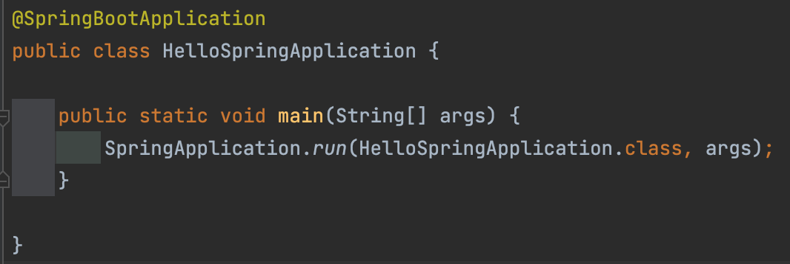
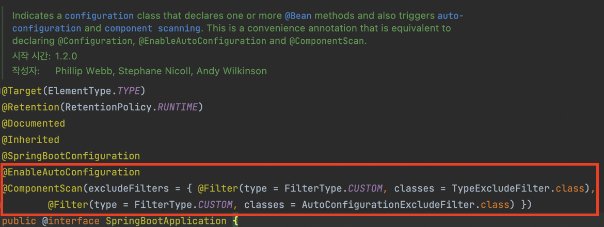
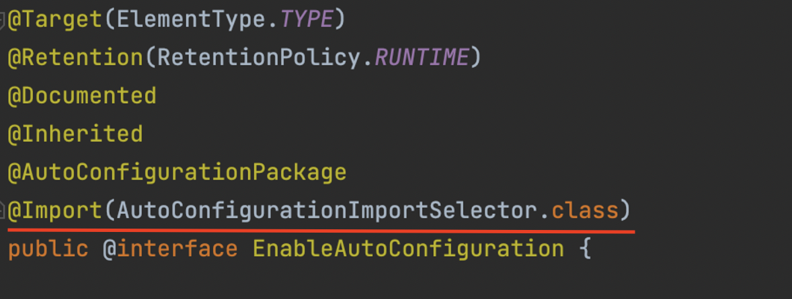
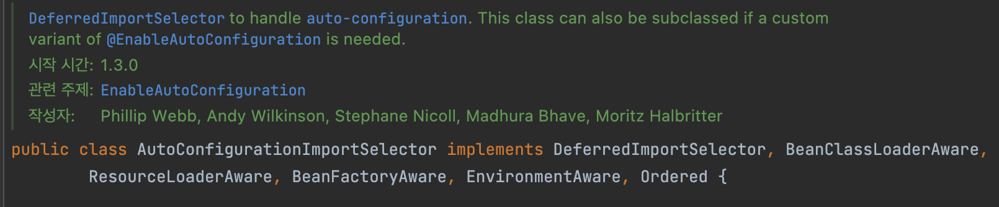
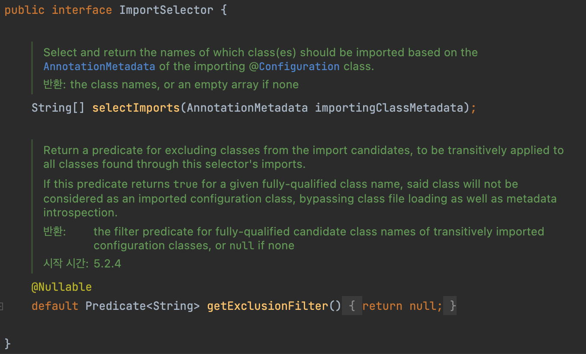
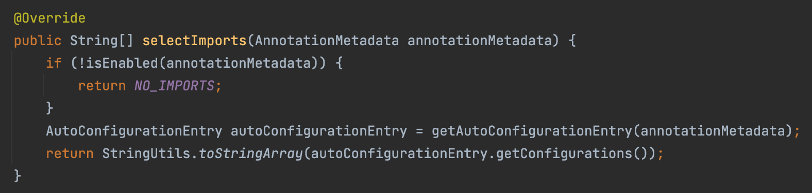

# AutoConfiguration

- 스프링부트는 자동 구성(Auto Configuration) 기능을 제공하는데, 일반적으로 수많은 빈들을 자동으로 등록해주는 기능이다.
- 이러한 기능으로 인해 반복적으로 빈을 등록하고 설정하는 부분을 줄이고 편리한 개발을 할 수 있게 도와주며 스프링 부트의 핵심적인 장점이라 할 수 있다.

## Auto Configuration 동작 방식

### main 메소드



스프링 부트 프로젝트를 처음 생성했을때 main 메소드를 살펴보자

클래스에 `@SpringBootApplication`이 붙어 있는 것을 볼 수 있다. 이 어노테이션이 없다면 평상시 자바소스를 작성하는 것과 별 다르지 않을 것이다.

`run()`을 보면 `HelloSpringApplication.class`를 넘겨주며, 이 클래스를 설정 정보로 사용하겠다는 것과 같다

`@SpringBootApplication`으로 인해 톰캣이 뜨고 서버가 열리고 포트가 열리는 등 일처리를 해주는 것을 보게 된다. 즉, 해당 어노테이션은 중요한 설정정보를 가지고 있다는 것이고 이 어노테이션을 자세히 살펴보자.

### SpringBootApplication



빈의 등록이 크게 2가지 단계를 걸쳐 이루어지는데, 먼저 `@ComponentScan`을 통해 `@Component` 가 붙어있는 객체들을 스캔하면서 자동으로 빈을 등록해주게 된다.

이 후, `@EnableAutoConfiguration`을 통해 스프링에서 자주 사용되는 빈들을 자동적으로 컨테이너에 등록해준다.

### EnableAutoConfiguration



`@EnableAutoConfiguraion`이 `AutoConfiguration`을 활성화 하는 기능이 된다.

여기서 `@Import` 는 스프링 설정정보를 포함할때 사용하는데 `AutoConfigurationImportSelector`를 봐보자.

### AutoConfigurationImportSelector



구현체에 있는 `ImportSelector`를 살펴보자.



앞서 본 스프링 설정정보를 포함할 때 `@Import`를 이용해 `ImportSelector`를 설정으로 사용할 대상을 동적으로 선택할 수 있다.

여기서 사용되는 `selectImports`를 구현체 쪽에서 사용해서 아래 경로에 있는 파일을 읽어서 스프링 부트 자동 구성으로 사용된다.



`getAutoConfigurationEntry()` 메서드로 AutoConfigurationEntry를 반환받는걸 볼 수 있다. `getAutoConfigurationEntry()`를 한 번 보자.

``` java
protected AutoConfigurationEntry getAutoConfigurationEntry(AnnotationMetadata annotationMetadata) {
		if (!isEnabled(annotationMetadata)) {
			return EMPTY_ENTRY;
		}
		AnnotationAttributes attributes = getAttributes(annotationMetadata);
		List<String> configurations = getCandidateConfigurations(annotationMetadata, attributes);
		configurations = removeDuplicates(configurations);
		Set<String> exclusions = getExclusions(annotationMetadata, attributes);
		checkExcludedClasses(configurations, exclusions);
		configurations.removeAll(exclusions);
		configurations = getConfigurationClassFilter().filter(configurations);
		fireAutoConfigurationImportEvents(configurations, exclusions);
		return new AutoConfigurationEntry(configurations, exclusions);
	}
```

1. AutoConfiguration의 후보를 뽑아서(getCantidateConfigurations()),
2. 중복을 제거하고(removeDuplicates()),
3. 자동 설정에서 제외되는 설정에 대한 정보를 가져와서(getExclusion()),
4. 제외되는 설정을 제거하고(configuration.removeAll()),
5. 필터를 적용하고(getConfigurationClassFilter().filter()),
6. 그 결과 남은 AutoConfiguration 목록을 담은 AutoConfigurationEntry를 반환한다.

#### 자동 구성 후보군 찾기 (getCandidateConfigurations())

여기서 `getCandidateConfigurations()` 메서드는 애노테이션을 기반으로 자동 설정 후보군을 구성합니다.

``` java
protected List<String> getCandidateConfigurations(AnnotationMetadata metadata, AnnotationAttributes attributes) {
		List<String> configurations = new ArrayList<>(
				SpringFactoriesLoader.loadFactoryNames(getSpringFactoriesLoaderFactoryClass(), getBeanClassLoader()));
		ImportCandidates.load(AutoConfiguration.class, getBeanClassLoader()).forEach(configurations::add);
		Assert.notEmpty(configurations,
				"No auto configuration classes found in META-INF/spring.factories nor in META-INF/spring/org.springframework.boot.autoconfigure.AutoConfiguration.imports. If you "
						+ "are using a custom packaging, make sure that file is correct.");
		return configurations;
	}
```

`ImportCandidates.load(AutoConfiguration.class, ..).forEach(configuration::add)`부분에서 알 수 있듯이, `@AutoConfiguration` 애노테이션이 붙은 클래스에 대한 정보를 모두 가져온다.

configuration에 담긴 정보들을 보면, `@AutoConfiguration` 이 설정된 클래스의 패키지를 포함한 Full Name을 가져오는 것을 알 수 있다.

``` java
public static ImportCandidates load(Class<?> annotation, ClassLoader classLoader) {
		Assert.notNull(annotation, "'annotation' must not be null");
		ClassLoader classLoaderToUse = decideClassloader(classLoader);
		String location = String.format(LOCATION, annotation.getName());
		Enumeration<URL> urls = findUrlsInClasspath(classLoaderToUse, location);
		List<String> importCandidates = new ArrayList<>();
		while (urls.hasMoreElements()) {
			URL url = urls.nextElement();
			importCandidates.addAll(readCandidateConfigurations(url));
		}
		return new ImportCandidates(importCandidates);
	}public static ImportCandidates load(Class<?> annotation, ClassLoader classLoader) {
		Assert.notNull(annotation, "'annotation' must not be null");
		ClassLoader classLoaderToUse = decideClassloader(classLoader);
		String location = String.format(LOCATION, annotation.getName());
		Enumeration<URL> urls = findUrlsInClasspath(classLoaderToUse, location);
		List<String> importCandidates = new ArrayList<>();
		while (urls.hasMoreElements()) {
			URL url = urls.nextElement();
			importCandidates.addAll(readCandidateConfigurations(url));
		}
		return new ImportCandidates(importCandidates);
	}
```

`ImportCandidates.load()` 메서드에서는 특정 경로(location)에서 후보군을 읽어온다. 디버깅으로 확인해보면 `META-INF/spring/org.springframework.boot.autoconfigure.AutoConfiguration.imports` 경로이다.(spring-boot-autoconfigure 라이브러리 내부)

```
## META-INF/spring/org.springframework.boot.autoconfigure.AutoConfiguration.imports

org.springframework.boot.autoconfigure.admin.SpringApplicationAdminJmxAutoConfiguration
org.springframework.boot.autoconfigure.aop.AopAutoConfiguration
org.springframework.boot.autoconfigure.amqp.RabbitAutoConfiguration
org.springframework.boot.autoconfigure.batch.BatchAutoConfiguration
org.springframework.boot.autoconfigure.cache.CacheAutoConfiguration
...
```

### 필터 적용

다시 `getAutoConfigurationEntry()` 메서드로 돌아가보자.

``` java
protected AutoConfigurationEntry getAutoConfigurationEntry(AnnotationMetadata annotationMetadata) {
		if (!isEnabled(annotationMetadata)) {
			return EMPTY_ENTRY;
		}
		AnnotationAttributes attributes = getAttributes(annotationMetadata);
		List<String> configurations = getCandidateConfigurations(annotationMetadata, attributes);
		configurations = removeDuplicates(configurations);
		Set<String> exclusions = getExclusions(annotationMetadata, attributes);
		checkExcludedClasses(configurations, exclusions);
		configurations.removeAll(exclusions);
		configurations = getConfigurationClassFilter().filter(configurations);
		fireAutoConfigurationImportEvents(configurations, exclusions);
		return new AutoConfigurationEntry(configurations, exclusions);
	}
```

`getConfigurationClassFilter().filter(configuration)` 에서는 `AutoConfigurationImportFilter`를 적용해 자동 구성에 포함시킬 클래스와 그렇지 않은 클래스를 필터링한다.

`getConfigurationClassFilter()` 내부에서

- `getAutoConfigurationImportFilter()`는 `OnBeanCondition` `OnClassCondition` `OnWebApplicationCondition` 라는 3개의 `AutoConfigurationImportFilter` 를 반환한다.
- 이 3개의 필터는 `ConfigurationClassFilter` 는 `ConfigurationClassFilter` 로 래핑된다.

``` java
private ConfigurationClassFilter getConfigurationClassFilter() {
		if (this.configurationClassFilter == null) {
			List<AutoConfigurationImportFilter> filters = getAutoConfigurationImportFilters();
			for (AutoConfigurationImportFilter filter : filters) {
				invokeAwareMethods(filter);
			}
			this.configurationClassFilter = new ConfigurationClassFilter(this.beanClassLoader, filters);
		}
		return this.configurationClassFilter;
	}
```

- `ConfigurationClassFilter`는 `filter()` 를 메서드로 갖고 있고, `AutoConfigurationMetadata`를 클래스 변수로 갖는다.
- `AutoConfigurationMetadata` 의 값은 `META-INF/spring-autoconfigure-metadata.properties` 의 값을 받아온다.

```
/* META-INF/spring-autoconfigure-metadata.properties */
org.springframework.boot.autoconfigure.batch.BatchAutoConfiguration=
org.springframework.boot.autoconfigure.batch.BatchAutoConfiguration$DataSourceInitializerConfiguration=
org.springframework.boot.autoconfigure.batch.BatchAutoConfiguration$DataSourceInitializerConfiguration.ConditionalOnBean=javax.sql.DataSource
org.springframework.boot.autoconfigure.batch.BatchAutoConfiguration$DataSourceInitializerConfiguration.ConditionalOnClass=org.springframework.jdbc.datasource.init.DatabasePopulator
org.springframework.boot.autoconfigure.batch.BatchAutoConfiguration.AutoConfigureAfter=org.springframework.boot.autoconfigure.orm.jpa.HibernateJpaAutoConfiguration
org.springframework.boot.autoconfigure.batch.BatchAutoConfiguration.ConditionalOnBean=org.springframework.batch.core.launch.JobLauncher
org.springframework.boot.autoconfigure.batch.BatchAutoConfiguration.ConditionalOnClass=javax.sql.DataSource,org.springframework.batch.core.launch.JobLauncher
```

이 파일 안에는 `ConditionalOnBean`, `ConditionalOnClass`, `AutoConfigureOrder`, `ConditionalOnMissingBean` 과 같은 `AutoConfiguration` 클래스에 대한 메타데이터가 들어있다. `filter()` 메소드는 이러한 정보를 기반으로 필터링을 진행하는 것이다.

위의 각 필터가 필터링하는 대상은 다음과 같다.

- **OnBeanCondition**
  - `@ConditionalOnBean` `@ConditionalOnMissingBean` `@ConditionalOnSingleCandidate`
- **OnClassCondition**
  - `@ConditionalOnClass` `@ConditionalOnMissingClass`
- **OnWebApplicationCondition**
  - `@ConditionalOnWebApplication` `@ConditionalOnNotWebApplication`

실제 AutoConfiguration 클래스의 내부를 들여다보면,

``` java
@AutoConfiguration(after = RepositoryRestMvcAutoConfiguration.class)
@EnableSpringDataWebSupport
@ConditionalOnWebApplication(type = Type.SERVLET)
@ConditionalOnClass({ PageableHandlerMethodArgumentResolver.class, WebMvcConfigurer.class })
@ConditionalOnMissingBean(PageableHandlerMethodArgumentResolver.class)
@EnableConfigurationProperties(SpringDataWebProperties.class)
public class SpringDataWebAutoConfiguration {
...
```

`@Conditional..` 애노테이션이 붙어있고, 여기에 설정되어 있는 값을 기반으로 필터는 해당 클래스를 자동 설정에 포함시킬지, 제외할 지 결정하게 되는 것이다.

### 동작 정리

즉, 스프링 부트 AutoConfiguration의 동작하는 방식은 이와 같다.

`@SpringBootAppliction` → `@EnableAutoConfiguration` → `@Import(AutoConfigurationImportSelector.class)` → `resources/META-INF/spring/org.springframework.boot.autoconfigure.AutoConfiguration.imports` 파일을 열어서 설정 정보를 가져와 유효하다면 스프링 컨테이너에 등록되어 사용된다.

