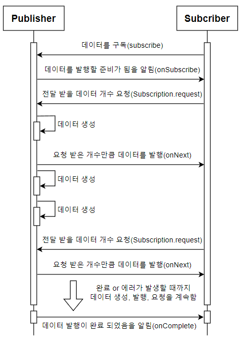

# 리액티브 스트림즈(Reactive Streams)

## Reactive Programming

리액티브 프로그래밍은 빠른 반응을 하고자 하는 시스템입니다.
클라이언트의 요청에 즉각적으로 응답함으로써 지연 시간을 최소화하고
이런 빠른 응답을 바탕으로 유지보수와 확장이 용이한 시스템을 구축하고자 합니다.

리액티브 선언문에 따르면, 리액티브 프로그래밍은 아래 4가지를 만족해야 합니다.

- **응답성** : 시스템이 가능한한 즉각적으로 응답
- **탄력성** : 시스템이 장애에 직면하더라도 응답성을 유지하는 것
- **유연성** : 시스템의 작업량이 변화하더라도 응답성을 유지하는 것
- **메세지 구동** : 비동기 메세지 전달에 의존하여 구성요소 간 느슨한 결합, 격리, 위치투명성을 - 보장

위의 설명에 의하면 Non-Blocking IO, Async, HA 와 같은 키워드들이 떠오릅니다.
그리고 이는 현대의 MSA 아키텍쳐에 아주 적합해보입니다.
Scale-Out 으로 빠른 반응성을 추구하는 MSA 아키텍쳐는 위와 같은 구성이 필요하기 때문입니다.
Reactive Streams 는 이러한 패러다임을 지키기위한 표준 spec 입니다.

## Reactive Streams

리액티브한 코드 작성과 구성을 용이하게 해 주는 리액티브 라이브러리를 어떻게 구현할지 정의해 놓은 표준 사양을 리액티브 스트림즈라고 합니다. 
한마디로,

데이터 스트림을 Non-Blocking이면서 비동기적인 방식으로 처리하기 위한 리액티브 라이브러리의 표준 사양
이라고 표현할 수 있습니다. 

Reactive Streams 명세에서는 다음과 같은 고민들로 시작되었다

1) I/O 데이터를 한 번에 받는게 아니라 수신자가 받을 수 있을 만큼만 나눠서 받을 순 없을까?
-> 데이터가 모두 완료되었을 때에만 처리하는 게 아니라 어느 정도 완료가 되었다면 바로 스트림에서 처리하기 위한 것. (**Iterator 패턴 적용**)

2) 데이터를 강제적으로 받지 않고 수신자가 받고 싶을 때에만 받을 순 없을까?
-> Non-Blocking I/O의 결과를 버퍼링 없이 받기 위한 것. (**Back Pressure 개념 도입**)

### Observer 패턴 + Iterator 패턴 도입

위 문제를 해결하기 위해 Reactive Streams은 Observer 패턴에 Iterator 패턴을 도입한다. 즉, I/O가 완료된 데이터를 한 번에 받는게 아니라 Iterator의 next, hasNext API와 결합하여 순차적으로 받고 데이터의 끝을 알 수 있게 된다.

- onComplete(): Iterator 패턴의 hasNext()와 같음
- onNext(T item): Observer 패턴의 observe와 Iterator 패턴의 next() 결합
- onError(Throwable t): next에서 Exception이 발생할 경우 전파를 위해 사용

### back pressure 개념 도입

Non-Blocking I/O의 결과 데이터를 모두 한번에 특정 시점에 받는 게 아니라, subscriber가 받을 수 있는 상황이 될 때, 원하는 만큼만 받도록 하자는 개념이며, 이로써 버퍼링 없이도 I/O 데이터를 처리하여 과부하를 방지할 수 있게 되었다. (Blocking I/O API에서는 publisher가 주도권을 갖고 있지만, 반대로  Non-Blocking I/O에서의 주도권을 subscriber에게 부여하자는 매커니즘이라고 이해하면 된다.)


### Reactive Streams 구성요소

리액티브 스트림즈를 통해 구현해야 하는 API 컴포넌트에는 Publisher, Subscriber, Subscription, Processor 가 있습니다. 


|컴포넌트|	설명|
|---|---|
|**Publisher**	|데이터를 생성하고 통지(발행)하는 역할|
|**Subscriber**	|구독한 Publisher로부터 통지(발행)된 데이터를 전달받아서 처리하는 역할|
|**Subscription**|	Publisher에 요청할 데이터의 개수를 지정하고, 데이터의 구독을 취소하는 |역할|
|**Processor**|	Publisher와 Subscriber의 기능을 모두 가진다. Publisher로서 다른Subscriber가 구독할 수 있고, Subscriber로서 다른 Publisher를 구독할 수 있다. |



위 그림은 **Publisher**와 **Subscriber** 간에 데이터가 전달되는 동작 과정을 그림으로 표현한 것입니다.

1. 먼저 Subscriber는 전달받을 데이터를 구독합니다(subscribe).
2. Publisher는 데이터를 발행(통지)할 준비가 되었음을 Subscriber에 알립니다(`onSubcribe`).
3. 이 알림을 받은 Subscriber는 전달받기 원하는 데이터의 개수를 Publisher에게 요청합니다.(`Subscription.request`).
4. 그 다음 Publisher는 Subscriber로부터 요청받은 만큼의 데이터를 발행합니다(`onNext`).
5. 위의 과정을 반복하다가 Publisher가 모든 데이터를 통지하게 되면 마지막으로 데이터 전송이 완료되었음을 Subscriber에게 알립니다(`onComplete`). 만약 Publisher가 데이터를 처리하는 과정에서 에러가 발생하면 Subscriber에게 에러가 발생했음을 알립니다(`onError`).

3번 과정을 통해 데이터의 요청 개수를 지정하는 이유는 Publisher와 Subscriber는 각각 다른 스레드에서 비동기적으로 상호작용하는 경우가 대부분입니다. 이 경우, Publisher가 발행(통지)하는 속도가 Publisher로부터 발행된 데이터를 Subscriber가 처리하는 속도보다 더 빠르면 처리를 기다리는 데이터가 쌓여 시스템 부하를 불러올 수 있습니다. 이와 같은 문제를 해결하기 위해 데이터 개수를 제어하는 것입니다. 

### 리액티브 스트림즈 컴포넌트

리액티브 스트림즈의 컴포넌트는 실제 코드에서는 인터페이스(Interface) 형태로 정의되고, 이를 구현해서 해당 컴포넌트를 사용하는 방식입니다. 

#### Publisher

``` java
public interface Publisher<T> {
    public void subscribe(Subscriber<? super T> s);
}
```

위 코드는 `Publisher` 인터페이스 코드 입니다. 
`subscribe` 메서드는 파리미터로 전달받은 `Subscriber`를 등록하는 역할을 합니다. 

#### Subscriber

``` java
public interface Subscriber<T> {
    public void onSubscribe(Subscription s);
    public void onNext(T t);
    public void onError(Throwable t);
    public void onComplete();
}
```

위 코드는 Subscriber 인터페이스 코드로 각 메서드는 다음과 같습니다.

- **onSubscribe** : Publisher에게 요청할 데이터의 개수를 지정 or 구독을 해지 → Subscription 객체를 통해 이루어집니다.
- **onNext** : Publisher가 발행한 데이터를 처리하는 역할
- **onError** : Publisher가 데이터 발행을 위한 처리 과정에서 에러가 발생했을 때, 해당 에러를 처리하는 역할
- **onComplete** : Publisher가 데이터 발행을 완료했음을 알릴 때 호출되는 메서드. 데이터 발행이 정상적으로 완료될 경우에 특정 후처리를 해야 한다면 이 메서드에서 처리 코드를 작성하면 됩니다. 

#### Subscription

``` java
public interface Subscription {
    public void request(long n);
    public void cancel();
}
```

위 코드는 Subscription 인터페이스 코드입니다.

- **request** : Publisher에게 데이터의 개수를 요청
- **cancel** : 구독을 해지

위 그림의 동작 과정을 컴포넌트 코드 과정에서 다시 설명하면 다음과 같습니다.

1. `Publisher`가 `Subscriber` 인터페이스 구현 객체를 `subscribe` 메서드의 파라미터로 전달
2. 전달 받은 `Subscriber` 구현 객체의 `onSubscribe` 메서드를 호출하면서 구독을 의미하는 `Subscription` 구현 객체를 `Subscriber`에게 전달
3. 호출된 `onSubscribe` 메서드에서 전달 받은 `Subscription` 객체를 통해 전달 받을 데이터의 개수를 `Publisher`에게 요청
4. 이 요청 개수만큼 데이터를 `Publisher`가 `onNext` 메서드를 호출해 `Subscriber`에게 전달
5. `Publisher`는 통지할 데이터가 더 이상 없을 경우 `onComplete` 메서드를 호출해 `Subscriber`에게 데이터 처리 종료 알림

#### Processor

``` java
public interface Processor<T, R> extends Subscriber<T>, Publisher<R> {
}
```

`Processor`는 `Subscriber`와 `Publisher` 인터페이스를 상속하고 있고, 별도로 구현해야 하는 메서드가 없습니다. 이 둘의 기능을 모두 가지고 있기 때문입니다. 