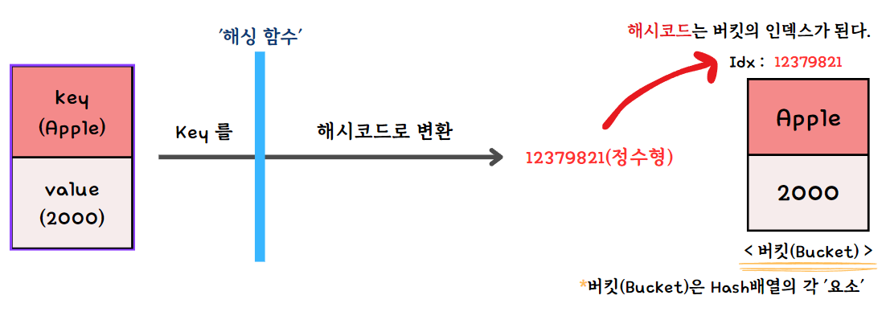

# Hash Map

'HashMap' 은 키(Key)와 값(value)쌍을 저장하는 자료 구조이다.
각 키는 고유하며, 키를 사용하여 해당하는 값을 빠르게 검색할 수 있다.

> **해싱 (Hashing)** :
'HashMap'의 핵심 원리이다.
'해싱 함수(Hashing Functoin)'는 키(key)를 받아서
정수값인 '해시코드(Hashcode)'를 반환하고,
반환된 해시코드는 Hash 배열의 각 요소인 '버킷(Bucket)'의 인덱스가 된다.



**구성 요소**

1. 배열(Array)

- 해시 맵의 기반 저장소
- 보통 bucket[] 라고 부름

2. 해시 함수(Hash Function)

- key → 정수(hash value)로 변환
- 예: hash(key) % bucket_size

3. 버킷(Bucket)

- 배열의 각 칸
- 충돌이 나면 여러 엔트리가 들어갈 수 있음

## 특징

- 키 기반의 빠른 액세스 : 키를 사용하여 값을 빠르게 검색하거나 수정할 수 있다.

- 순서를 보장하지 않음 : 'HashMap' 은 내부적으로 키의 순서를 보장하지 않는다.

- 키의 중복 불가 : 같은 키를 중복해서 사용할 수 없다. 이미 존재하는 키에 대해 값을 저장하면 기존 값이 덮어씌워진다.

- null 키와 값 : 'HashMap'은 null 키와 null 값을 저장할 수 있다. 하지만 키는 중복이 불가하므로 null 키는 하나만 저장될 수 있다.

- 키 기반의 유연성 : 어떤 객체든 키로 사용할 수 있다.

- **해싱 충돌** : 두 개 이상의 키가 동일한 해시 코드를 가질 때 충돌이 발생한다. 이는 성능 저하를 초래할 수 있다.

> **키 값이 다른데 동일한 해시코드를 갖는다 ?**
'이게 무슨 소리일까?' 싶을 것이다.
해싱 함수는 결코 완벽하지 않다. 실제로 많은 키가 있을 때 서로 다른 키가 동일한 해시코드를 생성할 가능성은 항상 존재한다.
대신, 해싱 충돌을 처리하기 위한 주요 방법들이 있다.

## 해시 충돌(Hash Collision)과 해결 방법

충돌이란?

서로 다른 key가 같은 bucket index로 매핑되는 현상

이건 절대 피할 수 없다.
배열 크기는 유한하고, key는 무한하기 때문이다.

### 대표적인 충돌 해결 방식

#### 체이닝(Chaining) – 가장 흔함

bucket 하나에 리스트(또는 트리) 를 둔다
```
bucket[0] → (apple, 1) → (banana, 2) → (grape, 3)
```
- Java HashMap, Python dict 내부 방식

#### 개방 주소법 (Open Addressing)

모든 키-값 쌍이 해시테이블의 배열 내에 직접 저장된다.
충돌이 발생하면, 다른 버킷의 위치를 찾아 삽입을 시도한다.
"다른 위치를 찾는" 과정은 또 여러 방법으로 나뉜다.

- **선형 조사 (Linear Probing)**:
초기 위치에서 일정 간격으로 버킷을 조사하여 빈 위치를 찾는다.
- **제곱 조사 (Quadratic Probing)**:
충돌 발생 시 제곱만큼 떨어진 위치를 조사한다.
- **이중 해싱 (Double Hashing)**:
두 번째 해시 함수를 사용하여 버킷 위치를 찾는다.

#### 재해싱 (Rehashing)

해시 테이블이 가득 차거나 충돌이 너무 많이 발생할 경우, 해시 테이블의 크기를 늘리고 모든 키-값 쌍을 새로운 크기에 맞게 재삽입하는 방법.
이 방법은 메모리 사용량을 늘리는 대신 충돌을 줄이고 성능을 향상시키는 데 효과적이다.

#### 버킷 확장 (Bucket Expansion)

충돌이 일어나면 해당 버킷의 크기를 확장하여 여러 키-값 쌍을 저장할 수 있게 한다.

### Load Factor(부하율)와 리사이징

**Load Factor 정의**
````
load factor = 저장된 원소 수 / bucket 수
````

예:

- bucket 16개
- 원소 12개
→ load factor = 0.75

왜 중요한가?

- load factor가 높아질수록 충돌 증가
- 성능 저하 발생

그래서 대부분 구현은:

- load factor가 특정 값(보통 0.75)을 넘으면
- 배열 크기를 2배로 늘리고 rehash 수행

이 과정은 비싸다(O(n))
하지만 자주 일어나지 않도록 설계되어 평균 성능은 O(1) 유지된다.