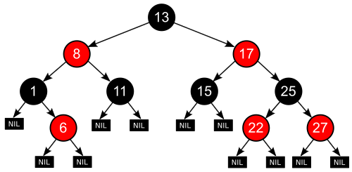

# Tree Map

TreeMap은 TreeSet과 동일하게 이진 탐색 트리 형태로 데이터를 저장한다.
하지만, Set 인터페이스의 특성과는 달리 Map 특성을 사용하기 때문에 키(Key)와 값(Value)으로 이루어진 Entry 객체 형태로 저장한다.

내부적으로 이진 탐색 트리(Binary Search Tree), 그 중에서도 **레드-블랙 트리(Red-Black Tree)** 를 기반으로 한다.

## 주요 특징

| 특징            | 설명                                                                 |
| ------------- | ------------------------------------------------------------------ |
| **정렬 유지**     | 키(key)들이 자동으로 **오름차순 정렬**됩니다. (`Comparable` 또는 `Comparator` 이용 가능) |
| **시간 복잡도**    | 삽입, 삭제, 탐색 모두 평균 **O(log n)**                                      |
| **중복 허용 X**   | 키는 중복 불가, 값은 중복 가능                                                 |
| **null 키 불가** | `HashMap`은 `null` 키 허용하지만, `TreeMap`은 허용하지 않음                      |

## 레드-블랙 트리(Red-Black Tree)

- 모든 노드는 빨강(red) 또는 검정(black)
- 루트는 항상 검정
- 빨강 노드는 연속으로 올 수 없음
- 리프 노드까지 가는 모든 경로에 대해 검정 노드 수는 같음

## 언제 TreeMap을 사용할까?

- 키들을 정렬된 순서로 탐색하거나
- **범위 기반 탐색 (subMap, headMap, tailMap 등)** 이 필요할 때
- 삽입/삭제가 자주 일어나고, 데이터의 정렬 상태가 중요할 때

